# Lucene

### 基本介绍

Lucene 是一个高性能、可扩展的开源全文搜索引擎库，它本身不是一个完整的搜索引擎（如 Google），而是一个 底层库 ，用于构建搜索功能。

### 用例引入

现在有三段文本，id 分别是 0、1、2，你需要快速找到哪段文本里含有关键词"xiaobai".


我们很容易想到，可以依次遍历这三段文本，匹配文本内是否含有"xiaobai"，最终将符合条件的文本 ID 输出。在数据量小的时候，问题不大，但如果我有上百亿条这样的数据呢？

我们可以对文本进行切分，比如"I like xiaobai"切分为"I"、"like"、"xiaobai"三部分，这个操作叫 **分词** ，分词后的每部分，我们称为一个 **词项** ，也就是  **term** 。记录词项和文本 id 的关系，于是上面的三段文本就变成了下面这样。


当我们想要搜索 xiaobai 的时候，只需要匹配到 xiaobai 词项，就可以立马得到它所在的文档 id 是 0 和 1。

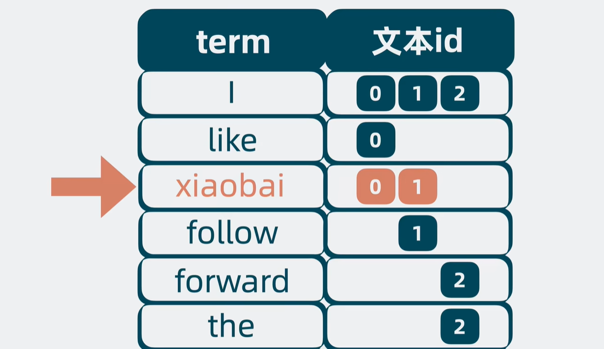

但这有个问题，短短三句话，就已经有这么多词项了，要是换成三篇文档，那词项就会多得离谱，怎么在这么多的词项里匹配出 xiaobai 呢？挨个遍历的话，时间复杂度就是 O(N), 太低效了。

我们可以将词项**按字典序**从小到大排序，通过二分查找的方法，直接将时间复杂度优化为 `O(lgN)`。


我们将这堆排好序的词项，称为 **Term Dictionary** ，而词项对应的文档 id 等信息的集合，就叫  **Posting List** 。它们共同构成了一个用于搜索的数据结构，它就是 **倒排索引(Inverted Index)** 。

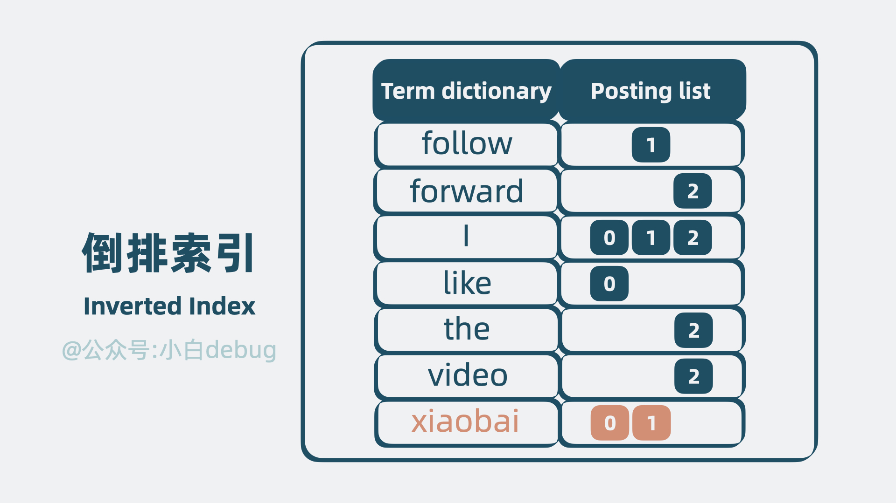

> 注意，Posting List 其实还包含词频和词项在文本里的偏移量等信息，但为了方便理解，我在上图中去掉了这部分内容。

但倒排索引还有个问题，Term Dictionary 数据量很大，放内存并不现实，因此必须放在磁盘中。但查询磁盘是个较慢的过程。

我们可以发现，词项和词项之间，有些**前缀**是一致的，比如 `follow` 和 `forward` 前面的 `fo` 是一致的，如果我们将部分 term 前缀提取出来，像下图一样，就可以用更少的空间表达更多的  **term** 。

基于这个原理，我们可以将 Term Dictionary 的**部分**词项提取出来，用这些 词项 的前缀信息，构建出一个 **精简的目录树** 。目录树的节点中存放这些词项在磁盘中的偏移量，也就是指向磁盘中的位置。这个目录树结构，体积小，适合放内存中，它就是所谓的  **Term Index** 。可以用它来加速搜索。

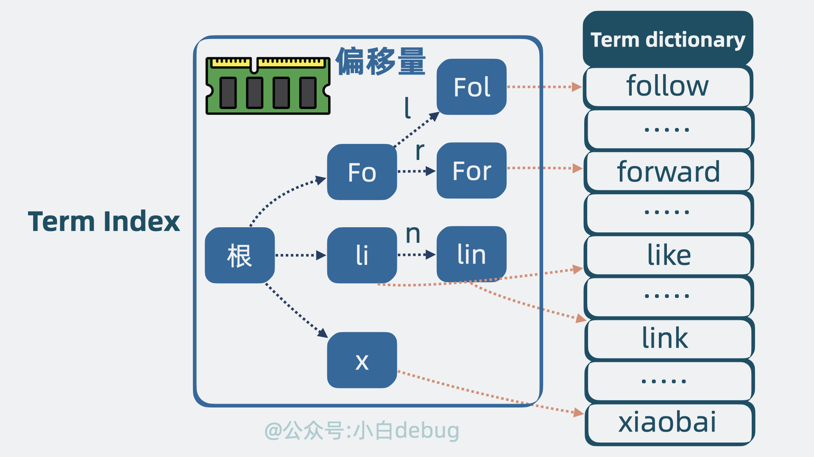

当我们需要查找某个词项的时候，只需要搜索 Term Index，就能快速获得词项在 Term Dictionary 中的大概位置。再跳转到 Term Dictionary，通过少量的检索，定位到词项内容。

到这里，搜索功能就有了。但有个问题，前面提到的倒排索引，搜索到的是 **文档 id** ，我们还需要拿着这个 id 找到 **文档内容本身** ，才能返回给用户。

因此还需要有个地方，存放完整的文档内容，它就是  **Stored Fields** （行式存储）。

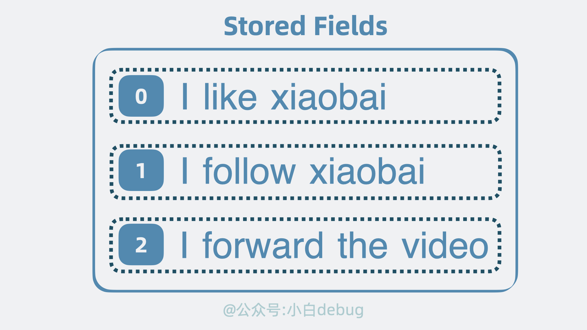

有了 id，我们就能从 Stored Fields 中取出文档内容。

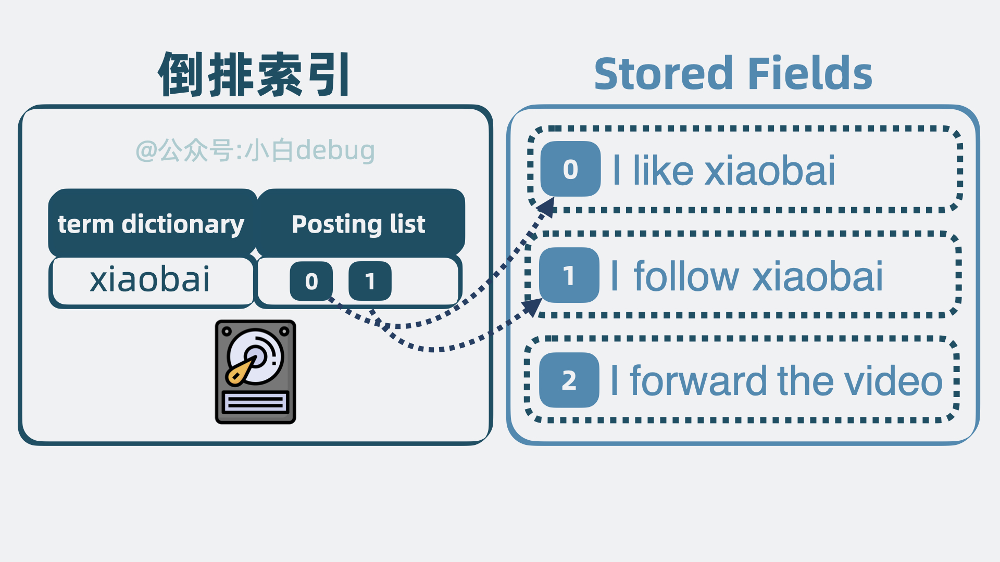

但用户经常需要根据某个字段排序文档，比如按时间排序或商品价格排序。但问题就来了，这些字段散落在文档里。也就是说，我们需要先获取 Stored Fields 里的文档，再提取出内部字段进行排序。

也不是说不行。但其实有更高效的做法。

我们可以用空间换时间的思路，再构造一个列式存储结构，将散落在各个文档的某个字段，集中存放，当我们想对某个字段排序的时候，就只需要将这些集中存放的字段一次性读取出来，就能做到针对性地进行排序。这个列式存储结构，就是所谓的 Doc Values。


在上文中，我们介绍了四种关键的结构：**倒排索引**用于搜索，**Term Index** 用于加速搜索，**Stored Fields** 用于存放文档的原始信息，以及 **Doc Values** 用于排序和聚合。这些结构共同组成了一个**复合**文件，也就是所谓的" **segment** ", 它是一个具备 **完整搜索功能的最小单元** 。

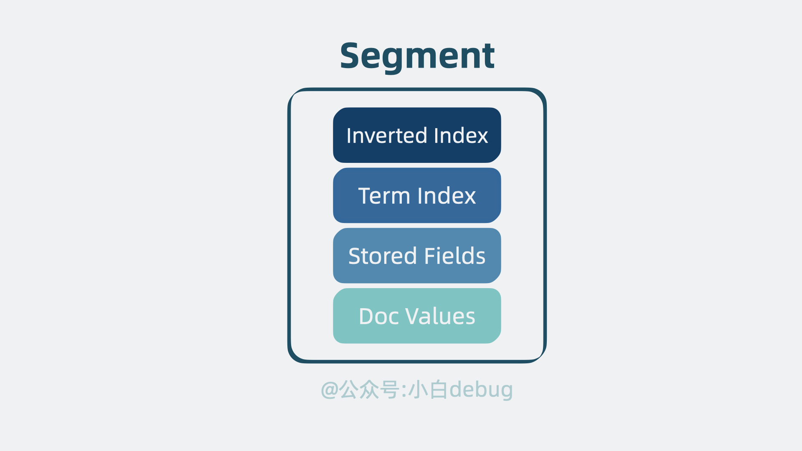

我们可以用多个文档生成一份 segment，**如果**新增文档时，还是写入到这份 segment，那就得同时更新 segment 内部的多个数据结构，这样并发读写时性能肯定会受影响。

那怎么办呢？

我们定个规矩。 **segment 一旦生成，则不能再被修改** 。如果还有新的文档要写入，那就生成新的 segment。这样 **老的 segment 只需要负责读，写则生成新的 segment** 。同时保证了读和写的性能。

但 segment 变多了，我们怎么知道要搜索的数据在哪个 segment 里呢？

问题不大，**并发同时读**多个 segment 就好了。

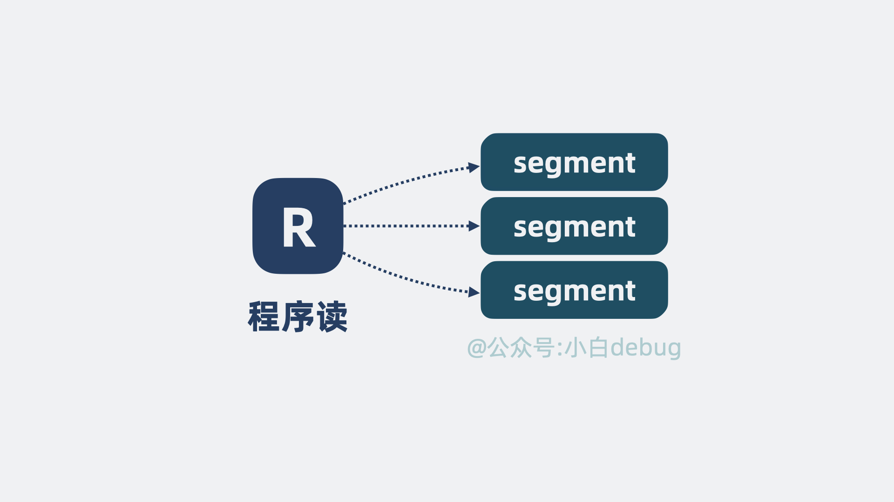

但这也引入了新问题，随着数据量增大，segment 文件越写越多，文件句柄被耗尽那是指日可待啊。

是的，但这个也好解决，我们可以不定期合并多个小 segment，变成一个大 segment，也就是段合并(segment merging)。这样文件数量就可控了。

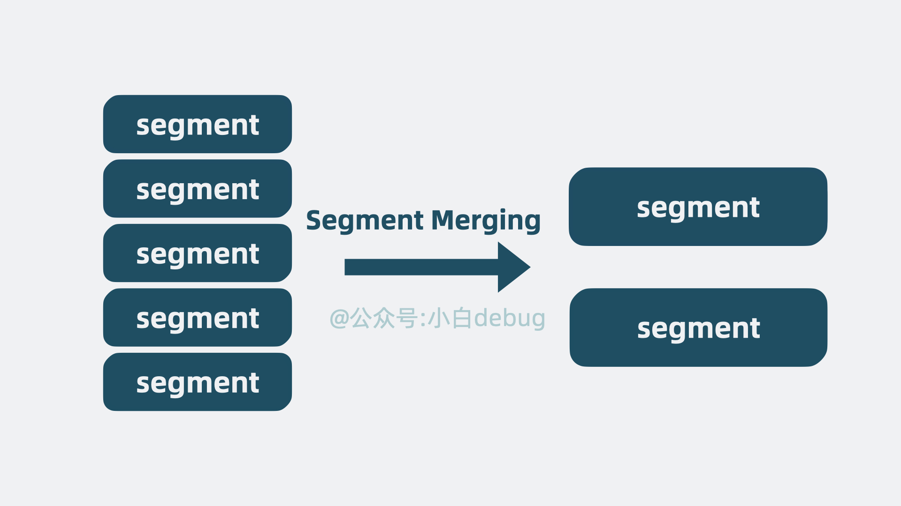

到这里，上面提到的多个 segment，就共同构成了一个 **单机文本检索库** ，它其实就是非常有名的开源基础搜索库  **lucene** 。

### 倒排索引

倒排索引的概念是基于MySQL这样的正向索引而言的。

##### 正向索引

> 设置了索引的话挺快的，但要是模糊查询则就很慢！

那么什么是正向索引呢？例如给下表（tb_goods）中的id创建索引：

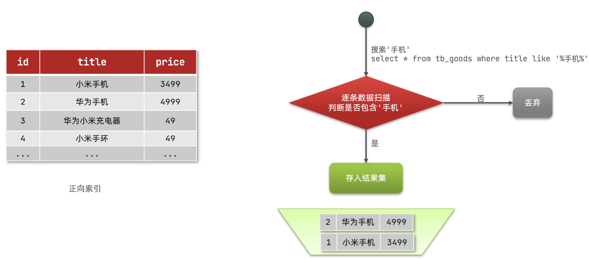

如果是根据id查询，那么直接走索引，查询速度非常快。

但如果是基于title做模糊查询，只能是逐行扫描数据，流程如下：

1）用户搜索数据，条件是title符合 `"%手机%"`

2）逐行获取数据，比如id为1的数据

3）判断数据中的title是否符合用户搜索条件

4）如果符合则放入结果集，不符合则丢弃。回到步骤1

逐行扫描，也就是全表扫描，随着数据量增加，其查询效率也会越来越低。当数据量达到数百万时，就是一场灾难。

##### 倒排索引

倒排索引中有两个非常重要的概念：

* 文档（`Document`）：用来搜索的数据，其中的每一条数据就是一个文档。例如一个网页、一个商品信息
* 词条（`Term`）：对文档数据或用户搜索数据，利用某种算法分词，得到的具备含义的词语就是词条。例如：我是中国人，就可以分为：我、是、中国人、中国、国人这样的几个词条

创建倒排索引是对正向索引的一种特殊处理，流程如下：

* 将每一个文档的数据利用算法分词，得到一个个词条
* 创建表，每行数据包括词条、词条所在文档id、位置等信息
* 因为词条唯一性，可以给词条创建索引，例如hash表结构索引

如图：

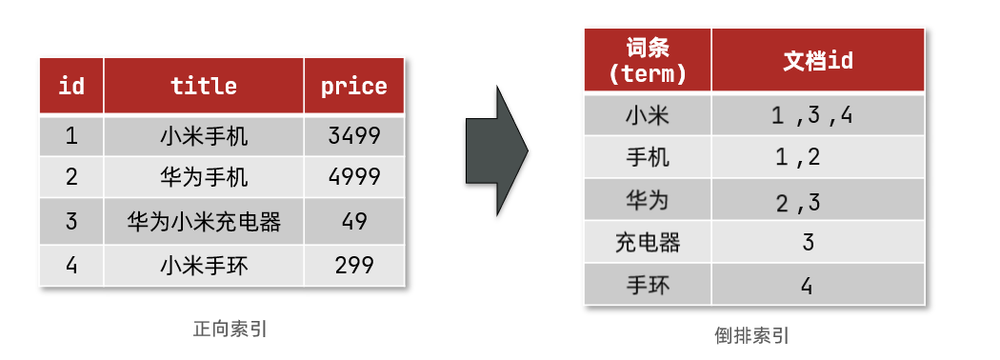

倒排索引的搜索流程如下（以搜索"华为手机"为例）：

1）用户输入条件 `"华为手机"`进行搜索。

2）对用户输入内容 **分词** ，得到词条：`华为`、`手机`。

3）拿着词条在倒排索引中查找，可以得到包含词条的文档id：1、2、3。

4）拿着文档id到正向索引中查找具体文档。

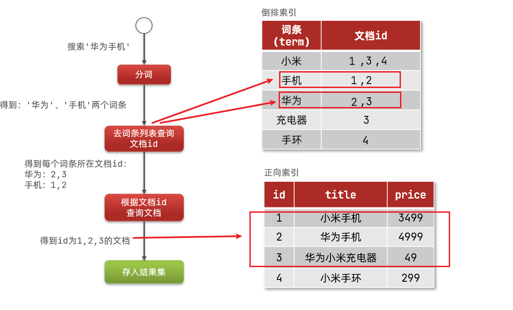

虽然要先查询倒排索引，再查询倒排索引，但是无论是词条、还是文档id都建立了索引，查询速度非常快！无需全表扫描。

##### 正向和倒排对比

概念区别：

* **正向索引**是最传统的，根据id索引的方式。但根据词条查询时，必须先逐条获取每个文档，然后判断文档中是否包含所需要的词条，是 **根据文档找词条的过程** 。
* 而**倒排索引**则相反，是先找到用户要搜索的词条，根据词条得到保护词条的文档的id，然后根据id获取文档。是 **根据词条找文档的过程** 。

| **特性**     | **正向索引 (Forward Index)**                                                           | **倒排索引 (Inverted Index)**                                                                     |
| ------------------ | -------------------------------------------------------------------------------------------- | ------------------------------------------------------------------------------------------------------- |
| **应用场景** | 结构化数据 、数据库、精确查询、排序。                                                        | 非结构化数据 、全文搜索、模糊查询。                                                                     |
| **存储结构** | 文档 → 词条 （如：用户ID$\rightarrow$用户名/年龄/地址）                                   | 词条 → 文档 （如：关键词$\rightarrow$包含该关键词的文档列表）                                        |
| **主要优点** | 可以为多个字段创建索引；<br />根据索引字段进行搜索和排序速度非常快。                         | 根据词条进行精确或模糊搜索时，速度 非常快 ；<br />适用于复杂的全文检索场景。                            |
| **主要缺点** | 根据非索引字段查询，需要全表扫描；<br />对索引字段进行部分词条查找时，效率低（需全表扫描）。 | 只能给词条创建索引，而不是字段（需要先进行分词）；<br />无法直接根据字段做排序 （需要额外的辅助存储）。 |

# ES

### 基本介绍

Elasticsearch 是一个高度可扩展的开源实时搜索和分析引擎，它允许用户在近实时的时间内执行全文搜索、结构化搜索、聚合、过滤等功能。Elasticsearch 基于 Lucene 构建，提供了强大的全文搜索功能，并且具有广泛的应用领域，包括日志和实时分析、社交媒体、电子商务等。

Elasticsearch 为所有类型的数据提供近乎实时的搜索和分析。无论是结构化文本还是非结构化文本、数字数据或地理空间数据，Elasticsearch 都能够以支持快速搜索的方式有效地存储和索引它们。除了简单的数据检索和聚合信息之外，还可以用 Elasticsearch 发现数据中的趋势和模式。随着数据和查询量的增长，Elasticsearch 的分布式特性能够横向扩展至数以百计的服务器存储以及处理PB级的数据，同时可以在极短的时间内索引、搜索和分析大量的数据。

### 使用场景

虽然不是每个问题都是搜索问题，但Elasticsearch在各种用例中提供了处理数据的速度和灵活性：

* 为APP或网站增加搜索功能
* 存储和分析日志、指标和安全事件数据
* 使用机器学习实时自动建模数据的行为
* 使用Elasticsearch作为存储引擎自动化业务工作流
* 使用Elasticsearch作为地理信息系统（GIS）管理、集成和分析空间信息
* 使用Elasticsearch作为生物信息学研究工具存储和处理遗传数据

基本上，Elasticsearch已经渗透到了我们工作和生活的方方面面。我们打开电商网站搜索商品、打开APP查询资料，或者工作上使用EFK搭建日志系统等，这背后都有Elasticsearch的贡献。对了，GitHub的搜索功能也是基于Elasticsearch构建起来的。

### Lucene → ES

lucene 作为一个搜索库，可以写入大量数据，并对外提供搜索能力。

多个调用方**同时读写**同一个 lucene 必然导致争抢计算资源。抢不到资源的一方就得等待，这不纯纯浪费时间吗！

有解决方案吗？有！

首先是对写入 lucene 的数据进行分类，比如体育新闻和八卦新闻数据算两类，每一类是一个  **Index Name** ，然后根据 Index Name 新增 lucene 的数量，将不同类数据写入到不同的 lucene 中，读取数据时，根据需要搜索不同的 Index Name 。这就大大降低了单个 lucene 的压力。

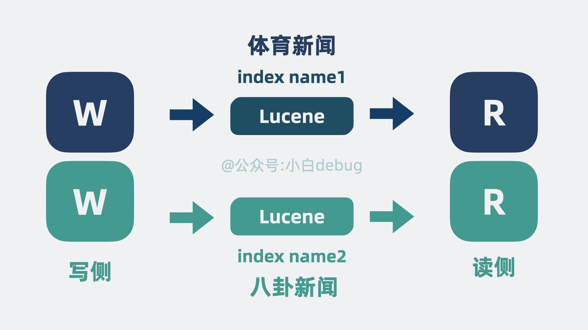

但单个 Index Name 内数据依然可能过多，于是可以将单个 Index Name 的同类数据，拆成好几份，每份是一个  **shard 分片** ， **每个 shard 分片本质上就是一个独立的 lucene 库** 。

这样我们就可以将读写操作分摊到多个分片中去，大大降低了争抢，提升了系统性能。

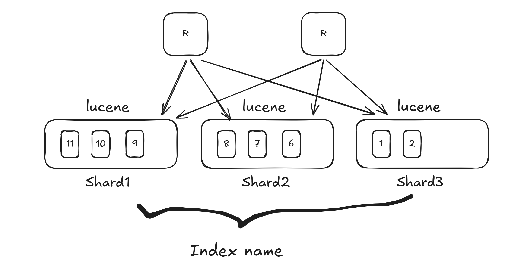

随着 分片 变多，如果 分片 都在同一台机器上的话，就会导致单机 cpu 和内存过高，影响整体系统性能。

于是我们可以申请更多的机器，将 分片 分散部署在多台机器上，这每一台机器，就是一个 Node。我们可以通过增加 Node 缓解机器 cpu 过高带来的性能问题。

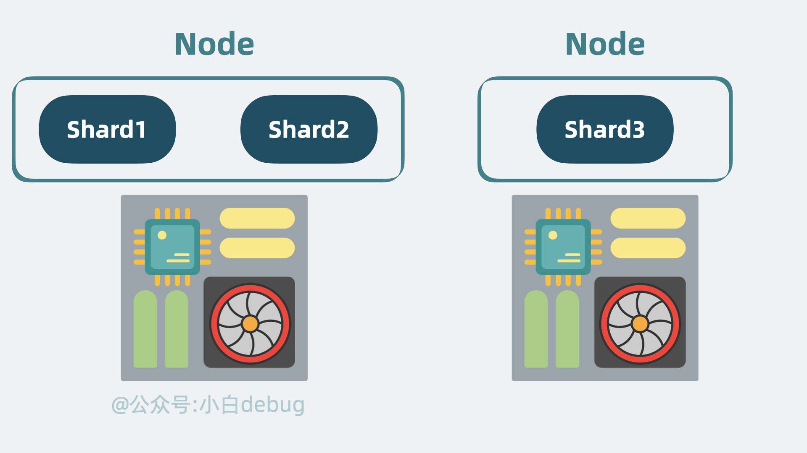

到这里，问题又又来了，如果其中一个 Node 挂了，那 Node 里所有分片 都无法对外提供服务了。我们需要保证服务的高可用。有解决方案吗？

有，我们可以给 分片 多加几个副本。将 分片 分为 Primary shard 和 Replica shard，也就是主分片和副本分片 。主分片会将数据同步给副本分片，副本分片既可以同时提供读操作，还能在主分片挂了的时候，升级成新的主分片让系统保持正常运行，提高性能的同时，还保证了系统的高可用。

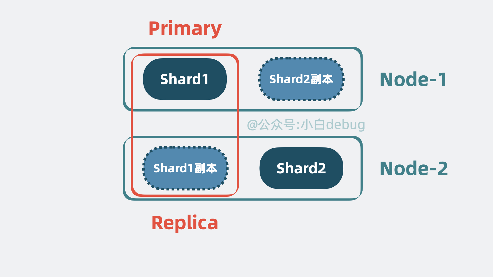

搜索架构需要支持的功能很多，既要负责 **管理集群** ，又要 **存储管理数据** ，还要 **处理客户端的搜索请求** 。如果每个 Node **都**支持这几类功能，那当集群有数据压力，需要扩容 Node 时，就会**顺带**把其他能力也一起扩容，但其实其他能力完全够用，不需要跟着扩容，这就有些**浪费**了。

因此我们可以将这几类功能拆开，给集群里的 Node 赋予 **角色身份** ，不同的角色负责不同的功能。

比如负责管理集群的，叫 **主节点(Master Node)** ， 负责存储管理数据的，叫 **数据节点(Data Node)** ， 负责接受客户端搜索查询请求的叫 **协调节点(Coordinate Node)** 。
集群规模小的时候，一个 Node 可以**同时**充当多个角色，随着集群规模变大，可以让一个 Node 一个角色。

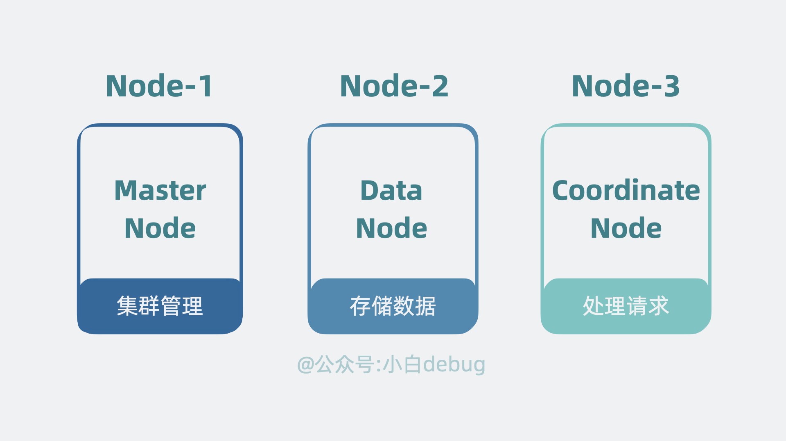

上面提到了主节点，那就意味着还有个**选主**的过程，但现在每个 Node 都是独立的，需要有个机制协调 Node 间的数据。

我们很容易想到，可以像 `kafka` 那样引入一个中心节点 `Zookeeper`，但如果不想引入新节点，还有其他更轻量的方案吗？

有， **去中心化** 。我们可以在 Node 间引入协调模块，用**类似一致性算法 Raft** 的方式，在节点间互相同步数据，让所有 Node 看到的集群数据状态都是一致的。这样，集群内的 Node 就能参与选主过程，还能了解到集群内某个 Node 是不是挂了等信息。

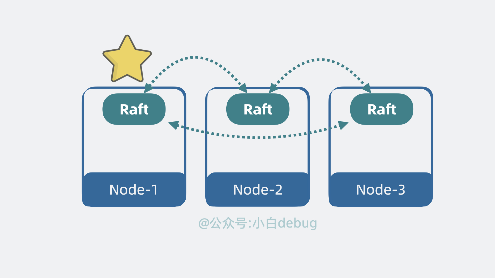

好了，到这里，当初那个简陋的 lucene，就成了一个高性能，高扩展性，高可用，支持持久化的分布式搜索引擎，它就是我们常说的  **elastic search** ，简称  **ES** 。它对外提供 `http` 接口，任何语言的客户端都可以通过 HTTP 接口接入 es，实现对数据的增删改查。

从架构角度来看，es 给了一套方案，告诉我们如何让一个**单机系统 lucene** 变成一个 **分布式系统** 。

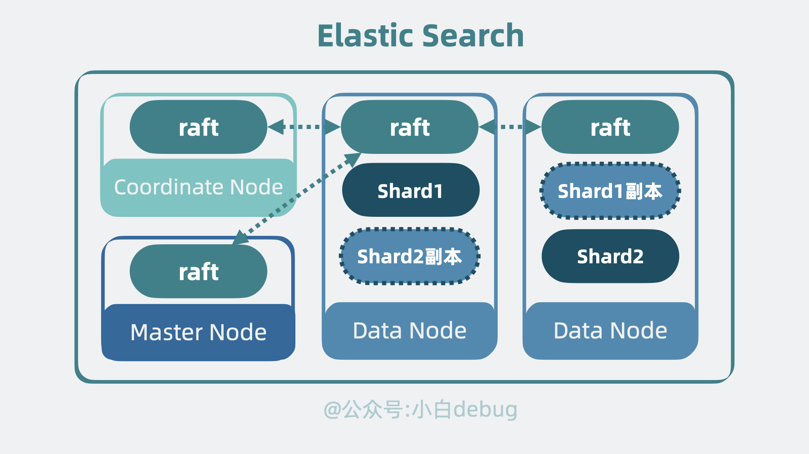

### 架构与工作原理

##### 架构概述

Elasticsearch 架构主要由三个组件构成：索引、分片和节点。

* 索引是文档的逻辑分组，类似于数据库中的表；
* 分片是索引的物理分区，用于提高数据分布和查询性能；
* 节点是运行 Elasticsearch 的服务器实例。

##### 工作原理

Elasticsearch 通过以下步骤完成搜索和分析任务：

1. 接收用户查询请求：Elasticsearch 通过 RESTful API 或 JSON 请求接收用户的查询请求。
2. 路由请求：接收到查询请求后，Elasticsearch 根据请求中的索引和分片信息将请求路由到相应的节点。
3. 执行查询：节点执行查询请求，并在相应的索引中查找匹配的文档。
4. 返回结果：查询结果以 JSON 格式返回给用户，包括匹配的文档和相关字段信息。

### 重要概念

##### 索引（Index）

在Elasticsearch中，索引是存储相关数据的数据结构，可以理解为数据库中的表。索引是通过对数据源进行索引创建的，它是一种对数据进行结构化和半结构化处理的结果。每个索引都有自己的映射（mapping），用于定义每个字段的数据类型和其他属性。

在Elasticsearch中，索引的创建和定义通常是通过REST API或者相关Java API来实现的。在创建索引时，我们需要指定一些参数，比如分片数量和副本数量。分片是将索引数据水平切分为多个小块的过程，这样可以提高数据检索和处理的效率。副本则是将索引数据复制到一个或多个节点上，以提高数据的可靠性和查询的可用性。

索引的映射（mapping）是用于定义索引中每个字段的数据类型和其他属性。在创建索引时，需要定义每个字段的数据类型（如文本、数字、日期等）和其他属性（如是否需要分析、是否存储等）。此外，映射还可以定义其他高级功能，如聚合、排序和过滤等。

##### 类型（Type）

在早期版本的Elasticsearch中，类型（type）是一个非常重要的概念。每个索引内部都可以有多个类型，而每个类型下又可以存储多个文档。类型实际上是索引内部的一种逻辑分区，通过类型名称在索引内进行唯一标识。

在索引和类型之间，我们可以把类型看作是表，索引看作是数据库。在创建索引的时候，可以指定一个或多个类型。类型的作用在于把索引中的数据按照一定的逻辑进行分类，从而方便后期的数据检索和分析。

每个类型下又可以存储多个文档，每个文档都有一个唯一的ID作为区分，以JSON格式来表示。在存储文档时，需要指定文档所属的类型和索引名称，同时还可以为文档指定一个或多个字段。字段可以是不同的数据类型，如文本、数字、日期等。

然而，需要注意的是，从Elasticsearch 7.x版本开始，索引中的每个文档都直接属于一个索引，而不再需要指定类型。这主要是为了简化索引和查询操作，提高查询效率。因此，在新的版本中，类型这个概念已经逐渐被淘汰。

##### 文档（Document）

文档是Elasticsearch中存储和检索的基本单位，它是序列化为JSON格式的数据结构。每个文档都有一个唯一的标识符，称为_id字段，用于唯一标识该文档。每个文档都存储在一个索引中，并且可以包含多个字段，这些字段可以是不同的数据类型，如文本、数字、日期等。

在Elasticsearch中，文档的属性包括_index、_type和_source等。_index表示文档所属的索引名称，_type表示文档所属的类型名称（在早期的Elasticsearch版本中，这是必需的，但在7.x版本之后已经不再需要），_source表示文档的原始JSON数据。

当我们在Elasticsearch中执行搜索查询时，实际上是在查询文档。我们可以使用简单的关键字搜索，也可以使用复杂的查询语句来搜索多个字段。在搜索时，Elasticsearch会使用反向索引来快速定位匹配的文档。反向索引是一个为每个字段建立的倒排索引，它允许Elasticsearch根据关键词在字段中快速查找包含该关键词的文档。

### 集群重要概念

##### 集群（Cluster）

一个Elasticsearch集群通常包含了多个节点（Node）和一个或多个索引（Index），并且这些节点和索引共同构成了整个Elasticsearch集群，在所有节点上提供联合索引和搜索功能。

每个Cluster都有一个唯一的名称，即cluster name，它用于标识和区分不同的Elasticsearch集群。

##### 节点（Node）

在Elasticsearch集群中，Node是指运行Elasticsearch实例的服务器。每个Node都有自己的名称和标识符，并且都有自己的数据存储和索引存储。

一个Elasticsearch集群由一个或多个Node组成，这些Node通过它们的集群名称进行标识。在默认情况下，如果Elasticsearch已经开始运行，它会自动生成一个叫做“elasticsearch”的集群。我们也可以在配置文件（elasticsearch.yml）中定制我们的集群名字。

Node在Elasticsearch中扮演着不同的角色。根据节点的配置和功能，可以将Node分为以下几种类型：

* Master Node：负责整个Cluster的配置和管理任务，如创建、更新和删除索引，添加或删除Node等。一个Cluster中至少需要有一个Master Node。
* Data Node：主要负责数据的存储和处理，它们可以处理数据的CRUD操作、搜索操作、聚合操作等。一个Cluster中可以有多个Data Node。
* Ingest Node：主要负责对文档进行预处理，如解析、转换、过滤等操作，然后再将文档写入到Index中。每个Cluster中至少需要有一个Ingest Node。
* 除了上述的三种类型外，还可以有Tribe Node、Remote Cluster Client等特殊用途的Node。

Node之间是对等关系（去中心化），每个节点上面的集群状态数据都是实时同步的。如果Master节点出故障，按照预定的程序，其他一台Node机器会被选举成为新的Master。

需要注意的是，一个Node可以同时拥有一种或几种功能，如一个Node可以同时是Master Node和Data Node。

##### 分片（Shards）

在Elasticsearch中，Shards是索引的分片，每个Shard都是一个基于Lucene的索引。当索引的数据量太大时，由于内存的限制、磁盘处理能力不足、无法足够快的响应客户端的请求等，一个节点可能不够用。这种情况下，数据可以被分为较小的分片，每个分片放到不同的服务器上。每个分片可以有零个或多个副本。这不仅能够提高查询效率，还能够提高系统的可靠性和可用性。如果某个节点或Shard发生故障，Elasticsearch可以从其他节点或Shard的副本中恢复数据，从而保证数据的可靠性和可用性。

每个Shard都存储在集群中的某个节点上，每个节点可以存储一个或多个Shard。当查询一个索引时，Elasticsearch会在所有的Shard上执行查询，并将结果合并返回给用户。

对于每个索引，在创建时需要指定主分片的数量，一旦索引创建后，主分片的数量就不能更改。

##### 副本（Replicas）

在Elasticsearch中，Replicas是指索引的副本。它们的作用主要有两点：

* 提高系统的容错性。当某个节点发生故障，或者某个分片（Shard）损坏或丢失时，可以从副本中恢复数据。这意味着，即使一个节点或分片出现问题，也不会导致整个索引的数据丢失。这种机制可以增加系统的可靠性，并减少因节点或分片故障导致的宕机时间。
* 提高查询效率。Elasticsearch会自动对搜索请求进行负载均衡，可以将搜索请求分配到多个节点上，从而并行处理搜索请求，提高查询效率。这种负载均衡机制可以在节点之间分发查询请求，使得每个节点都可以处理一部分查询请求，从而避免了一个节点的瓶颈效应。

需要注意的是，在Elasticsearch中，每个索引可以有多个副本（Replicas），但是每个副本只能有一个主分片（Primary Shard）。可以增加或删除副本的数量。

##### 与关系型数据库的参考对比

| **MySQL** | **Elasticsearch** | **说明**                                                                    |
| --------------- | ----------------------- | --------------------------------------------------------------------------------- |
| Table           | Index                   | 索引(index)，就是文档的集合，类似数据库的表(table)                                |
| Row             | Document                | 文档（Document），就是一条条的数据，类似数据库中的行（Row），文档都是JSON格式     |
| Column          | Field                   | 字段（Field），就是JSON文档中的字段，类似数据库中的列（Column）                   |
| Schema          | Mapping                 | Mapping（映射）是索引中文档的约束，例如字段类型约束。类似数据库的表结构（Schema） |
| SQL             | DSL                     | DSL是elasticsearch提供的JSON风格的请求语句，用来操作elasticsearch，实现CRUD       |

# ES 搭建环境

这里使用docker compose 快速搭建一套Elasticsearch和Kibana环境。

> 为什么要带Kibana？
>
> 因为Kibana 提供了一个好用的开发者控制台，非常适合用来练习Elasticsearch命令。

```yml
services:
  elasticsearch:
    container_name: elasticsearch
    image: docker.elastic.co/elasticsearch/elasticsearch:9.1.1
    environment:
      - node.name=elasticsearch
      - ES_JAVA_OPTS=-Xms512m -Xmx512m
      - discovery.type=single-node
      - xpack.security.enabled=false
    ports:
      - 9200:9200
      - 9300:9300
    networks:
      - elastic
  kibana:
    image: docker.elastic.co/kibana/kibana:9.1.1
    container_name: kibana
    ports:
      - 5601:5601
    networks:
      - elastic
    depends_on:
      - elasticsearch

networks:
  elastic:

```

将上面的内容保存至本地的 `docker-compose.yml`文件，并在相同目录下执行以下命令启动容器。

```bash
docker-compose up
```

待容器启动后，在本机浏览器打开 [http://127.0.0.1:5601](http://127.0.0.1:5601/)即可看到如下kibana管理界面。


点击页面上的 “Explore on my own” 按钮进入管理后台。

点击页面左侧的菜单栏，下滑找到 “Management” 菜单，点击 “Dev Tools” 即可打开如下开发工具。

后续我们就可以在页面左侧窗口中输入 `curl` 命令，点击 “▶” 符号发送请求后，在页面右侧窗口查看返回结果。

例如，上图中执行了 `GET /_cluster/health`命令，页面右侧返回了Elasticsearch集群的健康状态。

# ES REST APIs

对于没有任何elasticsearch基础的同学，强烈建议先阅读一下[Elasticsearch:权威指南](https://www.elastic.co/guide/cn/elasticsearch/guide/current/index.html)，了解关于Elasticsearch的基础概念。（这本书基于 Elasticsearch 2.x 版本，有些内容可能已经过时。但不影响用来了解关于Elasticsearch的基本概念）

本节只介绍 Elasticsearch 中常用的 REST API，完整REST API内容请查看[官方文档](https://www.elastic.co/guide/en/elasticsearch/reference/current/rest-apis.html)。

假设我们要搭建一个电商评价的审核服务，用户发表的评价数据格式如下。

```json
{
    "id":3,
    "userID":147982603,
    "score":1,
    "status":2,
    "publishTime":"2023-09-09T16:27:42.499144+08:00",
    "content":"这是一个差评！",
    "tags":[
        {
            "code":7000,
            "title":"差评"
        }
    ]
}
```

以下REST API示例命令均为 `Kibana Dev Console`中使用。

### 查看健康状态

输入以下命令可查看Elasticsearch集群的健康状态。

Kibana Dev Console输入以下命令：

```http
GET /_cat/health?v
```

或将上述命令转为curl命令在终端执行。

```bash
curl -X GET "127.0.0.1:9200/_cat/health?v"
```

输出：

```bash
epoch      timestamp cluster        status node.total node.data shards pri relo init unassign pending_tasks max_task_wait_time active_shards_percent
1694525220 13:27:00  docker-cluster yellow          1         1     19  19    0    0        1             0                  -                 95.0%
```

### 查询所有索引

输入以下命令可查看Elasticsearch集群所有的索引。

```bash
GET /_cat/indices?v
```

### 创建索引

创建索引的请求格式如下：

`PUT /<index>`

例如，下面的命令是在 Elasticsearch 集群创建一个名为 `my-index`的新索引。

```http
PUT /my-index
```

在创建索引时还可以指定以下内容：

* 索引的设置（setting）
* 索引中字段的映射（mapping）
* 索引别名（alias）

例如

```http
PUT /review-1
{
  "settings": {
    "number_of_replicas": 1
  },
  "mappings": {
    "properties": {
      "id":{
        "type": "long"
      },
      "userID":{
        "type": "long"
      },
      "score":{
        "type": "integer"
      },
      "status":{
        "type": "integer"
      },
      "content":{
        "type": "text"
      },
      "publishTime":{
        "type": "date"
      },
      "tags":{
        "type": "nested",
        "properties": {
          "code":{
            "type": "keyword"
          },
          "title":{
            "type": "text"
          }
        }
      }
    }
  },
  "aliases": {
    "review_1": {}
  }
}
```

### 删除索引

删除索引的请求格式如下：

`DELETE /<index>`

例如，输入以下命令来删除上面创建的 `my-index`索引。

```http
DELETE /my-index
```

### 创建文档

将 JSON 文档添加到指定的数据流或索引并使其可搜索。如果目标是索引并且文档已经存在，则请求更新文档并递增其版本。

`PUT /<target>/_doc/<_id>`

`POST /<target>/_doc/`

`PUT /<target>/_create/<_id>`

`POST /<target>/_create/<_id>`

```http
POST /review-1/_create/1
{
    "id":1,
    "userID":147982601,
    "score":5,
    "status":2,
    "publishTime":"2023-09-09T16:07:42.499144+08:00",
    "content":"这是一个好评！",
    "tags":[
        {
            "code":1000,
            "title":"好评"
        },
        {
            "code":2000,
            "title":"物超所值"
        },
        {
            "code":3000,
            "title":"有图"
        }
    ]
}
```

### 判断文档是否存在

```http
HEAD /review-1/_doc/1
```

如果存在，Elasticsearch 返回 `200 - OK`的响应状态码，如果不存在则返回 `404 - Not Found`。

### 获取文档

```http
GET /review-1/_doc/1
```

返回整个文档的内容，包括元数据。

```json
{
  "_index": "review-1",
  "_id": "1",
  "_version": 1,
  "_seq_no": 0,
  "_primary_term": 1,
  "found": true,
  "_source": {
    "id": 1,
    "userID": 147982601,
    "score": 5,
    "status": 2,
    "publishTime": "2023-09-09T16:07:42.499144+08:00",
    "content": "这是一个好评！",
    "tags": [
      {
        "code": 1000,
        "title": "好评"
      },
      {
        "code": 2000,
        "title": "物超所值"
      },
      {
        "code": 3000,
        "title": "有图"
      }
    ]
  }
}
```

### 获取数据

```http
GET /review-1/_source/1
```

返回数据。

```json
{
  "id": 1,
  "userID": 147982601,
  "score": 5,
  "status": 2,
  "publishTime": "2023-09-09T16:07:42.499144+08:00",
  "content": "这是一个好评！",
  "tags": [
    {
      "code": 1000,
      "title": "好评"
    },
    {
      "code": 2000,
      "title": "物超所值"
    },
    {
      "code": 3000,
      "title": "有图"
    }
  ]
}
```

### 获取指定字段

可以在查询时指定查询的具体字段。

```http
GET /review-1/_source/1?_source=content,score
```

返回

```json
{
  "score": 5,
  "content": "这是一个好评！"
}
```

### 更新文档

更新文档的请求格式如下：

`POST /<index>/_update/<_id>`

例如，下面的命令用于更新 `_id`为1的文档。

```http
POST /review-1/_update/1
{
  "doc": {
    "content": "这是修改过的好评！"
  }
}
```

返回 `updated` 表示更新成功。

```json
{
  "_index": "review-1",
  "_id": "1",
  "_version": 2,
  "result": "updated",
  "_shards": {
    "total": 2,
    "successful": 1,
    "failed": 0
  },
  "_seq_no": 8,
  "_primary_term": 1
}
```

### 批量获取

命令格式：

`GET /_mget`

`GET /<index>/_mget`

```http
GET /review-1/_mget
{
  "docs":[
    {
      "_id":"1"
    },
    {
      "_id":"2"
    }
  ]
}
```

### 删除文档

```http
DELETE /review-1/_doc/1
```

### 检索

返回与请求中定义的查询匹配的搜索结果。

支持的检索请求格式：

`GET /<target>/_search`

`GET /_search`

`POST /<target>/_search`

`POST /_search`

查询 `userID=147982601`的文档。

```http
GET /review-1/_search
{
  "query": {
    "bool": {
      "filter":{
        "term":{"userID": 147982601}
      }
    }
  }
}
```

查询 `publishTime<=2023-09-09T16:20:00+08:00`的文档。

```http
GET /review-1/_search
{
  "query": {
    "bool": {
      "filter": [
        {
          "range": {
            "publishTime": {
              "lte": "2023-09-09T16:20:00+08:00"
            }
          }
        }
      ]
    }
  }
}
```

查询 `content`中包含 `差评`的文档。

```http
GET /review-1/_search
{
  "query": {
    "match_phrase": {
      "content": "差评"
    }
  }
}
```

### 获取数量

用于获取搜索查询的匹配数量的请求格式如下。

`GET /<target>/_count`

例如，查询 `content`中包含 `差评`的文档数量。

```http
GET /review-1/_count
{
  "query": {
    "match_phrase": {
      "content": "差评"
    }
  }
}
```

### 聚合

查询评价的平均分数。

```http
POST /review-1/_search?size=0
{
  "aggs": {
    "avg_score": { "avg": { "field": "score"} }
  }
}
```

返回结果

```http
{
  "took": 2,
  "timed_out": false,
  "_shards": {
    "total": 1,
    "successful": 1,
    "skipped": 0,
    "failed": 0
  },
  "hits": {
    "total": {
      "value": 5,
      "relation": "eq"
    },
    "max_score": null,
    "hits": []
  },
  "aggregations": {
    "avg_score": {
      "value": 3.8
    }
  }
}
```

查询每个标签下的评价数。

```http
GET /review-1/_search
{
  "size": 0,
  "aggs": {
    "tagList": {
      "nested": {
        "path": "tags"
      },
      "aggs": {
        "tagCount":{
          "terms": {
            "field": "tags.code",
            "size": 10
          }
        }
      }
    }
  }
}
```

返回

```json
{
  "took": 2,
  "timed_out": false,
  "_shards": {
    "total": 1,
    "successful": 1,
    "skipped": 0,
    "failed": 0
  },
  "hits": {
    "total": {
      "value": 5,
      "relation": "eq"
    },
    "max_score": null,
    "hits": []
  },
  "aggregations": {
    "tagList": {
      "doc_count": 9,
      "tagCount": {
        "doc_count_error_upper_bound": 0,
        "sum_other_doc_count": 0,
        "buckets": [
          {
            "key": "1000",
            "doc_count": 3
          },
          {
            "key": "3000",
            "doc_count": 3
          },
          {
            "key": "2000",
            "doc_count": 1
          },
          {
            "key": "6000",
            "doc_count": 1
          },
          {
            "key": "7000",
            "doc_count": 1
          }
        ]
      }
    }
  }
}
```

# ES go客户端

### 安装依赖

执行以下命令安装v8版本的 go 客户端。

```bash
go get github.com/elastic/go-elasticsearch/v9@latest
```

导入依赖。

```go
import "github.com/elastic/go-elasticsearch/v9"
```

可以根据实际需求导入不同的客户端版本，也支持在一个项目中导入不同的客户端版本。

```go
import (
  elasticsearch9 "github.com/elastic/go-elasticsearch/v9"
  elasticsearch8 "github.com/elastic/go-elasticsearch/v8"
)

// ...
es9, _ := elasticsearch7.NewDefaultClient()
es8, _ := elasticsearch8.NewDefaultClient()
```

### 连接 ES

指定要连接 ES 的相关配置，并创建客户端连接。

```go
// 创建配置
cfg := es.Config{
	Addresses: []string{
		"http://localhost:9200",
	},
}
// 创建 Elasticsearch 客户端
client, err := es.NewTypedClient(cfg)
if err != nil {
	fmt.Printf("Error creating the client: %s", err)
	return
}
```

### 操作 ES

本文接下来将以电商平台 “用户评价” 数据为例，演示 Go 语言 Elasticsearch 客户端的相关操作。

##### 创建 index

创建一个名为 `my-review-1` 的 index。

```go
// createIndex 创建索引
func createIndex(client *es.TypedClient) {
	res, err := client.Indices.Create("my-index-1").Do(context.Background())
	if err != nil {
		fmt.Printf("Error creating the index: %s", err)
		return
	}
	fmt.Println(res)
}func createIndex(client *elasticsearch.TypedClient) {
	resp, err := client.Indices.
		Create("my-review-1").
		Do(context.Background())
	if err != nil {
		fmt.Printf("create index failed, err:%v\n", err)
		return
	}
	fmt.Printf("index:%#v\n", resp.Index)
}
```

##### 创建 document

定义与 document 数据对应的 `Review` 和 `Tag` 结构体，分别表示"评价"和"评价标签"。

```go
// Review 评价数据
type Review struct {
	ID          int64     `json:"id"`
	UserID      int64     `json:"userID"`
	Score       uint8     `json:"score"`
	Content     string    `json:"content"`
	Tags        []Tag     `json:"tags"`
	Status      int       `json:"status"`
	PublishTime time.Time `json:"publishDate"`
}

// Tag 评价标签
type Tag struct {
	Code  int    `json:"code"`
	Title string `json:"title"`
}
```

创建一条 document 并添加到 `my-review-1` 的 index 中。

```go
// createDocument 创建文档
func createDocument(client *es.TypedClient) {
	// 创建评价数据
	doc := Review{
		ID:          1001,
		UserID:      2001,
		Score:       5,
		Content:     "好评",
		Tags:        []Tag{
			{Code: 1000, Title: "好评"}, 
			{Code: 2000, Title: "物超所值"}, 
			{Code: 9000, Title: "有图"},
		},
		Status:      2,
		PublishTime: time.Now(),
	}
	// 创建文档
	res, err := client.Index("my-index-1").
		Id(strconv.FormatInt(doc.ID, 10)).
		Document(doc).
		Do(context.Background())
	// 检查错误
	if err != nil {
		fmt.Printf("Error creating the document: %s", err)
		return
	}
	fmt.Println(res.Result)
}
```

查询可得：

```json
{
  "_index": "my-index-1",
  "_id": "1001",
  "_version": 1,
  "_seq_no": 2,
  "_primary_term": 1,
  "found": true,
  "_source": {
    "id": 1001,
    "userID": 2001,
    "score": 5,
    "content": "好评",
    "tags": [
      {
        "code": 1000,
        "title": "好评"
      },
      {
        "code": 2000,
        "title": "物超所值"
      },
      {
        "code": 9000,
        "title": "有图"
      }
    ],
    "status": 2,
    "publishDate": "2025-12-02T04:47:46.9086174+08:00"
  }
}
```

##### 获取 document

根据 id 获取 document。

```go
// getDocument 获取文档
func getDocument(client *es.TypedClient, id int64) {
	res, err := client.Get("my-index-1", strconv.FormatInt(id, 10)).Do(context.Background())
	if err != nil {
		fmt.Printf("Error getting the document: %s", err)
		return
	}
	fmt.Printf("Document: %s\n", res.Source_)
}
```

##### 检索 document

构建搜索查询可以使用结构化的查询条件。

```go
// searchDocument 搜索所有文档
func searchDocument(client *es.TypedClient) {
	res, err := client.Search().
		Index("my-index-1").
		Query(&types.Query{
			MatchAll: &types.MatchAllQuery{},
		}).
		Do(context.Background())
	if err != nil {
		fmt.Printf("Error getting the document: %s", err)
		return
	}
	// 解析结果
	for _, hit := range res.Hits.Hits {
		fmt.Printf("Document: %s\n", hit.Source_)
	}
}
```

下面是在 `my-review-1` 中搜索 content 包含传入参数的文档。

```go
// searchDocumentByContent 搜索包含指定内容的文档
func searchDocumentByContent(client *es.TypedClient, content string) {
	res, err := client.Search().
		Index("my-index-1").
		Query(&types.Query{
			MatchPhrase: map[string]types.MatchPhraseQuery{
				"content": {
					Query: content,
				},
			},
		}).
		Do(context.Background())
	if err != nil {
		fmt.Printf("Error getting the document: %s", err)
		return
	}
	// 解析结果
	for _, hit := range res.Hits.Hits {
		fmt.Printf("Document: %s\n", hit.Source_)
	}
}

```

##### 聚合

在 `my-review-1` 上运行一个平均值聚合，得到所有文档 score 的平均值。

```go
// aggregationDemo 聚合演示
func aggregationDemo(client *es.TypedClient) {
	// 1. 创建聚合请求: 计算所有文档的平均评分
	res, err := client.Search().
		Index("my-index-1").
		Request(&search.Request{
			Size: some.Int(0),
			Aggregations: map[string]types.Aggregations{
				"avg_score": {
					Avg: &types.AverageAggregation{
						Field: some.String("score"),
					},
				},
			},
		}).
		Do(context.Background())
	// 检查错误
	if err != nil {
		fmt.Printf("Error getting the document: %s", err)
		return
	}
	// 2. 解析聚合结果
	agg, found := res.Aggregations["avg_score"]

	if !found || agg == nil {
		fmt.Println("聚合结果 avg_score 未找到")
		return
	}

	avgAgg := agg.(*types.AvgAggregate)
	if avgAgg.Value == nil {
		fmt.Println("无法解析 avg_score 为平均值类型")
		return
	}
	fmt.Printf("平均评分: %f\n", *avgAgg.Value)
}
```

##### 更新 document

使用新值更新文档。

```go
// updateDocument 更新文档
func updateDocument(client *es.TypedClient, id int64) {
	// 更新评价数据
	doc := Review{
		ID:      id,
		UserID:  1001,
		Score:   4,
		Content: "更新后的好评",
		Tags: []Tag{
			{Code: 1000, Title: "好评"},
			{Code: 2000, Title: "物超所值"},
			{Code: 9000, Title: "有图"},
		},
		Status:      2,
		PublishTime: time.Now(),
	}
	// 更新文档
	res, err := client.Update("my-index-1", strconv.FormatInt(doc.ID, 10)).
		Doc(doc).
		Do(context.Background())
	// 检查错误
	if err != nil {
		fmt.Printf("Error updating the document: %s", err)
		return
	}
	fmt.Println(res.Result)
}
```

更新可以使用结构体变量也可以使用原始JSON字符串数据。注意只要传入我们的数据。

```go
// updateDocumentByJson 通过JSON更新文档
func updateDocumentByJson(client *es.TypedClient, id int64) {
	// 更新评价数据
	str := `{ 
     "id": 1001, 
     "userID": 1001, 
     "score": 5, 
     "content": "还是给个五分吧", 
     "tags": [ 
       { 
         "code": 1000, 
         "title": "好评" 
       }, 
       { 
         "code": 2000, 
         "title": "物超所值" 
       }, 
       { 
         "code": 9000, 
         "title": "有图" 
       } 
     ], 
     "status": 2, 
     "publishDate": "2025-12-02T06:24:29.4763909+08:00" 
   }`
	// 更新文档
	res, err := client.
		Update("my-index-1", strconv.FormatInt(id, 10)).
		Request(&update.Request{
			Doc: json.RawMessage(str),
		}).
		Do(context.Background())
	// 检查错误
	if err != nil {
		fmt.Printf("Error updating the document: %s", err)
		return
	}
	fmt.Println(res.Result)
}

```

### 删除 document

根据文档 id 删除文档。

```go
// deleteDocument 删除文档
func deleteDocument(client *es.TypedClient, id int64) {
	// 删除文档
	res, err := client.
		Delete("my-index-1", strconv.FormatInt(id, 10)).
		Do(context.Background())
	// 检查错误
	if err != nil {
		fmt.Printf("Error deleting the document: %s", err)
		return
	}
	fmt.Println(res.Result)
}
```

### 删除 index

删除指定的 index。

```go
// deleteIndex 删除索引
func deleteIndex(client *es.TypedClient, index string) {
	// 删除索引
	res, err := client.Indices.
		Delete(index).
		Do(context.Background())
	// 检查错误
	if err != nil {
		fmt.Printf("Error deleting the index: %s", err)
		return
	}
	fmt.Println(res.Acknowledged)
}
```

# 参考文章

[ElasticSearch (ES从入门到精通一篇就够了) - 不吃紫菜 - 博客园](https://www.cnblogs.com/buchizicai/p/17093719.html)

[elasticSearch 是什么？工作原理是怎么样的？ | golang全栈指南](https://golangguide.top/%E4%B8%AD%E9%97%B4%E4%BB%B6/es/%E6%A0%B8%E5%BF%83%E7%9F%A5%E8%AF%86%E7%82%B9/elasticSearch%E6%9E%B6%E6%9E%84%E6%98%AF%E6%80%8E%E4%B9%88%E6%A0%B7%E7%9A%84.html#%E4%BB%80%E4%B9%88%E6%98%AF%E5%80%92%E6%8E%92%E7%B4%A2%E5%BC%95)

[Elasticsearch简明教程 | 李文周的博客](https://www.liwenzhou.com/posts/Go/elasticsearch/#c-0-0)

[go-elasticsearch使用指南 | 李文周的博客](https://www.liwenzhou.com/posts/Go/go-elasticsearch/)
