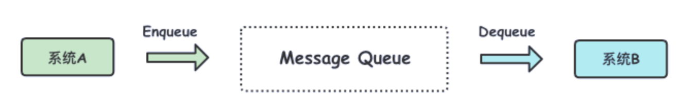
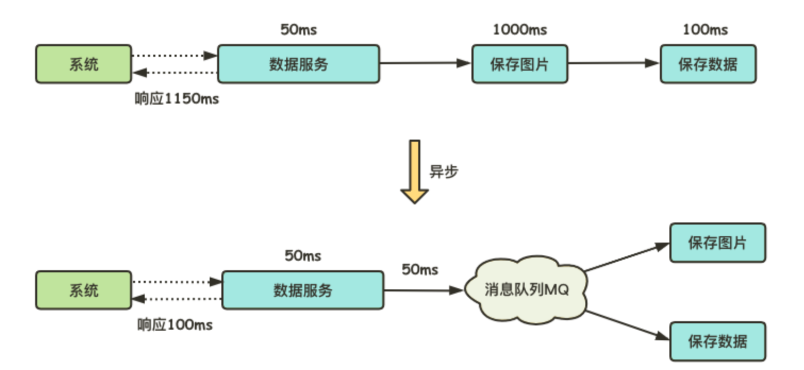
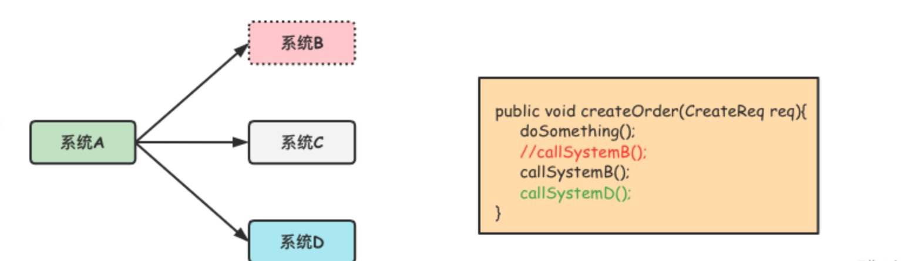
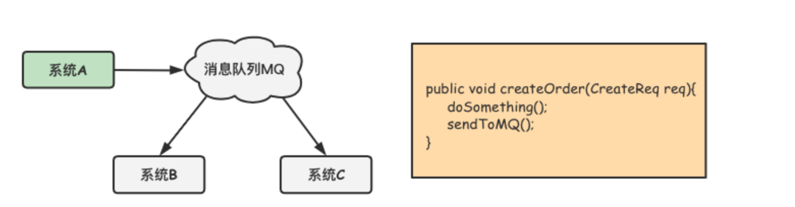
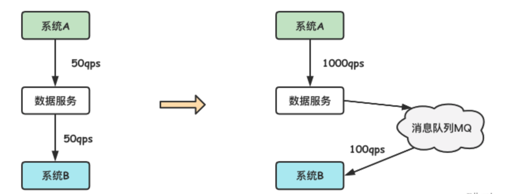
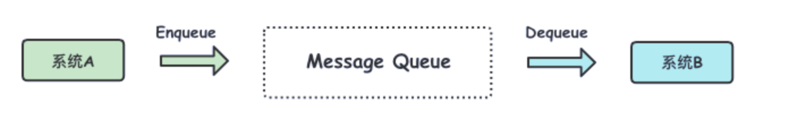
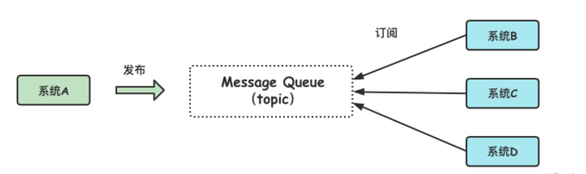
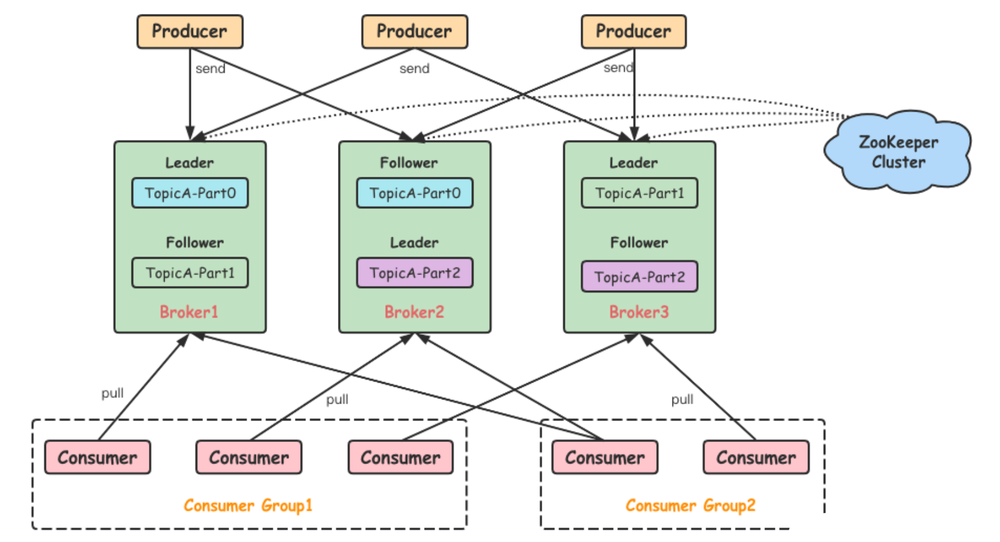
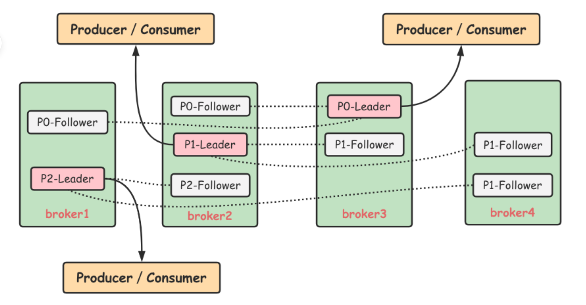

# 消息队列

学习 Kafka 不可避免地要认识下消息队列，也就是我们常提到的 MQ(Message Queue)，因为 Kafka 本质上也是一个消息队列。

### 基本介绍

那么消息队列又是什么呢？先来看一个比较官方的回答。

消息队列是一种进程间通信或者同一个进程中不同线程间的通信方式，主要解决异步处理、应用耦合、流量消峰等问题，实现高性能、高可用、可伸缩和最终一致性架构，是大型分布式系统不可缺少的中间件。

再说的直观点，如下图，系统 A 将消息发布到 MQ，然后系统 B 再从 MQ 取消息。



那么，为什么系统 A 不直接发消息给系统 B ，中间还要隔一个 MQ 呢？这就要看下 MQ 的三个主要功能了。

### 主要功能

##### 异步处理

消息队列提供了异步处理机制，因为很多时候用户并不需要立即响应来处理消息，那么通过这个机制就可以把所有消息放入 MQ 中。比如，某系统发来的数据中包含很多图片信息，如果对其中的信息都进行保存处理，用户一番操作下来可能会很久。采用异步处理之后，系统会将所有数据存放在 MQ 中，用户不需要立即处理，大大缩短了系统的响应时间。



##### 应用解耦

消息队列可以对系统间的依赖进行解耦，降低依赖系统变更带来的影响。比如，用户在下单后，订单系统A需要通知系统B、系统C等做出响应的处理。传统的做法，如下图所示。


此时的系统A是强依赖系统B和系统C的，一旦系统B出现故障或者需要重新加入高耦合的系统D时，就必须要更改系统A的代码。



如果经常出现这种依赖系统迭代的情况，那么系统A就会很难维护，可以通过消息队列对依赖系统进行解耦（如下图），这样系统A也无需关心其他系统的可用性。



##### 流量削峰

流量削峰还有个形象的名字叫做削峰填谷，其实就是指当数据量激增时，能够有效地隔离上下游业务，将上游突增的流量缓存起来，真正地填到谷中，以平滑的方式传到下游系统，避免了流量的不规则冲击。

比如，有个活动页面平时也就 50qps，某一特殊时刻访问量突然增多，能达到 1000qps，但是当前系统的处理能力最多为 100qps，这个时候可以通过消息队列来进行削峰填谷，如下图所示。



当然，Kafka 除了以上 MQ 这些功能之外，还提供了消息顺序性保障、回溯消息、持久化存储等功能，这个在后续文章中会详细讲解。

### 传输模式

消息在 MQ 中有两种传输模型，分别是点对点 (point to point) 和发布/订阅 (publish/subscribe) 模型。

##### 点对点模型

如图所示，系统A发送的消息只能被系统B接收，其他的任何系统都不能获取到系统A发送的消息。在日常生活中就像A拨通了B的电话，其他人是不可能接听到的。



##### 发布/订阅模型

与点对点模型的区别在于发布/订阅模型多了一个 topic 的概念，可以存在多个发布者向相同主题发送消息，而订阅者也可以存在多个，接收相同主题的消息。在日常生活中就像不同主题的报纸期刊，同时也有不同群体的读者来订阅。



那么 Kafka 属于哪种呢，事实上 Kafka 可以同时支持这两种传输模型，这个后面会讲。

# Kafka简介

Apache Kafka是⼀个开源的分布式流系统，该项⽬旨在提供⼀个统⼀的、⾼吞吐量、低延迟的平台，用于处理实时数据流。

它具有以下特点：

* 支持消息的发布与订阅（类似 RabbitMQ、RocketMQ）；
* 支持实时数据处理；
* 能保证消息的可靠投递；
* 支持持久化存储，通过多副本分布式方案保障容错；
* 高吞吐率：单 Broker 可轻松处理数千个分区及每秒百万级消息量。

### 架构组成

Kafka是⼀个数据流系统，允许开发⼈员在新事件发⽣时实时做出反应。Kafka体系结构由存储层和计算层组成。存储层旨在⾼效地存储数据，是⼀个分布式系统，可以轻松地扩展系统以适应增⻓。

计算层由四个核⼼组件组成——⽣产者、消费者、流和连接器API，它们允许Kafka在分布式系统中扩展应⽤程序。

1. ⽣产者（Producer）
2. 消费者（Consumer）
3. 流处理（Streams）
4. 连接器（Connectors）APIs

一个典型的Kafka 系统架构会包括 Producer、broker、Cosumer 等角色，以及一个 ZooKeeper 集群，先上个图。



* Producer：生产者，负责将客户端生产的消息发送到 Kafka 中，可以支持消息的异步发送和批量发送；
* broker：服务代理节点，Kafka 集群中的一台服务器就是一个 broker，可以水平无限扩展，同一个 Topic 的消息可以分布在多个 broker 中；
* Consumer：消费者，通过连接到 Kafka 上来接收消息，用于相应的业务逻辑处理。
* [ZooKeeper](https://www.cnblogs.com/datadance/p/16293445.html)：协调和管理 Kafka 集群的元数据与状态。
* Consumer Group：消费者组，指的是多个消费者共同组成一个组来消费一个 Topic 中的消息。

前面提到 Kafka 同时支持两种消息传输模型，其中实现点对点模型的方式就是引入了 Consumer Group，目的主要是让多个消费者同时消费，可以加速整个消费者端的吞吐量。

> 需要注意的是：一个 Topic 中的一个分区只能被同一个 Consumer Group 中的一个消费者消费，其他消费者不能进行消费。这里的一个消费者，指的是运行消费者应用的进程，也可以是一个线程。

在整个 Kafka 集群中 Producer 将消息发送给 broker，然后 broker 再将接收到的消息存储到磁盘中，然后 Consumer 再从 Broker 订阅并消费消息。ZooKeeper 则是 Kafka 集群用来负责集群元数据的管理、控制器的选举等操作的。

### 重要概念

##### Topic 与 Partition

在 Kafka 中消息是以 Topic 为单位进行归类的，Topic 在逻辑上可以被认为是一个 Queue，Producer 生产的每一条消息都必须指定一个 Topic，然后 Consumer 会根据订阅的 Topic 到对应的 broker 上去拉取消息。

为了提升整个集群的吞吐量，Topic 在物理上还可以细分多个分区，一个分区在磁盘上对应一个文件夹。由于一个分区只属于一个主题，很多时候也会被叫做主题分区(Topic-Partition)。

##### Leader 和 Follower

一个分区会有多个副本，副本之间是一主(Leader)多从(Follower)的关系，Leader 对外提供服务，这里的对外指的是与客户端程序进行交互，而 Follower 只是被动地同步 Leader 而已，不能与外界进行交互。

当然了，你可能知道在很多其他系统中 Follower 是可以对外提供服务的，比如 MySQL 的从库是可以处理读操作的，但是在 Kafka 中 Follower 只负责消息同步，不会对外提供服务。

### 多副本机制

Kafka 为分区引入了多副本机制，同一分区的不同副本中保存的信息是相同的，通过多副本机制实现了故障的自动转移，当集群中某个 broker 失效时仍然能保证服务可用，可以提升容灾能力。

如图所示，Kafka 集群中有4个 broker，某个 Topic 有三个分区，假设副本因子也有设置为3，那么每个分区就会有一个 Leader 和两个 Follower 副本。



副本处于不同 broker 中，生产者与消费者只和 Leader 副本进行交互，而 Follower 副本只负责消息的同步。当 Leader 副本出现故障时，会从 Follower 副本中重新选举新的 Leader 副本对外提供服务。

接下来我们来了解 Kafka 多副本机制中的一些重要术语。

* AR(Assigned Replicas)：一个分区中的所有副本统称为 AR；
* ISR(In-Sync Replicas)：Leader 副本和所有保持一定程度同步的 Follower 副本（包括 Leader 本身）组成 ISR；
* OSR(Out-of-Sync Raplicas)：与 ISR 相反，没有与 Leader 副本保持一定程度同步的所有Follower 副本组成OSR；

首先，生产者会将消息发送给 Leader 副本，然后 Follower 副本才能从 Leader 中拉取消息进行同步，在同一时刻，所有副本中的消息不完全相同，也就是说同步期间，Follower 相对于 Leader 而言会有一定程度上的滞后，当然这个滞后程度是可以通过参数来配置的。

那么，我们就可以厘清了它们三者的关系：AR = ISR + OSR。

Leader 负责维护和跟踪 ISR 集合中所有 Follower 副本的滞后状态，当 Follower 出现滞后太多或者失效时，Leader 将会把它从 ISR 集合中剔除。

当然，如果 OSR 集合中有 Follower 同步范围追上了 Leader，那么 Leader 也会把它从 OSR 集合中转移至 ISR 集合。

一般情况下，当 Leader 发送故障或失效时，只有 ISR 集合中的 Follower 才有资格被选举为新的 Leader，而 OSR 集合中的 Follower 则没有这个机会（不过可以修改参数配置来改变）。

# kafka-go

### 环境准备

这里推荐使用Docker Compose快速搭建一套本地开发环境。

以下 `docker-compose.yml`文件用来搭建一套单节点zookeeper和单节点kafka环境，并且在 `8080`端口提供 `kafka-ui`管理界面。

```yml
version: '2.1'

services:
  zoo1:
    image: confluentinc/cp-zookeeper
    hostname: zoo1
    container_name: zoo1
    ports:
      - "2181:2181"
    environment:
      ZOOKEEPER_CLIENT_PORT: 2181
      ZOOKEEPER_SERVER_ID: 1
      ZOOKEEPER_SERVERS: zoo1:2888:3888

  kafka1:
    image: confluentinc/cp-kafka:7.3.2
    hostname: kafka1
    container_name: kafka1
    ports:
      - "9092:9092"
      - "29092:29092"
      - "9999:9999"
    environment:
      KAFKA_ADVERTISED_LISTENERS: INTERNAL://kafka1:19092,EXTERNAL://${DOCKER_HOST_IP:-127.0.0.1}:9092,DOCKER://host.docker.internal:29092
      KAFKA_LISTENER_SECURITY_PROTOCOL_MAP: INTERNAL:PLAINTEXT,EXTERNAL:PLAINTEXT,DOCKER:PLAINTEXT
      KAFKA_INTER_BROKER_LISTENER_NAME: INTERNAL
      KAFKA_ZOOKEEPER_CONNECT: "zoo1:2181"
      KAFKA_BROKER_ID: 1
      KAFKA_LOG4J_LOGGERS: "kafka.controller=INFO,kafka.producer.async.DefaultEventHandler=INFO,state.change.logger=INFO"
      KAFKA_OFFSETS_TOPIC_REPLICATION_FACTOR: 1
      KAFKA_TRANSACTION_STATE_LOG_REPLICATION_FACTOR: 1
      KAFKA_TRANSACTION_STATE_LOG_MIN_ISR: 1
      KAFKA_JMX_PORT: 9999
      KAFKA_JMX_HOSTNAME: ${DOCKER_HOST_IP:-127.0.0.1}
      KAFKA_AUTHORIZER_CLASS_NAME: kafka.security.authorizer.AclAuthorizer
      KAFKA_ALLOW_EVERYONE_IF_NO_ACL_FOUND: "true"
    depends_on:
      - zoo1
  kafka-ui:
    container_name: kafka-ui
    image: provectuslabs/kafka-ui:latest
    ports:
      - 8080:8080
    depends_on:
      - kafka1
    environment:
      DYNAMIC_CONFIG_ENABLED: "TRUE"

```

将上述 `docker-compose.yml`文件在本地保存，在同一目录下执行以下命令启动容器。

```bash
docker-compose up -d
```

容器启动后，使用浏览器打开[127.0.0.1:8080](http://127.0.0.1:8080/) 即可看到 `kafka-ui` 界面，配置kafka服务连接信息。

### 安装依赖

执行以下命令下载 kafka-go依赖。

```bash
go get github.com/segmentio/kafka-go
```

### 使用指南

kafka-go 提供了两套与Kafka交互的API。

* 低级别（ low-level）：基于与 Kafka 服务器的原始网络连接实现。
* 高级别（high-level）：对于常用读写操作封装了一套更易用的API。

通常建议直接使用高级别的交互API。

##### Connection

[Conn](https://pkg.go.dev/github.com/segmentio/kafka-go#Conn) 类型是 `kafka-go` 包的核心。它代表与 Kafka broker之间的连接。基于它实现了一套与Kafka交互的低级别 API。

##### Reader

`Reader`是由 `kafka-go` 包提供的另一个概念，对于从单个主题-分区（topic-partition）消费消息这种典型场景，使用它能够简化代码。Reader 还实现了自动重连和偏移量管理，并支持使用 Context 支持异步取消和超时的 API。

**注意：** 当进程退出时，必须在 `Reader` 上调用 `Close()` 。Kafka服务器需要一个优雅的断开连接来阻止它继续尝试向已连接的客户端发送消息。如果进程使用 SIGINT (shell 中的 Ctrl-C)或 SIGTERM (如 docker stop 或 kubernetes start)终止，那么下面给出的示例不会调用 `Close()`。当同一topic上有新Reader连接时，可能导致延迟(例如，新进程启动或新容器运行)。在这种场景下应使用 `signal.Notify`处理程序在进程关闭时关闭Reader。

###### 消费消息

下面的代码演示了如何使用Reader连接至Kafka消费消息。

```go
// readByReader 通过Reader接收消息
func readByReader() {
	// 创建Reader
	r := kafka.NewReader(kafka.ReaderConfig{
		Brokers:   []string{"localhost:9092", "localhost:9093", "localhost:9094"},
		Topic:     "topic-A",
		Partition: 0,
		MaxBytes:  10e6, // 10MB
	})
	r.SetOffset(42) // 设置Offset

	// 接收消息
	for {
		m, err := r.ReadMessage(context.Background())
		if err != nil {
			break
		}
		fmt.Printf("message at offset %d: %s = %s\n", m.Offset, string(m.Key), string(m.Value))
	}

	// 程序退出前关闭Reader
	if err := r.Close(); err != nil {
		log.Fatal("failed to close reader:", err)
	}
}
```

###### 消费者组

`kafka-go`支持消费者组，包括broker管理的offset。要启用消费者组，只需在 `ReaderConfig` 中指定 `GroupID`。

使用消费者组时，ReadMessage 会自动提交偏移量。

```go
// 创建一个reader，指定GroupID，从 topic-A 消费消息
r := kafka.NewReader(kafka.ReaderConfig{
	Brokers:  []string{"localhost:9092", "localhost:9093", "localhost:9094"},
	GroupID:  "consumer-group-id", // 指定消费者组id
	Topic:    "topic-A",
	MaxBytes: 10e6, // 10MB
})

// 接收消息
for {
	m, err := r.ReadMessage(context.Background())
	if err != nil {
		break
	}
	fmt.Printf("message at topic/partition/offset %v/%v/%v: %s = %s\n", m.Topic, m.Partition, m.Offset, string(m.Key), string(m.Value))
}

// 程序退出前关闭Reader
if err := r.Close(); err != nil {
	log.Fatal("failed to close reader:", err)
}
```

在使用消费者组时会有以下限制：

* `(*Reader).SetOffset` 当设置了GroupID时会返回错误
* `(*Reader).Offset` 当设置了GroupID时会永远返回 `-1`
* `(*Reader).Lag` 当设置了GroupID时会永远返回 `-1`
* `(*Reader).ReadLag` 当设置了GroupID时会返回错误
* `(*Reader).Stats` 当设置了GroupID时会返回一个 `-1`的分区

###### 显式提交

`kafka-go` 也支持显式提交。当需要显式提交时不要调用 `ReadMessage`，而是调用 `FetchMessage`获取消息，然后调用 `CommitMessages` 显式提交。

```go
ctx := context.Background()
for {
    // 获取消息
    m, err := r.FetchMessage(ctx)
    if err != nil {
        break
    }
    // 处理消息
    fmt.Printf("message at topic/partition/offset %v/%v/%v: %s = %s\n", m.Topic, m.Partition, m.Offset, string(m.Key), string(m.Value))
    // 显式提交
    if err := r.CommitMessages(ctx, m); err != nil {
        log.Fatal("failed to commit messages:", err)
    }
}
```

在消费者组中提交消息时，具有给定主题/分区的最大偏移量的消息确定该分区的提交偏移量的值。例如，如果通过调用 `FetchMessage` 获取了单个分区的偏移量为 1、2 和 3 的消息，则使用偏移量为3的消息调用 `CommitMessages` 也将导致该分区的偏移量为 1 和 2 的消息被提交。

###### 管理提交间隔

默认情况下，调用 `CommitMessages`将同步向Kafka提交偏移量。为了提高性能，可以在ReaderConfig中设置CommitInterval来定期向Kafka提交偏移。

```go
// 创建一个reader从 topic-A 消费消息
r := kafka.NewReader(kafka.ReaderConfig{
    Brokers:        []string{"localhost:9092", "localhost:9093", "localhost:9094"},
    GroupID:        "consumer-group-id",
    Topic:          "topic-A",
    MaxBytes:       10e6, // 10MB
    CommitInterval: time.Second, // 每秒刷新一次提交给 Kafka
})
```

##### Writer

向Kafka发送消息，除了使用基于 `Conn`的低级API，`kafka-go`包还提供了更高级别的 Writer 类型。大多数情况下使用 `Writer`即可满足条件，它支持以下特性。

* 对错误进行自动重试和重新连接。
* 在可用分区之间可配置的消息分布。
* 向Kafka同步或异步写入消息。
* 使用Context的异步取消。
* 关闭时清除挂起的消息以支持正常关闭。
* 在发布消息之前自动创建不存在的topic。

###### 发送消息

```go
// 创建一个writer 向topic-A发送消息
w := &kafka.Writer{
	Addr:         kafka.TCP("localhost:9092", "localhost:9093", "localhost:9094"),
	Topic:        "topic-A",
	Balancer:     &kafka.LeastBytes{}, // 指定分区的balancer模式为最小字节分布
	RequiredAcks: kafka.RequireAll,    // ack模式
	Async:        true,                // 异步
}

err := w.WriteMessages(context.Background(),
	kafka.Message{
		Key:   []byte("Key-A"),
		Value: []byte("Hello World!"),
	},
	kafka.Message{
		Key:   []byte("Key-B"),
		Value: []byte("One!"),
	},
	kafka.Message{
		Key:   []byte("Key-C"),
		Value: []byte("Two!"),
	},
)
if err != nil {
    log.Fatal("failed to write messages:", err)
}

if err := w.Close(); err != nil {
    log.Fatal("failed to close writer:", err)
}
```

###### 创建不存在的topic

如果给Writer配置了 `AllowAutoTopicCreation:true`，那么当发送消息至某个不存在的topic时，则会自动创建topic。

```go
w := &Writer{
    Addr:                   kafka.TCP("localhost:9092", "localhost:9093", "localhost:9094"),
    Topic:                  "topic-A",
    AllowAutoTopicCreation: true,  // 自动创建topic
}

messages := []kafka.Message{
    {
        Key:   []byte("Key-A"),
        Value: []byte("Hello World!"),
    },
    {
        Key:   []byte("Key-B"),
        Value: []byte("One!"),
    },
    {
        Key:   []byte("Key-C"),
        Value: []byte("Two!"),
    },
}

var err error
const retries = 3
// 重试3次
for i := 0; i < retries; i++ {
    ctx, cancel := context.WithTimeout(context.Background(), 10*time.Second)
    defer cancel()
  
    err = w.WriteMessages(ctx, messages...)
    if errors.Is(err, LeaderNotAvailable) || errors.Is(err, context.DeadlineExceeded) {
        time.Sleep(time.Millisecond * 250)
        continue
    }

    if err != nil {
        log.Fatalf("unexpected error %v", err)
    }
    break
}

// 关闭Writer
if err := w.Close(); err != nil {
    log.Fatal("failed to close writer:", err)
}
```

###### 写入多个topic

通常，`WriterConfig.Topic`用于初始化单个topic的Writer。通过去掉WriterConfig中的Topic配置，分别设置每条消息的 `message.topic`，可以实现将消息发送至多个topic。

```go
w := &kafka.Writer{
	Addr:     kafka.TCP("localhost:9092", "localhost:9093", "localhost:9094"),
    // 注意: 当此处不设置Topic时,后续的每条消息都需要指定Topic
	Balancer: &kafka.LeastBytes{},
}

err := w.WriteMessages(context.Background(),
    // 注意: 每条消息都需要指定一个 Topic, 否则就会报错
	kafka.Message{
        Topic: "topic-A",
		Key:   []byte("Key-A"),
		Value: []byte("Hello World!"),
	},
	kafka.Message{
        Topic: "topic-B",
		Key:   []byte("Key-B"),
		Value: []byte("One!"),
	},
	kafka.Message{
        Topic: "topic-C",
		Key:   []byte("Key-C"),
		Value: []byte("Two!"),
	},
)
if err != nil {
    log.Fatal("failed to write messages:", err)
}

if err := w.Close(); err != nil {
    log.Fatal("failed to close writer:", err)
}
```

注意：Writer中的Topic和Message中的Topic是互斥的，同一时刻有且只能设置一处。

# 参考文章

[一文带你搞懂 Kafka 的系统架构（深度好文，值得收藏） - Data跳动 - 博客园](https://www.cnblogs.com/datadance/p/16292991.html)

[go操作kafka | 李文周的博客](https://www.liwenzhou.com/posts/Go/kafka/)
