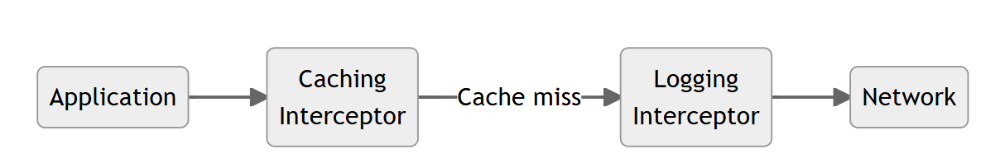
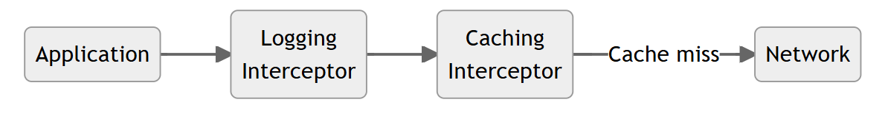

# RPC

### 基本介绍

RPC（Remote Procedure Call），即远程过程调用。它允许像调用本地服务一样调用远程服务。

RPC是一种服务器-客户端（Client/Server）模式，经典实现是一个通过发送请求-接受回应进行信息交互的系统。

RPC是为了解决类似远程、跨内存空间的函数/方法的调用而产生的。


要实现RPC就需要解决以下三个问题：

* 如何确定要执行的函数？ 在本地调用中，函数主体通过函数指针函数指定，然后调用 add 函数，编译器通过函数指针函数自动确定 add 函数在内存中的位置。但是在 RPC 中，调用不能通过函数指针完成，因为它们的内存地址可能完全不同。因此，调用方和被调用方都需要维护一个{ function <-> ID }映射表，以确保调用正确的函数。
* 如何表达参数？ 本地过程调用中传递的参数是通过堆栈内存结构实现的，但 RPC 不能直接使用内存传递参数，因此参数或返回值需要在传输期间序列化并转换成字节流，反之亦然。
* 如何进行网络传输？ 函数的调用方和被调用方通常是通过网络连接的，也就是说，function ID 和序列化字节流需要通过网络传输，因此，只要能够完成传输，调用方和被调用方就不受某个网络协议的限制。.例如，一些 RPC 框架使用 TCP 协议，一些使用 HTTP。

### 原理介绍

RPC 让远程调用就像本地调用一样，其调用过程可拆解为以下步骤。


```
① 服务调用方（client）以本地调用方式调用服务
② client stub接收到调用后负责将方法、参数等组装成能够进行网络传输的消息体
③ client stub找到服务地址，并将消息发送到服务端④ server 端接收到消息
⑤ server stub收到消息后进行解码
⑥ server stub根据解码结果调用本地的服务
⑦ 本地服务执行并将结果返回给server stub
⑧ server stub将返回结果打包成能够进行网络传输的消息体
⑨ 按地址将消息发送至调用方
⑩ client 端接收到消息
⑪ client stub收到消息并进行解码
⑫ 调用方得到最终结果
```

使用RPC框架的目标是只需要关心第1步和最后1步，中间的其他步骤统统封装起来，让使用者无需关心。例如社区中各式RPC框架（grpc、thrift等）就是为了让RPC调用更方便。

# gRPC

### 基本介绍

`gRPC`是一种现代化开源的高性能RPC框架，能够运行于任意环境之中。最初由谷歌进行开发。它使用HTTP/2作为传输协议。

在gRPC里，客户端可以像调用本地方法一样直接调用其他机器上的服务端应用程序的方法，帮助你更容易创建分布式应用程序和服务。与许多RPC系统一样，gRPC是基于定义一个服务，指定一个可以远程调用的带有参数和返回类型的的方法。在服务端程序中实现这个接口并且运行gRPC服务处理客户端调用。在客户端，有一个stub提供和服务端相同的方法。


使用gRPC， 我们可以一次性的在一个 `.proto`文件中定义服务并使用任何支持它的语言去实现客户端和服务端，反过来，它们可以应用在各种场景中，从Google的服务器到你自己的平板电脑—— gRPC帮你解决了不同语言及环境间通信的复杂性。使用 `protocol buffers`还能获得其他好处，包括高效的序列化，简单的IDL以及容易进行接口更新。总之一句话，使用gRPC能让我们更容易编写跨语言的分布式代码。

> IDL（Interface description language）是指接口描述语言，是用来描述软件组件接口的一种计算机语言，是跨平台开发的基础。IDL通过一种中立的方式来描述接口，使得在不同平台上运行的对象和用不同语言编写的程序可以相互通信交流；比如，一个组件用C++写成，另一个组件用Go写成。

### 前置准备

学习gRPC之前要下载gRPC、protobuf和相关插件，还要[了解protobuf的基本语法](https://github.com/STAR0903/note/blob/main/Go/%E5%BE%AE%E6%9C%8D%E5%8A%A1/protobuf.md)。

### 快速入门

gRPC开发分三步：编写 `.proto`文件  --->  `protoc` 命令生成代码  --->  编写业务逻辑代码

##### 编写proto代码

`Protocol Buffers`是一种与语言无关，平台无关的可扩展机制，用于序列化结构化数据。使用 `Protocol Buffers`可以一次定义结构化的数据，然后可以使用特殊生成的源代码轻松地在各种数据流中使用各种语言编写和读取结构化数据。

```protobuf
// 版本声明，使用Protocol Buffers v3版本
syntax = "proto3"; 

// 指定生成的Go代码在你项目中的导入路径
option go_package = "xx"; 

// 包名
package pb; 

// 定义服务
service Greeter {
    rpc SayHello (HelloRequest) returns (HelloResponse) {}
}

// 请求消息
message HelloRequest {
    string name = 1;
}

// 响应消息
message HelloResponse {
    string reply = 1;
}
```

##### Server端Go代码

我们新建一个 `hello_server`项目，在项目根目录下执行 `go mod init hello_server`。

再新建一个 `pb`文件夹，将上面的 proto 文件保存为 `hello.proto`，将 `go_package`按如下方式修改。

```protobuf
option go_package = "hello_server/pb";
```

此时，项目的目录结构为：

```bash
hello_server
├── go.mod
├── go.sum
├── main.go
└── pb
    └── hello.proto
```

在项目根目录下执行以下命令，根据 `hello.proto`生成 go 源码文件。

```bash
protoc --go_out=. --go_opt=paths=source_relative --go-grpc_out=. --go-grpc_opt=paths=source_relative pb/hello.proto
```

生成后的go源码文件会保存在pb文件夹下。

```bash
hello_server
├── go.mod
├── go.sum
├── main.go
└── pb
    ├── hello.pb.go
    ├── hello.proto
    └── hello_grpc.pb.go
```

将下面的内容添加到 `hello_server/main.go`中。

```go
package main

import (
	"context"
	"fmt"
	"hello_server/pb"
	"net"

	"google.golang.org/grpc"
)

// hello server

type server struct {
	pb.UnimplementedGreeterServer
}

func (s *server) SayHello(ctx context.Context, in *pb.HelloRequest) (*pb.HelloResponse, error) {
	return &pb.HelloResponse{Reply: "Hello " + in.Name}, nil
}

func main() {
	// 监听本地的8972端口
	lis, err := net.Listen("tcp", ":8972")
	if err != nil {
		fmt.Printf("failed to listen: %v", err)
		return
	}
	// 创建gRPC服务器
	s := grpc.NewServer()   
	// 在gRPC服务端注册服务
	pb.RegisterGreeterServer(s, &server{}) 
	// 启动服务
	err = s.Serve(lis)
	if err != nil {
		fmt.Printf("failed to serve: %v", err)
		return
	}
}
```

##### Client端Go代码

我们新建一个 `hello_client`项目，在项目根目录下执行 `go mod init hello_client`。

再新建一个 `pb`文件夹，将上面的 proto 文件保存为 `hello.proto`，将 `go_package`按如下方式修改。

```protobuf
option go_package = "hello_client/pb";
```

在项目根目录下执行以下命令，根据 `hello.proto`在 `http_client`项目下生成 go 源码文件。

```bash
protoc --go_out=. --go_opt=paths=source_relative --go-grpc_out=. --go-grpc_opt=paths=source_relative pb/hello.proto
```

此时，项目的目录结构为：

```bash
http_client
├── go.mod
├── go.sum
├── main.go
└── pb
    ├── hello.pb.go
    ├── hello.proto
    └── hello_grpc.pb.go
```

在 `http_client/main.go`文件中按下面的代码调用 `http_server`提供的 `SayHello` RPC服务。

```go
package main

import (
	"context"
	"flag"
	"log"
	"time"

	"hello_client/pb"

	"google.golang.org/grpc"
	"google.golang.org/grpc/credentials/insecure"
)

// hello_client

const (
	defaultName = "world"
)

var (
	addr = flag.String("addr", "127.0.0.1:8972", "the address to connect to")
	name = flag.String("name", defaultName, "Name to greet")
)

func main() {
	flag.Parse()
	// 连接到server端，此处禁用安全传输
	conn, err := grpc.NewClient(*addr, grpc.WithTransportCredentials(insecure.NewCredentials()))
	if err != nil {
		log.Fatalf("did not connect: %v", err)
	}
	defer conn.Close()
	c := pb.NewGreeterClient(conn)

	// 执行RPC调用并打印收到的响应数据
	ctx, cancel := context.WithTimeout(context.Background(), time.Second)
	defer cancel()
	r, err := c.SayHello(ctx, &pb.HelloRequest{Name: *name})
	if err != nil {
		log.Fatalf("could not greet: %v", err)
	}
	log.Printf("Greeting: %s", r.GetReply())
}
```

### 流式示例

在上面的示例中，客户端发起了一个RPC请求到服务端，服务端进行业务处理并返回响应给客户端，这是gRPC最基本的一种工作方式（Unary RPC）。除此之外，依托于HTTP2，gRPC还支持流式RPC（Streaming RPC）。

```go
type ServerStream interface {
	// ... 省略部分metadata内容

	// Context 返回该流的上下文。
	Context() context.Context

	// SendMsg 发送消息。发生错误时，SendMsg 将中止流并直接返回错误。
	//
	// SendMsg 阻塞直到满足以下条件之一：
	//   - 有足够的流量控制配额将消息 m 调度到传输层
	//   - 流结束
	//   - 流中断
	//
	// SendMsg 不等待客户端接收消息。流的不适时关闭可能导致消息丢失。
	//
	// 安全使用场景：
	//   - 同一流上可一个 goroutine 调用 SendMsg，另一个 goroutine 调用 RecvMsg
	// 不安全场景：
	//   - 不同 goroutine 在同一流上调用 SendMsg
	//   - 调用 SendMsg 后修改消息（跟踪库和统计处理器可能延迟使用消息）
	SendMsg(m any) error

	// RecvMsg 阻塞直到接收到消息到 m 或流结束。
	// 当客户端调用 CloseSend 时将返回 io.EOF。
	// 任何非 EOF 错误都会中止流，并携带 RPC 状态信息。
	//
	// 安全使用场景：
	//   - 同一流上可一个 goroutine 调用 SendMsg，另一个 goroutine 调用 RecvMsg
	// 不安全场景：
	//   - 不同 goroutine 在同一流上调用 RecvMsg
	RecvMsg(m any) error
}
```

```go
type ClientStream interface {
	// ... 省略部分metadata内容

	// CloseSend 关闭流的发送方向。当遇到非 nil 错误时将关闭流。
	// 禁止与 SendMsg 并发调用该方法。
	CloseSend() error

	// Context 返回该流的上下文。
	//
	// 调用时机限制：
	//   - 必须在 Header 或 RecvMsg 返回后调用
	//   - 调用后将禁用客户端重试机制
	Context() context.Context

	// SendMsg 通常由生成的代码调用。出错时将中止流：
	//   - 客户端产生的错误直接返回状态
	//   - 服务端错误返回 io.EOF，需通过 RecvMsg 获取流状态
	//   - 对于一元或服务端流式 RPC（StreamDesc.ClientStreams=false）无条件返回 nil
	//
	// 阻塞条件：
	//   - 有足够流量控制配额调度消息 m
	//   - 流结束
	//   - 流中断
	//
	// 注意：
	//   - 不等待服务端接收，不当关闭可能导致消息丢失
	//   - 需通过 RecvMsg 确认 RPC 完成以保证消息投递
	//
	// 并发安全：
	//   √ 同一流上不同 goroutine 分别调用 SendMsg 和 RecvMsg
	//   × 不同 goroutine 调用同一流的 SendMsg
	//   × 与 CloseSend 并发调用
	//
	// 调用后禁止修改消息（跟踪库和统计处理器可能延迟使用）
	SendMsg(m any) error

	// RecvMsg 阻塞直到接收消息到 m 或流结束。
	// 流成功完成时返回 io.EOF，其他错误表示流中止并携带 RPC 状态。
	//
	// 并发安全：
	//   √ 同一流上不同 goroutine 分别调用 SendMsg 和 RecvMsg
	//   × 不同 goroutine 调用同一流的 RecvMsg
	RecvMsg(m any) error
}
```

##### 服务端流式RPC

客户端发出一个RPC请求，服务端与客户端之间建立一个单向的流，服务端可以向流中写入多个响应消息，最后主动关闭流；而客户端需要监听这个流，不断获取响应直到流关闭。应用场景举例：客户端向服务端发送一个股票代码，服务端就把该股票的实时数据源源不断的返回给客户端。

```go
// ServerStreamingServer 
// ServerStreamingServer 表示服务端流式 RPC（单请求，多响应）的服务端接口。
// 泛型参数 Res 为响应消息类型，用于生成的代码。
type ServerStreamingServer[Res any] interface {
	// Send 向客户端发送响应消息。服务端处理程序可多次调用以发送多个消息。
	// 返回值说明：
	//   - 非 nil 错误表示流异常终止
	//   - 出现错误后应立即返回，流将不可用
	Send(*Res) error

	// 内嵌 ServerStream 以提供以下功能：
	//   - Context() 获取上下文
	//   - SetHeader()/SendHeader() 设置头部
	//   - SetTrailer() 设置尾部
	// 注意：禁止直接调用 ServerStream 的其他方法
	ServerStream
}


// ServerStreamingClient 
// ServerStreamingClient 表示服务端流式 RPC（单请求，多响应）的客户端接口。
// 泛型参数 Res 为响应消息类型，用于生成的代码。
type ServerStreamingClient[Res any] interface {
	// Recv 从服务端接收下一个响应消息。客户端可重复调用该方法读取响应流。
	// 返回值说明：
	//   - io.EOF 表示流已正常终止（OK 状态）
	//   - 其他错误携带 RPC 状态码和消息（与 status 包兼容）
	Recv() (*Res, error)

	// 内嵌 ClientStream 以提供以下功能：
	//   - Context() 获取上下文
	//   - Header()/Trailer() 获取元数据
	// 注意：禁止直接调用 ClientStream 的其他方法
	ClientStream
}
// 终止响应流的正确方式：
//   - 从处理程序方法返回时：
//     * 返回 status 包的错误类型以指定状态码
//     * 返回 nil 表示 OK 状态码

```

我们在此编写一个使用多种语言打招呼的方法，客户端发来一个用户名，服务端分多次返回打招呼的信息。

1.定义服务

```protobuf
// 服务端返回流式数据
rpc LotsOfReplies(HelloRequest) returns (stream HelloResponse);
```

同步修改客户端和服务端的 `.proto`文件后，需要重新使用 protocol buffers编译器生成客户端和服务端代码。

2.服务端需要实现 `LotsOfReplies` 方法。

```go
func (s *server) LotsOfReplies(in *pb.HelloRequest, stream pb.Greeter_LotsOfRepliesServer) error {
	words := []string{
		"你好",
		"hello",
		"こんにちは",
		"안녕하세요",
	}

	for _, word := range words {
		res := &pb.HelloResponse{
			Reply: fmt.Sprintf("%v,%v", word, in.Name),
		}
		if err := stream.Send(res); err != nil {
			return err
		}
	}

	return nil
}
```

3.客户端调用 `LotsOfReplies` 并将收到的数据依次打印出来。

```go
func runLotsOfReplies(c pb.GreeterClient) {
	// server端流式
	ctx, cancel := context.WithTimeout(context.Background(), time.Second)
	defer cancel()

	stream, err := c.LotsOfReplies(ctx, &pb.HelloRequest{Name: *name})
	if err != nil {
		log.Fatalf("c.LotsOfReplies failed:%v", err)
	}

	for {
		res, err := stream.Recv()
		if err == io.EOF {
			break
		} else if err != nil {
			log.Fatalf("c.LotsOfReplies failed:%v", err)
		}
		log.Printf("res:%v", res.Reply)
	}

}
```

执行程序后会得到如下输出结果。

```bash
2025/04/14 23:13:09 res:你好,star
2025/04/14 23:13:09 res:hello,star
2025/04/14 23:13:09 res:こんにちは,star
2025/04/14 23:13:09 res:안녕하세요,star
```

##### 客户端流式RPC

客户端传入多个请求对象，服务端返回一个响应结果。典型的应用场景举例：物联网终端向服务器上报数据、大数据流式计算等。

```go
// ClientStreamingServer 
// ClientStreamingServer 表示客户端流式 RPC（多请求，单响应）的服务端接口。
// 泛型参数：
//   - Req 为请求消息类型
//   - Res 为响应消息类型
type ClientStreamingServer[Req any, Res any] interface {
	// Recv 接收来自客户端的下一个请求消息。返回值说明：
	//   - io.EOF 表示客户端已调用 CloseAndRecv
	//   - 其他错误表示流异常终止，应立即返回
	Recv() (*Req, error)

	// SendAndClose 发送单个响应并关闭流。调用规则：
	//   - 必须在处理完所有请求后调用且仅调用一次
	//   - 调用后禁止继续调用 Recv
	SendAndClose(*Res) error

	// 内嵌 ServerStream 以提供以下功能：
	//   - Context() 获取上下文
	//   - SetHeader()/SendHeader() 设置头部
	//   - SetTrailer() 设置尾部
	// 注意：禁止直接调用 ServerStream 的其他方法
	ServerStream
}
// 终止 RPC 的正确方式：
//   - 方式一：调用 SendAndClose 并返回 nil
//   - 方式二：不调用 SendAndClose 并返回 status 包的错误


// ClientStreamingClient ¶
// ClientStreamingClient 表示客户端流式 RPC（多请求，单响应）的客户端接口。
// 泛型参数：
//   - Req 为请求消息类型
//   - Res 为响应消息类型
type ClientStreamingClient[Req any, Res any] interface {
	// Send 向服务端发送请求消息。客户端可多次调用以发送多个消息。
	// 错误处理：
	//   - 出错时中止流
	//   - 客户端错误直接返回状态
	//   - 服务端错误返回 io.EOF，需通过 CloseAndRecv 获取流状态
	Send(*Req) error

	// CloseAndRecv 关闭请求流并等待服务端响应。调用规则：
	//   - 必须在发送完所有请求后调用且仅调用一次
	//   - 返回错误与 status 包兼容
	CloseAndRecv() (*Res, error)

	// 内嵌 ClientStream 以提供以下功能：
	//   - Context() 获取上下文
	//   - Header()/Trailer() 获取元数据
	// 注意：禁止直接调用 ClientStream 的其他方法
	ClientStream
}
```

在这个示例中，我们编写一个多次发送人名，服务端统一返回一个打招呼消息的程序。

1.定义服务

```protobuf
// 客户端发送流式数据
rpc LotsOfGreetings(stream HelloRequest) returns (HelloResponse);
```

同步修改客户端和服务端的 `.proto`文件后，需要重新使用 protocol buffers编译器生成客户端和服务端代码。

2.服务端实现 `LotsOfGreetings`方法。

```go
// LotsOfGreetings 接收流式数据
func (s *server) LotsOfGreetings(stream pb.Greeter_LotsOfGreetingsServer) error {
	reply := "hello:"
	for {
		req, err := stream.Recv()
		if err == io.EOF {
			return stream.SendAndClose(&pb.HelloResponse{Reply: reply})
		} else if err != nil {
			return err
		}
		reply = fmt.Sprintf("%v %v", reply, req.Name)
	}
}
```

3.客户端调用 `LotsOfGreetings`方法，向服务端发送流式请求数据，接收返回值并打印。

```go
func runLotsOfGreetings(c pb.GreeterClient) {

	ctx, cancle := context.WithTimeout(context.Background(), time.Second)
	defer cancle()

	stream, err := c.LotsOfGreetings(ctx)
	if err != nil {
		log.Fatalf("c.LotsOfGreetings failed:%v", err)
	}

	list := []string{"star", "for", "qaq", "www"}
	for _, v := range list {
		err = stream.Send(&pb.HelloRequest{Name: v})
		if err != nil {
			log.Fatalf("c.LotsOfGreetings failed to send %v:%v", v, err)
		}
	}
	res, err := stream.CloseAndRecv()
	if err != nil {
		log.Fatalf("c.LotsOfGreetings failed:%v", err)
	}
	log.Println(res.Reply)
}
```

执行上述函数将得到如下数据结果。

```bash
2025/04/14 23:13:09 hello: star for qaq www
```

##### 双向流式RPC

双向流式RPC即客户端和服务端均为流式的RPC，能发送多个请求对象也能接收到多个响应对象。典型应用示例：聊天应用等。

```go
// BidiStreamingServer 
// BidiStreamingServer 表示双向流式 RPC（多请求，多响应）的服务端接口。
// 泛型参数：
//   - Req 为请求消息类型
//   - Res 为响应消息类型
type BidiStreamingServer[Req any, Res any] interface {
	// Recv 接收来自客户端的下一个请求消息。返回值说明：
	//   - io.EOF 表示客户端已调用 CloseSend
	//   - 其他错误表示流异常终止，应立即返回
	Recv() (*Req) error

	// Send 向客户端发送响应消息。服务端可多次调用以发送多个消息。
	// 错误处理：
	//   - 非 nil 错误表示流异常终止
	//   - 出现错误后应立即返回，流将不可用
	Send(*Res) error

	// 内嵌 ServerStream 以提供以下功能：
	//   - Context() 获取上下文
	//   - SetHeader()/SendHeader() 设置头部
	//   - SetTrailer() 设置尾部
	// 注意：禁止直接调用 ServerStream 的其他方法
	ServerStream
}
// 终止流的正确方式：
//   - 从处理程序方法返回时：
//     * 返回 status 包的错误类型以指定状态码
//     * 返回 nil 表示 OK 状态码


// BidiStreamingClient ¶
// BidiStreamingClient 表示双向流式 RPC（多请求，多响应）的客户端接口。
// 泛型参数：
//   - Req 为请求消息类型
//   - Res 为响应消息类型
type BidiStreamingClient[Req any, Res any] interface {
	// Send 向服务端发送请求消息。客户端可多次调用以发送多个消息。
	// 错误处理：
	//   - 出错时中止流
	//   - 客户端错误直接返回状态
	//   - 服务端错误返回 io.EOF，需通过 Recv 获取流状态
	Send(*Req) error

	// Recv 接收来自服务端的下一个响应消息。客户端可重复调用以读取响应流。
	// 返回值说明：
	//   - io.EOF 表示流已正常终止（OK 状态）
	//   - 其他错误携带 RPC 状态码和消息（与 status 包兼容）
	Recv() (*Res, error)

	// 内嵌 ClientStream 以提供以下功能：
	//   - Context() 获取上下文
	//   - Header()/Trailer() 获取元数据
	//   - CloseSend() 关闭发送端
	// 注意：禁止直接调用 ClientStream 的其他方法
	ClientStream
}
```

我们这里还是编写一个客户端和服务端进行预言游戏的双向流式RPC示例。

1.定义服务

```protobuf
// 双向流式数据
rpc BidiHello(stream HelloRequest) returns (stream HelloResponse);
```

同步修改客户端和服务端的 `.proto`文件后，需要重新使用 protocol buffers编译器生成客户端和服务端代码。

2.服务端实现 `BidiHello`方法。

```go
func (s *server) BidiHello(stream pb.Greeter_BidiHelloServer) error {
	// 读取请求-->返回响应
	for {
		req, err := stream.Recv()
		if err == io.EOF {
			return nil
		} else if err != nil {
			return err
		}
		res := &pb.HelloResponse{Reply: magic(req.Name)}
		if err := stream.Send(res); err != nil {
			return err
		}
	}
}
```

3.客户端调用 `BidiHello`方法，一边从终端获取输入的请求数据发送至服务端，一边从服务端接收流式响应。

```go
func runBidiHello(c pb.GreeterClient) {
	ctx, cancle := context.WithTimeout(context.Background(), 3*time.Minute)
	defer cancle()

	stream, err := c.BidiHello(ctx)
	if err != nil {
		log.Fatalf("runBidiHello failed:%v", err)
	}

	var wg sync.WaitGroup
	wg.Add(1)
	// 流式收取响应
	go func() {
		defer wg.Done()
		for {
			res, err := stream.Recv()
			if err == io.EOF {
				return
			} else if err != nil {
				log.Fatalf("runBidiHello failed to Recv Response:%v", err)
			}
			fmt.Println(res.Reply)
		}
	}()

	// 流式发送
	reader := bufio.NewReader(os.Stdin) // 从标准输入生成读对象
	for {
		cmd, _ := reader.ReadString('\n') // 读到换行
		cmd = strings.TrimSpace(cmd)
		if len(cmd) == 0 {
			continue
		}
		if strings.ToUpper(cmd) == "QUIT" {
			break
		}

		err := stream.Send(&pb.HelloRequest{Name: cmd})
		if err != nil {
			log.Fatalf("runBidiHello failed to Send Request:%v", err)
		}
	}
	stream.CloseSend()
	wg.Wait()
}
```

将服务端和客户端的代码都运行起来，就可以实现简单的预言程序了。

```bash
www
To www: 当冬日的河流向北，石头上将长出第三只眼睛。记住：流动的从不只是水。
qaq
To qaq: 你追逐的镜中之花终将枯萎，但低头时，会发现根须早已穿透你的掌心。
star
To star: 你追逐的镜中之花终将枯萎，但低头时，会发现根须早已穿透你的掌心。
mmm
To mmm: 水与火的契约终将破裂，但灰烬中会诞生新的语言——说真话者将失去面具，戴面具者将失去声音。
quit
```

##### 流的关闭

1.服务端流式

* 服务端完成所有 `Send()` 后返回 nil
* 客户端通过 `Recv()` 收到 io.EOF

2.客户端流式

* 客户端必须显式调用 `CloseAndRecv()`
* 服务端必须调用 `SendAndClose(*Res)`

3.双向流式

客户端关闭：

* 调用 `CloseSend()` 关闭发送端
* 仍可通过 `Recv()` 接收剩余响应

服务端关闭：

* 返回非 nil 错误（携带状态码）
* 或自然返回 nil（OK 状态）

### metadata

元数据（[metadata](https://pkg.go.dev/google.golang.org/grpc/metadata)）是指在处理RPC请求和响应过程中需要但又不属于具体业务（例如身份验证详细信息）的信息，采用键值对列表的形式，其中键是 `string`类型，值通常是 `[]string`类型，但也可以是二进制数据。gRPC中的 metadata 类似于我们在 HTTP headers中的键值对，元数据可以包含认证token、请求标识和监控标签等。

metadata中的键是大小写不敏感的，由字母、数字和特殊字符 `-`、`_`、`.`组成并且不能以 `grpc-`开头（gRPC保留自用），二进制值的键名必须以 `-bin`结尾。

元数据对 gRPC 本身是不可见的，我们通常是在应用程序代码或中间件中处理元数据，我们不需要在 `.proto`文件中指定元数据。

如何访问元数据取决于具体使用的编程语言。 在Go语言中我们是用[google.golang.org/grpc/metadata](https://pkg.go.dev/google.golang.org/grpc/metadata)这个库来操作metadata。

metadata 类型定义如下：

```go
type MD map[string][]string
```

元数据可以像普通 map 一样读取。注意，这个 map 的值类型是 `[]string`，因此用户可以使用一个键附加多个值。

##### 创建新的metadata

常用的创建MD的方法有以下两种。

第一种方法是使用函数 `New` 基于 `map[string]string` 创建元数据:

```go
md := metadata.New(map[string]string{"key1": "val1", "key2": "val2"})
```

另一种方法是使用 `Pairs`。具有相同键的值将合并到一个列表中:

```go
md := metadata.Pairs(
    "key1", "val1",
    "key1", "val1-2", 
    "key2", "val2",
)
```

**NOTE:** 所有的键将自动转换为小写，因此“ kEy1”和“ Key1”将是相同的键，它们的值将合并到相同的列表中。这种情况适用于 `New` 和 `Pair`。

##### 元数据中存储二进制数据

在元数据中，键始终是字符串。但是值可以是字符串或二进制数据。

要在元数据中存储二进制数据值，只需在密钥中添加“-bin”后缀。在创建元数据时，将对带有“-bin”后缀键的值进行(base64) 编码，收到后会进行解码。

```go
md := metadata.Pairs(
    "key", "string value",
    "key-bin", string([]byte{96, 102}), 
)
```

##### 从请求上下文中获取元数据

可以使用 `FromIncomingContext` 可以从RPC请求的上下文中获取元数据:

```go
func (s *server) SomeRPC(ctx context.Context, in *pb.SomeRequest) (*pb.SomeResponse, err) {
    md, ok := metadata.FromIncomingContext(ctx)
    // do something with metadata
}
```

##### 客户端

###### 发送元数据

主要是通过操作传递给服务端的上下文来传递元数据。

**AppendToOutgoingContext**

`AppendToOutgoingContext` 返回一个新的上下文，其中包含提供的 kv 与上下文中现有的元数据合并。

无论context中是否已经有元数据都可以使用这个方法。如果先前没有元数据，则添加元数据; 如果context中已经存在元数据，则将 kv 对合并进去。

```go
ctx = metadata.AppendToOutgoingContext(ctx, "test", "you get it")
```

```go
ctx = metadata.AppendToOutgoingContext(ctx, "test", "you get it")
ctx = metadata.AppendToOutgoingContext(ctx, "test2", "you can get test")
```

服务端打印结果如下：

```bash
2025/04/15 22:43:17 metatdata:map[:authority:[127.0.0.1:8972] content-type:[application/grpc] test:[you get it] user-agent:[grpc-go/1.71.1]]

2025/04/15 22:59:01 metatdata:map[:authority:[127.0.0.1:8972] content-type:[application/grpc] test:[you get it] test2:[you can get test] user-agent:[grpc-go/1.71.1]]
```

**NewOutgoingContext**

`NewOutgoingContext` 会覆盖任何之前附加的元数据，创建一个新的带有传出元数据的上下文。

1.创建带有 metadata 的context

```go
md := metadata.Pairs("test", "first creat")
ctx = metadata.NewOutgoingContext(ctx, md)
```

2.覆盖之前附加的元数据，创建一个新的带有传出元数据的上下文

```go
md := metadata.Pairs("test", "first creat")
ctx = metadata.NewOutgoingContext(ctx, md)
md2 := metadata.Pairs("test", "cover")
ctx = metadata.NewOutgoingContext(ctx, md2)
```

3.使用 `NewOutgoingContext` 添加metadata

```go
// Join 将任意数量的 mds 合并成一个 MD
func Join(mds ...MD) MD  
// FromOutgoingContext 返回 ctx 中的传出元数据（如果存在）
func FromOutgoingContext(ctx context.Context) (MD, bool)   
```

```go
md := metadata.Pairs("test", "first creat")
ctx = metadata.NewOutgoingContext(ctx, md)
oldMD, _ := metadata.FromOutgoingContext(ctx)
newMD := metadata.Pairs("test2", "add")
ctx = metadata.NewOutgoingContext(ctx, metadata.Join(oldMD, newMD))
```

4.使用 `AppendToOutgoingContext` 添加metadata

```go
md := metadata.Pairs("test", "first creat")
ctx = metadata.NewOutgoingContext(ctx, md)
ctx = metadata.AppendToOutgoingContext(ctx, "test2", "try to add")
```

服务端打印结果如下：

```bash
2025/04/15 23:08:05 metatdata:map[:authority:[127.0.0.1:8972] content-type:[application/grpc] test:[first creat] user-agent:[grpc-go/1.71.1]]  

2025/04/15 23:15:35 metatdata:map[:authority:[127.0.0.1:8972] content-type:[application/grpc] test:[cover] user-agent:[grpc-go/1.71.1]]  

2025/04/15 23:19:34 metatdata:map[:authority:[127.0.0.1:8972] content-type:[application/grpc] test:[first creat] test2:[add] user-agent:[grpc-go/1.71.1]]

2025/04/15 23:24:42 metatdata:map[:authority:[127.0.0.1:8972] content-type:[application/grpc] test:[first creat] test2:[try to add] user-agent:[grpc-go/1.71.1]]
```

**普通调用 && 流式调用**

```go
// 发起普通RPC请求
response, err := client.SomeRPC(ctx, someRequest)

// 或者发起流式RPC请求
stream, err := client.SomeStreamingRPC(ctx)
```

###### 接收元数据

客户端可以接收的元数据包括header和trailer。

> trailer可以用于服务器希望在处理请求后给客户端发送任何内容，例如在流式RPC中只有等所有结果都流到客户端后才能计算出负载信息，这时候就不能使用headers（header在数据之前，trailer在数据之后）。

引申：[HTTP trailer](https://developer.mozilla.org/zh-CN/docs/Web/HTTP/Headers/Trailer)

**普通调用**

可以使用 [CallOption](https://godoc.org/google.golang.org/grpc#CallOption) 中的 [Header](https://godoc.org/google.golang.org/grpc#Header) 和 [Trailer](https://godoc.org/google.golang.org/grpc#Trailer) 函数来获取普通RPC调用发送的header和trailer。

```go
var header, trailer metadata.MD 
r, err := client.SomeRPC(
    ctx,
    someRequest,
    grpc.Header(&header),  
    grpc.Trailer(&trailer),  
)
```

**流式调用**

使用接口 [ClientStream](https://godoc.org/google.golang.org/grpc#ClientStream) 中的 `Header` 和 `Trailer` 函数，可以从返回的流中接收 Header 和 Trailer。

```go
// Header 获取从服务端接收的头部元数据（如果存在）。
// 若元数据尚未就绪，该方法会阻塞。如果返回的元数据和错误均为 nil，
// 表示流在未发送头部的情况下终止，此时应通过 RecvMsg 获取状态信息。
Header() (metadata.MD, error)

// Trailer 获取从服务端接收的尾部元数据（如果存在）。
// 必须在以下情况之后调用：
//   - stream.CloseAndRecv 已返回
//   - stream.Recv 返回非 nil 错误（包括 io.EOF）
Trailer() metadata.MD
```

```go
stream, err := client.SomeStreamingRPC(ctx)

// 接收 header
header, err := stream.Header()

// 接收 trailer
trailer := stream.Trailer()
```

##### 服务端

###### 发送元数据

**普通调用**

在普通调用中，服务器可以调用 [grpc](https://godoc.org/google.golang.org/grpc) 模块中的 [SendHeader/SetHeader](https://godoc.org/google.golang.org/grpc#SendHeader) 和 [SetTrailer](https://godoc.org/google.golang.org/grpc#SetTrailer) 函数向客户端发送header和trailer。

```go
// SendHeader 
func SendHeader(ctx context.Context, md metadata.MD) error
// SendHeader 发送头部元数据。调用规则：
//   - 最多只能调用一次
//   - 在触发头部发送的事件后禁止调用（完整事件列表参见 SetHeader）
//   - 将发送通过 SetHeader() 设置的元数据及本次提供的 md
//
// 注意错误处理：
//   - 返回错误与 status 包兼容
//   - 但状态码可能与客户端看到的 RPC 状态不一致
//   - 不推荐依赖此错误的状态码进行业务判断

// SetHeader 
// v1.0.3 版本新增
func SetHeader(ctx context.Context, md metadata.MD) error
// SetHeader 设置服务端向客户端发送的头部元数据。上下文要求：
//   - 必须使用传递给服务器处理程序的上下文
//   - 流式 RPC 应优先使用 ServerStream 的 SetHeader 方法
//
// 合并规则：
//   - 多次调用时所有元数据将被合并
//   - 在以下任一情况触发元数据发送：
//     1. 调用 grpc.SendHeader（流式处理时调用 stream.SendHeader）
//     2. 发送首个响应消息：
//        - 一元 RPC：处理程序返回时
//        - 流式 RPC：调用 stream.SendMsg 时
//     3. 发送 RPC 状态（成功/错误）
//
// 调用限制：
//   - 上述事件发生后调用本方法将失败
//
// 错误处理同 SendHeader 的注意事项

// SetTrailer 
func SetTrailer(ctx context.Context, md metadata.MD) error
// SetTrailer 设置 RPC 返回时将发送的尾部元数据
//   - 多次调用时所有元数据将被合并
//   - 错误处理注意事项同 SendHeader/SetHeader
```

这两个函数将context作为第一个参数。它应该是 RPC 处理程序的上下文或从中派生的上下文。

```go
func (s *server) SomeRPC(ctx context.Context, in *pb.someRequest) (*pb.someResponse, error) {
    // 创建和发送 header
    header := metadata.Pairs("header-key", "val")
    grpc.SendHeader(ctx, header)
    // 创建和发送 trailer
    trailer := metadata.Pairs("trailer-key", "val")
    grpc.SetTrailer(ctx, trailer)
}
```

**流式调用**

对于流式调用，可以使用接口 [ServerStream](https://godoc.org/google.golang.org/grpc#ServerStream) 中的 `SendHeader或者SetHeader` 和 `SetTrailer` 函数发送header和trailer。

```go
// SetHeader 设置头部元数据。该方法可被多次调用。
// 多次调用时，所有提供的元数据将被合并。
// 在以下任一情况发生时，所有元数据将被发送：
//  - 调用 ServerStream.SendHeader()
//  - 发送首个响应时
//  - 发送 RPC 状态时（无论成功或错误）
SetHeader(metadata.MD) error

// SendHeader 发送头部元数据。
// 将发送通过 SetHeader() 设置的元数据及本次提供的 md。
// 重复调用该方法将失败。
SendHeader(metadata.MD) error

// SetTrailer 设置将随 RPC 状态一起发送的尾部元数据。
// 多次调用时，所有提供的元数据将被合并。
SetTrailer(metadata.MD)
```

```go
func (s *server) SomeStreamingRPC(stream pb.Service_SomeStreamingRPCServer) error {
    // 创建和发送 header
    header := metadata.Pairs("header-key", "val")
    stream.SendHeader(header)
    // 创建和发送 trailer
    trailer := metadata.Pairs("trailer-key", "val")
    stream.SetTrailer(trailer)
}
```

###### 接收元数据

要读取客户端发送的元数据，服务器需要从 RPC 上下文检索它。如果是普通RPC调用，则可以使用 RPC 处理程序的上下文。对于流调用，服务器需要从流中获取上下文。

**普通调用**

```
func (s *server) SomeRPC(ctx context.Context, in *pb.someRequest) (*pb.someResponse, error) {
    md, ok := metadata.FromIncomingContext(ctx)
}
```

**流式调用**

```go
func (s *server) SomeStreamingRPC(stream pb.Service_SomeStreamingRPCServer) error {
    md, ok := metadata.FromIncomingContext(stream.Context()) 
}
```

##### 代码示例

这里以更加常用的普通调用为例。

###### 客户端

```go
func runSayHelloWithMetadata(c proto.GreeterClient) {
	ctx, cancel := context.WithTimeout(context.Background(), time.Second)
	defer cancel()
	// 设置要发送的元数据
	md := metadata.Pairs(
		"token", "app-test-star",
		"request_id", "10001",
	)
	ctx = metadata.NewOutgoingContext(ctx, md)
	// 发送请求 && 接收元数据
	var header, trailer metadata.MD
	res, err := c.SayHello(
		ctx,
		&proto.HelloRequest{Name: *name},
		grpc.Header(&header),
		grpc.Trailer(&trailer),
	)
	if err != nil {
		log.Fatalf("failed to Greet: %v", err)
	}
	log.Printf("header:%v", header)
	log.Printf("reply: %s", res.Reply)
	log.Printf("trailer:%s", trailer)
}
```

###### 服务端

```go
func (s *server) SayHello(ctx context.Context, request *proto.HelloRequest) (*proto.HelloResponse, error) {
	// 接收元数据
	md, ok := metadata.FromIncomingContext(ctx)
	if !ok {
		return nil, status.Errorf(codes.DataLoss, "SayHello: failed to get metadata")
	}
	val := md.Get("token")
	if len(val) < 1 || val[0] != "app-test-star" {
		return nil, status.Error(codes.Unauthenticated, "SayHello: 认证失败")
	}
	// 设置header
	header := metadata.New(map[string]string{"msg": "token obtained"})
	grpc.SetHeader(ctx, header)
	// 通过defer设置trailer
	defer func() {
		trailer := metadata.Pairs("time", time.Now().String())
		grpc.SetTrailer(ctx, trailer)
	}()
	// 返回响应
	reply := fmt.Sprintf("Hello, %s", request.Name)
	return &proto.HelloResponse{Reply: reply}, nil
}
```

```bash
2025/11/15 17:50:40 header:map[content-type:[application/grpc] msg:[token obtained]]
2025/11/15 17:50:40 reply: Hello, star
2025/11/15 17:50:40 trailer:map[time:[2025-11-15 17:50:40.637336 +0800 CST m=+7.681770601]]
```

### 错误处理

##### gRPC code

类似于HTTP定义了一套响应状态码，gRPC也定义有一些状态码。Go语言中此状态码由[codes](https://pkg.go.dev/google.golang.org/grpc/codes)定义，本质上是一个uint32。

使用时需导入 `google.golang.org/grpc/codes`包。

```
import "google.golang.org/grpc/codes"
```

目前已经定义的状态码有如下几种。

| Code               | 值 | 含义                                                                                                                                                              |
| ------------------ | -- | ----------------------------------------------------------------------------------------------------------------------------------------------------------------- |
| OK                 | 0  | 请求成功                                                                                                                                                          |
| Canceled           | 1  | 操作已取消                                                                                                                                                        |
| Unknown            | 2  | 未知错误。如果从另一个地址空间接收到的状态值属 于在该地址空间中未知的错误空间，则可以返回此错误的示例。 没有返回足够的错误信息的API引发的错误也可能会转换为此错误 |
| InvalidArgument    | 3  | 表示客户端指定的参数无效。 请注意，这与 FailedPrecondition 不同。 它表示无论系统状态如何都有问题的参数（例如，格式错误的文件名）。                                |
| DeadlineExceeded   | 4  | 表示操作在完成之前已过期。对于改变系统状态的操作，即使操作成功完成，也可能会返回此错误。 例如，来自服务器的成功响应可能已延迟足够长的时间以使截止日期到期。       |
| NotFound           | 5  | 表示未找到某些请求的实体（例如，文件或目录）。                                                                                                                    |
| AlreadyExists      | 6  | 创建实体的尝试失败，因为实体已经存在。                                                                                                                            |
| PermissionDenied   | 7  | 表示调用者没有权限执行指定的操作。 它不能用于拒绝由耗尽某些资源引起的（使用 ResourceExhausted ）。 如果无法识别调用者，也不能使用它（使用 Unauthenticated ）。    |
| ResourceExhausted  | 8  | 表示某些资源已耗尽，可能是每个用户的配额，或者整个文件系统空间不足                                                                                                |
| FailedPrecondition | 9  | 指示操作被拒绝，因为系统未处于操作执行所需的状态。 例如，要删除的目录可能是非空的，rmdir 操作应用于非目录等。                                                     |
| Aborted            | 10 | 表示操作被中止，通常是由于并发问题，如排序器检查失败、事务中止等。                                                                                                |
| OutOfRange         | 11 | 表示尝试超出有效范围的操作。                                                                                                                                      |
| Unimplemented      | 12 | 表示此服务中未实施或不支持/启用操作。                                                                                                                             |
| Internal           | 13 | 意味着底层系统预期的一些不变量已被破坏。 如果你看到这个错误，则说明问题很严重。                                                                                   |
| Unavailable        | 14 | 表示服务当前不可用。这很可能是暂时的情况，可以通过回退重试来纠正。 请注意，重试非幂等操作并不总是安全的。                                                         |
| DataLoss           | 15 | 表示不可恢复的数据丢失或损坏                                                                                                                                      |
| Unauthenticated    | 16 | 表示请求没有用于操作的有效身份验证凭据                                                                                                                            |
| _maxCode           | 17 | -                                                                                                                                                                 |

##### gRPC Status

Go语言使用的gRPC Status 定义在[google.golang.org/grpc/status](https://pkg.go.dev/google.golang.org/grpc/status)，使用时需导入。

```
import "google.golang.org/grpc/status"
```

RPC服务的方法应该返回 `nil` 或来自 `status.Status`类型的错误。客户端可以直接访问错误。

**创建错误**

当遇到错误时，gRPC服务的方法函数应该创建一个 `status.Status`。通常我们会使用 `status.New`函数并传入适当的 `status.Code`和错误描述来生成一个 `status.Status`。调用 `status.Err`方法便能将一个 `status.Status`转为 `error`类型。也存在一个简单的 `status.Error`方法直接生成 `error`。下面是两种方式的比较。

```
// status.New()
st := status.New(codes.NotFound, "some description")
err := st.Err() 
// status.Error()
err := status.Error(codes.NotFound, "some description")
```

**为错误添加其他详细信息**

在某些情况下，可能需要为服务器端的特定错误添加详细信息。`status.WithDetails`就是为此而存在的，它可以添加任意多个 `proto.Message`，我们可以使用 `google.golang.org/genproto/googleapis/rpc/errdetails`中的定义或自定义的错误详情。

```
st := status.New(codes.ResourceExhausted, "Request limit exceeded.")

ds, err := st.WithDetails(
	&errdetails.BadRequest{},
	&errdetails.DebugInfo{},
	&errdetails.ErrorInfo{},
	&errdetails.Help{},
	&errdetails.LocalizedMessage{},
	&errdetails.PreconditionFailure{},
	&errdetails.QuotaFailure{},
	&errdetails.RequestInfo{},
	&errdetails.ResourceInfo{},
	&errdetails.RetryInfo{},
)

return nil, ds.Err()
```

然后，客户端可以通过首先将普通 `error`类型转换回 `status.Status`，然后使用 `status.Details`来读取这些详细信息。

```
s := status.Convert(err)
for _, d := range s.Details() {...}
```

##### 代码示例

我们现在要为 `hello`服务设置访问限制，每个 `name`只能调用一次 `SayHello`方法，超过此限制就返回一个请求超过限制的错误。

**服务端**

使用map存储每个name的请求次数，超过1次则返回错误，并且记录错误详情。

```go
package main

import (
	"context"
	"fmt"
	"google.golang.org/genproto/googleapis/rpc/errdetails"
	"google.golang.org/grpc"
	"google.golang.org/grpc/codes"
	"google.golang.org/grpc/status"
	"io"
	"log"
	"math/rand"
	"net"
	"server/pb"
	"sync"
)

// hello server
// 提供可调用的服务

// 结构体代表服务
type server struct {
	pb.UnimplementedGreeterServer // 确保没有完全实现proto文件里面的方法时，仍然可以运行程序
	mu                            sync.Mutex
	count                         map[string]int
}

// SayHello 提供对外服务的方法
func (s *server) SayHello(ctx context.Context, in *pb.HelloRequest) (*pb.HelloResponse, error) {
	// 每个名字只能访问一次
	s.mu.Lock()
	defer s.mu.Unlock()
	// 记录请求访问行为
	s.count[in.Name]++
	// 判断是否符合
	if s.count[in.Name] > 1 {
		// 返回请求次数限制的错误
		st := status.New(codes.ResourceExhausted, "request limit")
		// 添加错误详情信息
		ds, err := st.WithDetails(
			&errdetails.QuotaFailure{
				Violations: []*errdetails.QuotaFailure_Violation{
					{
						Subject:     fmt.Sprintf("name:%s", in.Name),
						Description: "限制每个名称只能调用一次",
					},
				},
			},
		)
		if err != nil {
			log.Printf("st.WithDetails failed:%v", err)
			return nil, st.Err()
		}
		return nil, ds.Err()
	}
	// 正常处理
	reply := fmt.Sprintf("hello,%s", in.Name)
	return &pb.HelloResponse{Reply: reply}, nil
}

func main() {
	// 监听本地的8972端口
	l, err := net.Listen("tcp", ":8972")
	if err != nil {
		fmt.Printf("faild to listen:%v/n", err)
	}
	// 创建gRPC服务器
	s := grpc.NewServer()
	// 在gRPC服务端注册服务，注意初始化count
	pb.RegisterGreeterServer(s, &server{count: make(map[string]int)})
	// 启动服务
	err = s.Serve(l)
	if err != nil {
		fmt.Printf("faild to server:%v", err)
	}
}
```

**客户端**

当服务端返回错误时，尝试从错误中获取detail信息。

```go
package main

import (
	"bufio"
	"client/pb"
	"context"
	"flag"
	"fmt"
	"google.golang.org/genproto/googleapis/rpc/errdetails"
	"google.golang.org/grpc"
	"google.golang.org/grpc/credentials/insecure"
	"google.golang.org/grpc/status"
	"io"
	"log"
	"os"
	"strings"
	"sync"
	"time"
)

// hello client
// 调用 server 端的 SayHello 方法

const defaultName = "star"

var (
	name = flag.String("name", defaultName, "姓名")
	addr = flag.String("addr", "127.0.0.1:8972", "连接地址")
)

func main() {
	flag.Parse()
	// 连接到server端，此处禁用安全传输
	conn, err := grpc.NewClient(*addr, grpc.WithTransportCredentials(insecure.NewCredentials()))
	if err != nil {
		log.Fatalf("connect failed:%v", err)
	}
	defer conn.Close()
	c := pb.NewGreeterClient(conn)

	// 执行RPC调用并打印收到的响应数据
	runSayHello(c)

}

func runSayHello(c pb.GreeterClient) {
	ctx, cancel := context.WithTimeout(context.Background(), time.Second)
	defer cancel()
	// 调用服务
	r, err := c.SayHello(ctx, &pb.HelloRequest{Name: *name})
	if err != nil {
		// 打印详细错误信息
		// error -> status
		s := status.Convert(err)
		for _, v := range s.Details() {
			switch info := v.(type) {
			case *errdetails.QuotaFailure:
				fmt.Printf("Quota failure:%v\n", info)
			default:
				fmt.Printf("Unexpected type:%v\n", info)
			}
		}
		// 打印错误
		log.Fatalf("SayHello failed:%v", err)
	}
	log.Printf("res:%v\n", r.Reply)

}

```

**输出示例**

```bash
E:\GOcode\gRPC\hello\client
go run ./
2025/04/16 15:14:06 res:hello,star

E:\GOcode\gRPC\hello\client
go run ./
Quota failure:violations:{subject:"name:star" description:"限制每个名称只能调用一次"}
2025/04/16 15:14:16 SayHello failed:rpc error: code = ResourceExhausted desc = request limit
exit status 1
```

### 加密与认证

##### 无加密认证

在上面的示例中，我们都没有为我们的 gRPC 配置加密或认证，属于不安全的连接（insecure connection）。

Client端：

```
conn, _ := grpc.NewClient("127.0.0.1:8972", grpc.WithTransportCredentials(insecure.NewCredentials()))
client := pb.NewGreeterClient(conn)
```

Server端：

```
s := grpc.NewServer()
lis, _ := net.Listen("tcp", "127.0.0.1:8972")
s.Serve(lis)
```

##### 使用服务器身份验证 SSL/TLS

gRPC 内置支持 SSL/TLS，可以通过 SSL/TLS 证书建立安全连接，对传输的数据进行加密处理。

这里我们演示如何使用自签名证书进行server端加密。

**[openssl](https://slproweb.com/products/Win32OpenSSL.html)**

下拉网页，选择对应版本下载，记得将.exe文件路径加入环境变量。

**生成证书**

1.生成私钥

执行下面的命令生成私钥文件——`server.key`。

```
openssl ecparam -genkey -name secp384r1 -out server.key
```

这里生成的是ECC私钥，当然你也可以使用RSA。

2.生成自签名的证书

Go1.15之后x509弃用Common Name改用SANs。

当出现如下错误时，需要提供SANs信息。

```
transport: authentication handshake failed: x509: certificate relies on legacy Common Name field, use SANs or temporarily enable Common Name matching with GODEBUG=x509ignoreCN=0
```

为了在证书中添加SANs信息，我们将下面自定义配置保存到 `server.cnf`文件中。

```
[ req ]
default_bits       = 4096
default_md		= sha256
distinguished_name = req_distinguished_name
req_extensions     = req_ext

[ req_distinguished_name ]
countryName                 = Country Name (2 letter code)
countryName_default         = CN
stateOrProvinceName         = State or Province Name (full name)
stateOrProvinceName_default = BEIJING
localityName                = Locality Name (eg, city)
localityName_default        = BEIJING
organizationName            = Organization Name (eg, company)
organizationName_default    = DEV
commonName                  = Common Name (e.g. server FQDN or YOUR name)
commonName_max              = 64
commonName_default          = liwenzhou.com

[ req_ext ]
subjectAltName = @alt_names

[alt_names]
DNS.1   = localhost
DNS.2   = liwenzhou.com
IP      = 127.0.0.1
```

执行下面的命令生成自签名证书——`server.crt`。

```
openssl req -nodes -new -x509 -sha256 -days 365 -config server.cnf -extensions 'req_ext' -key server.key -out server.crt
```

**建立安全连接**

Server端使用 `credentials.NewServerTLSFromFile`函数分别加载证书 `server.cert`和秘钥 `server.key`。

```
func main() {
	// 监听本地的8972端口
	l, err := net.Listen("tcp", ":8972")
	if err != nil {
		fmt.Printf("faild to listen:%v/n", err)
	}
	// 加载证书
	creds, err := credentials.NewServerTLSFromFile("certs/server.crt", "/certs/server.key")
	if err != nil {
		log.Fatalf("credentials.NewServerTLSFromFile failed:%v", err)
	}
	// 创建gRPC服务器
	s := grpc.NewServer(grpc.Creds(creds))
	// 在gRPC服务端注册服务
	pb.RegisterGreeterServer(s, &server{count: make(map[string]int)})
	// 启动服务
	err = s.Serve(l)
	if err != nil {
		fmt.Printf("faild to server:%v", err)
	}
}
```

而client端使用上一步生成的证书文件——`server.cert`建立安全连接。

```
func main() {
	flag.Parse()
	// 加载证书
	creds, err := credentials.NewClientTLSFromFile("certs/server.crt", "")
	if err != nil {
		log.Fatalf("credentials.NewClientTLSFromFile failed:%v", err)
	}
	// 连接到server端
	conn, err := grpc.NewClient(*addr, grpc.WithTransportCredentials(creds))
	if err != nil {
		log.Fatalf("connect failed:%v", err)
	}
	defer conn.Close()
	c := pb.NewGreeterClient(conn)

	// 执行RPC调用并打印收到的响应数据
	runSayHello(c)

}
```

除了这种自签名证书的方式外，生产环境对外通信时通常需要使用受信任的CA证书。

### 拦截器（中间件）

gRPC 为在每个 ClientConn/Server 基础上实现和安装拦截器提供了一些简单的 API。 拦截器拦截每个 RPC 调用的执行。用户可以使用拦截器进行日志记录、身份验证/授权、指标收集以及许多其他可以跨 RPC 共享的功能。

在 gRPC 中，拦截器根据拦截的 RPC 调用类型可以分为两类。第一个是普通拦截器（一元拦截器），它拦截普通RPC 调用。另一个是流拦截器，它处理流式 RPC 调用。而客户端和服务端都有自己的普通拦截器和流拦截器类型。因此，在 gRPC 中总共有四种不同类型的拦截器。

##### 客户端端拦截器

###### 普通拦截器/一元拦截器

```
type UnaryClientInterceptor func(ctx context.Context, method string, req, reply any, cc *ClientConn, invoker UnaryInvoker, opts ...CallOption) error
```

[UnaryClientInterceptor](https://godoc.org/google.golang.org/grpc#UnaryClientInterceptor) 用于在客户端拦截一元 RPC 的执行。一元拦截器可通过 `WithUnaryInterceptor()` 或 `WithChainUnaryInterceptor()` 作为 DialOption，在创建 ClientConn 时指定。当在 ClientConn 上设置一元拦截器后，gRPC 会将所有一元 RPC 调用委托给该拦截器， **拦截器的职责是通过调用 `invoker` 来完成该 RPC 的处理** 。

###### 流拦截器

```
type StreamClientInterceptor func(ctx context.Context, desc *StreamDesc, cc *ClientConn, method string, streamer Streamer, opts ...CallOption) (ClientStream, error)
```

[StreamClientInterceptor](https://godoc.org/google.golang.org/grpc#StreamClientInterceptor) 用于拦截 ClientStream 的创建过程。流式拦截器可通过 `WithStreamInterceptor()`或 `WithChainStreamInterceptor() `作为 Dial 选项，在创建 ClientConn 时指定。当在 ClientConn 上设置流式拦截器后，gRPC 会将所有流的创建委托给拦截器，**拦截器的核心职责是调用 streamer**。

desc 参数包含流的描述信息。cc 是发起 RPC 调用的 ClientConn 实例。streamer 是实际创建 ClientStream 的处理程序，拦截器必须调用它。opts 包含所有适用的调用选项（包括 ClientConn 的默认选项和单次调用的特定选项）。

StreamClientInterceptor 可以返回自定义的 ClientStream 以拦截所有 I/O 操作。返回的错误必须与 status 包兼容。

##### server端拦截器

服务器端拦截器与客户端类似，但提供的信息略有不同。

###### 普通拦截器/一元拦截器

```
type UnaryServerInterceptor func(ctx context.Context, req any, info *UnaryServerInfo, handler UnaryHandler) (resp any, err error)
```

[UnaryServerInterceptor](https://godoc.org/google.golang.org/grpc#UnaryServerInterceptor) 是一个函数类型，用于在服务器端拦截一元 RPC 的执行。其中 info 参数包含了该 RPC 的所有信息（拦截器可基于这些信息进行操作），handler 是对服务方法实现的封装。拦截器的职责是通过调用 handler 来完成该 RPC 的处理。

###### 流拦截器

```
type StreamServerInterceptor func(srv any, ss ServerStream, info *StreamServerInfo, handler StreamHandler) error
```

[StreamServerInterceptor](https://godoc.org/google.golang.org/grpc#StreamServerInterceptor) 是一个函数类型，用于在服务器端拦截流式 RPC 的执行。其中 info 参数包含该 RPC 的元信息（如方法名、流类型等），handler 是实际处理流式 RPC 的服务方法实现。拦截器必须通过调用 handler 来完成该流式 RPC 的处理。

##### 注册拦截器

客户端注册拦截器

```
conn, err := grpc.NewClient("127.0.0.1:8972",
	grpc.WithTransportCredentials(creds),
	grpc.WithUnaryInterceptor(unaryInterceptor),
	grpc.WithStreamInterceptor(streamInterceptor),
)
```

服务端注册拦截器

```
s := grpc.NewServer(
	grpc.Creds(creds),
	grpc.UnaryInterceptor(unaryInterceptor),
	grpc.StreamInterceptor(streamInterceptor),
)
```

##### 示例代码

[官方示例](https://github.com/grpc/grpc-go/tree/master/examples/features/interceptor)写得很好，简单易懂。

##### 拦截器顺序

当使用多个拦截器时，它们的顺序很重要。您需要确保了解您的 gRPC 实现将执行它们的顺序。将拦截器视为应用程序和网络之间的一条线是有用的。一些拦截器将“更靠近网络”，并且对发送的内容有更多的控制权，而另一些拦截器将“更靠近应用程序”，它们可以更好地了解应用程序的行为。

假设您有两个客户端拦截器：一个缓存拦截器和一个日志记录拦截器。它们应该按什么顺序排列？您可能希望日志记录拦截器更靠近网络，以便更好地监视您的应用程序的通信并忽略缓存的 RPC。



```
grpc.ChainUnaryInterceptor(
    cacheInterceptor,
    loggingInterceptor,
)
```

或者，您可能希望它更靠近应用程序，以便了解您的应用程序的行为并查看它正在加载哪些信息。



```
grpc.ChainUnaryInterceptor(
    loggingInterceptor,
    cacheInterceptor,
)
```

拦截器的优先级取决于它们被添加到拦截器链中的顺序，可以通过更改拦截器的顺序在这些选项之间进行选择。

##### go-grpc-middleware

社区中有很多开源的常用的grpc中间件——[go-grpc-middleware](https://github.com/grpc-ecosystem/go-grpc-middleware)，大家可以根据需要选择使用。
