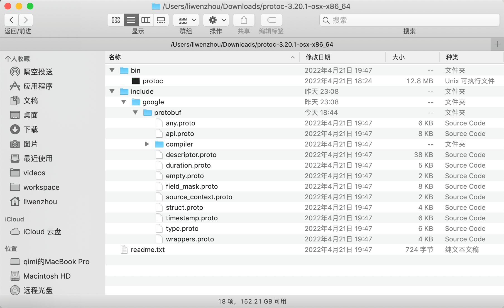
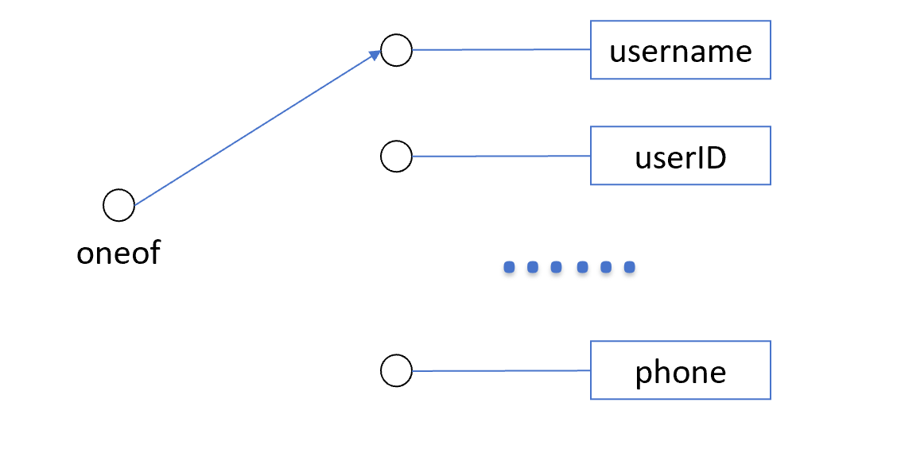
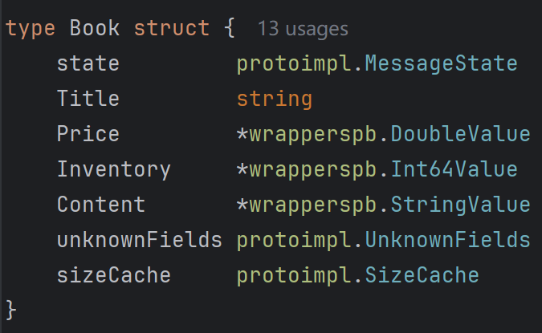
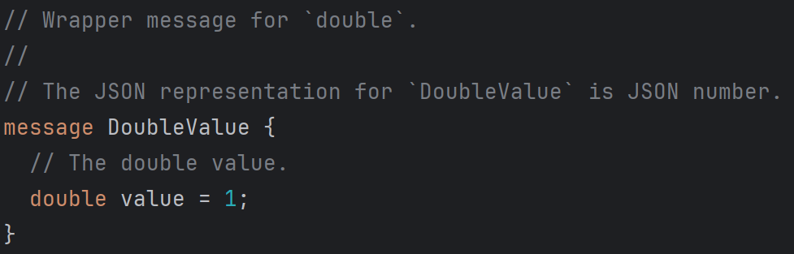
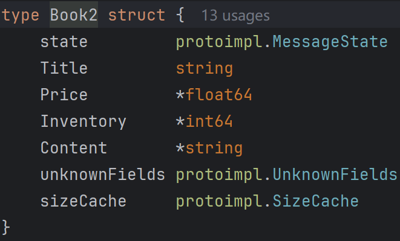
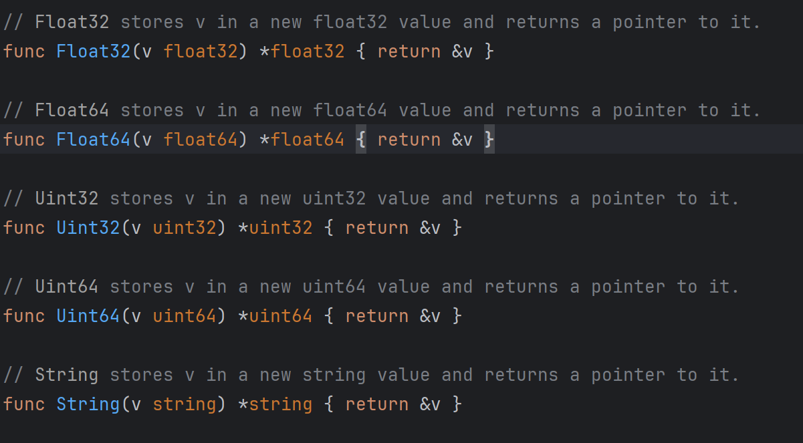
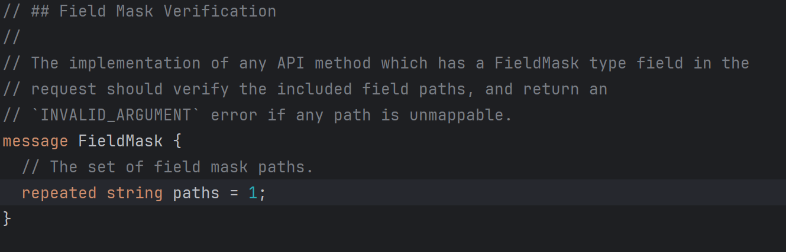

# 基本介绍

[Protobuf](https://developers.google.com/protocol-buffers)全称 `Protocol Buffer`，是 Google 公司于2008年开源的一种语言无关、平台无关、可扩展的用于序列化结构化数据——类似于XML，但比XML更小、更快、更简单，它可用于（数据）通信协议、数据存储等。你只需要定义一次你想要的数据结构，然后你就可以使用特殊生成的源代码来轻松地从各种数据流和各种语言中写入和读取你的结构化数据。目前 Protobuf 被广泛用作微服务中的通信协议。

# 语法规则

参考笔记：[protobuf v3语法官方文档](https://developers.google.com/protocol-buffers/docs/proto3)

### 快速入门

```

// 版本声明：protocol buffers v3 版本
syntax = "proto3";

// 导入路径：指定生成的go代码在项目的导入路径
option go_package = "client/pb";

// 包名:注意server端与client端的包名要一致
package pb;

// 定义消息类型，需要指定：字段类型、字段名、字段编号
// 请求信息
message HelloRequest{
  string name = 1;
}
// 响应信息
message HelloResponse{
  string reply = 1;
}

// 定义服务
service Greeter {
  rpc SayHello(HelloRequest) returns (HelloResponse) {}
}


```

### 版本声明

```
syntax = "proto3";
```

这个声明必须是文件的第一个非空非注释行。

如果不这样写，protocol buffer编译器将假定你使用 proto2。

### 导入路径

为了生成 Go 代码，必须为每个 `.proto` 文件（包括那些被生成的 `.proto` 文件传递依赖的文件）提供 Go 包的导入路径。

有两种方法可以指定 Go 导入路径：

* 通过在 `.proto` 文件中声明它。
* 通过在调用 `protoc` 时在命令行上声明它。

我们建议在 `.proto` 文件中声明它，以便 `.proto` 文件的 Go 包可以与 `.proto` 文件本身集中标识，并简化调用 `protoc` 时传递的标志集。 如果给定 `.proto` 文件的 Go 导入路径由 `.proto` 文件本身和命令行提供，则后者优先于前者。

Go 导入路径是在 `.proto` 文件中指定的，通过声明带有 Go 包的完整导入路径的 `go_package` 选项来创建 proto 文件。

```
option go_package = "example.com/project/protos/fizz";
```

调用编译器时，可以在命令行上指定 Go 导入路径，方法是传递一个或多个 `M${PROTO_FILE}=${GO_IMPORT_PATH}` 标志位。

```
protoc --proto_path=src \
  --go_opt=Mprotos/buzz.proto=example.com/project/protos/fizz \
  --go_opt=Mprotos/bar.proto=example.com/project/protos/foo \
  protos/buzz.proto protos/bar.proto
```

由于所有 `.proto` 文件到其 Go 导入路径的映射可能非常大，这种指定 Go 导入路径的模式通常由控制整个依赖树的某些构建工具（例如 Bazel）执行。 如果给定的 `.proto` 文件有重复条目，则指定的最后一个条目优先。

导入路径用于确定一个 `.proto` 文件导入另一个 `.proto` 文件时必须生成哪些导入语句。 例如，如果 `a.proto`导入 `b.proto`，则生成的 `a.pb.go` 文件需要导入包含生成的 `b.pb.go` 文件的 Go 包（除非两个文件在同一个包中）。 导入路径也用于构造输出文件名。

Go 导入路径和 `.proto` 文件中的 `package`说明符之间没有关联。 后者仅与 protobuf 命名空间相关，而前者仅与 Go 命名空间相关。 此外，Go 导入路径和 `.proto` 导入路径之间没有关联。

### Packages

可以向 `.proto` 文件添加一个可选 `package`说明符，以防止协议消息类型之间的名称冲突。

```
package foo.bar;
message Open { ... }
```

然后，你可以在定义消息类型的字段时使用package说明符:

```
message Foo {
  ...
  foo.bar.Open open = 1;
  ...
}
```

对于Go，包可以被用做Go包名称，除非你显式的提供一个 `option go_package`在你的.proto文件中。

### 定义message

```
// 定义消息类型，需要指定：字段类型、字段名、字段编号
message HelloRequest{
  string name = 1;
}
message HelloResponse{
  string reply = 1;
}
```

当你使用 protocol buffer 编译器来运行.proto文件时，编译器用你选择的语言生成你需要使用文件中描述的消息类型，包括获取和设置字段值，将消息序列化为输出流，以及从输入流解析消息的代码。

对于 Go，编译器为文件中的每种消息类型生成一个类型（type）到一个.pb.go 文件。

#### 字段类型

##### 标量值类型

| .proto Type | Notes                                                                             | Go Type |
| ----------- | --------------------------------------------------------------------------------- | ------- |
| double      |                                                                                   | float64 |
| float       |                                                                                   | float32 |
| int32       | 使用可变长度编码。编码负数效率低下——如果你的字段可能有负值，则使用 sint32代替。 | int32   |
| int64       | 使用可变长度编码。编码负数效率低下——如果你的字段可能有负值，则使用 sint64代替。 | int64   |
| uint32      | 使用变长编码。                                                                    | uint32  |
| uint64      | 使用变长编码。                                                                    | uint64  |
| sint32      | 使用可变长度编码。带符号的 int 值。这些编码比普通的 int32更有效地编码负数。       | int32   |
| sint64      | 使用可变长度编码。带符号的 int 值。这些编码比普通的 int64更有效地编码负数。       | int64   |
| fixed32     | 总是四个字节。如果值经常大于228，则比 uint32更有效率。                            | uint32  |
| fixed64     | 总是8字节。如果值经常大于256，则比 uint64更有效率。                               |         |
| sfixed32    | 总是四个字节。                                                                    | int32   |
| sfixed64    | 总是八个字节。                                                                    |         |
| bool        |                                                                                   | bool    |
| string      | 字符串必须始终包含 UTF-8编码的或7位 ASCII 文本，且不能长于232。                   | string  |
| bytes       | 可以包含任何不超过232字节的任意字节序列。                                         | []byte  |

##### 复合类型

###### 枚举

在定义消息类型时，你可能希望其中一个字段只能是预定义的值列表中的一个值。

例如，假设你想为每个 SearchRequest 添加一个语料库字段，其中语料库可以是 UNIVERSAL、 WEB、 IMAGES、 LOCAL、 NEWS、 PRODUCTS 或 VIDEO。

你可以通过在消息定义中添加一个枚举，为每个可能的值添加一个常量来非常简单地完成这项工作。枚举的常数必须在32位整数的范围内。由于枚举值在传输时使用变长编码，因此负值效率低，因此不推荐使用。

note：枚举的定义中常量为枚举值，message定义中常量为编号，两者互不影响。

```
message SearchRequest {
  string query = 1;
  int32 page_number = 2;
  int32 result_per_page = 3;
  enum Corpus {
    UNIVERSAL = 0;
    WEB = 1;
    IMAGES = 2;
    LOCAL = 3;
    NEWS = 4;
    PRODUCTS = 5;
    VIDEO = 6;
  }
  Corpus corpus = 4;
}
```

定义一个枚举可以在message的外部或内部定义，且第一个枚举值必须是0。

使用 MessageType.EnumType 语法，可以在一个消息中声明的enum类型作为不同消息中的字段类型。

你可以通过将相同的值分配给不同的枚举常量来定义别名。为此，你需要将 allow _ alias 选项设置为 true，否则，当发现别名时，protocol 编译器将生成错误消息。

```
enum Today{
  UNKNOWN = 0;
  Mon = 1;
  Tues = 2;
  Wed = 3;
  Thur = 4;
  Fri = 5;
  Sat = 6;
  Sun = 7;
}

message MyMessage1 {
  enum Status {
    option allow_alias = true;
    UNKNOWN = 0;
    STARTED = 1;
    RUNNING = 1;
  }
}

message MyMessage2{
  Today today = 1;
  MyMessage1.Status status = 2;
}
```

如果通过完全删除枚举条目或注释掉枚举类型来更新枚举类型，那么未来的用户在自己更新该类型时可以重用该数值。

这可能会导致严重的问题，如果以后有人加载旧版本的相同 `.proto`文件，包括数据损坏，隐私漏洞等等。确保不发生这种情况的一种方法是指定已删除条目的数值(或名称，这也可能导致 JSON 序列化问题)为 `reserved`。

如果任何未来的用户试图使用这些标识符，protocol buffer 编译器将报错。

你可以使用 `max`关键字指定保留的数值范围最大为可能的值。

```protobuf
enum Foo {
  reserved 2, 15, 9 to 11, 40 to max;
  reserved "FOO", "BAR";
}
```

注意，不能在同一个保留语句中混合字段名和数值。

###### 嵌套message

你可以在其他消息类型中定义和使用消息类型，如下面的例子——这里的 `Result`消息是在 `SearchResponse`消息中定义的:

```
message SearchResponse {
  message Result {
    string url = 1;
    string title = 2;
    repeated string snippets = 3;
  }
  repeated Result results = 1;
}
```

如果要在其父消息类型之外重用此消息类型，请通过 `_Parent_._Type_`使用:

```
message SomeOtherMessage {
  SearchResponse.Result result = 1;
}
```

###### Maps

如果你想创建一个关联映射作为你数据定义的一部分，protocol buffers提供了一个方便的快捷语法:

```
map<key_type, value_type> map_field = N;
```

其中 `key_type`可以是任何整型或字符串类型。

注意，枚举不是有效的 `key_type`。

`value_type`可以是除另一个映射以外的任何类型。

例如，如果你想创建一个项目映射，其中每个 `Project`消息都与一个字符串键相关联，你可以这样定义:

```
map<string, Project> projects = 3;
```

note：

* 映射字段不能重复。
* 当为 `.proto` 生成文本格式时，映射按键排序。数字键按数字排序。
* 当从连接解析或合并时，如果有重复的映射键，则使用最后看到的键。当从文本格式解析映射时，如果有重复的键，解析可能会失败。
* 如果为映射字段提供了键但没有值，则该字段序列化时的行为与语言相关。在 C++ 、 Java、 Kotlin 和 Python 中，类型的默认值是序列化的，而在其他语言中，没有任何值是序列化的。

生成的映射 API 目前可用于所有支持 proto3的语言。你可以在相关的 [API 参考](https://developers.google.com/protocol-buffers/docs/reference/overview)中找到更多关于所选语言的映射 API 的信息。

**向后兼容性**

map语法序列化后等同于如下内容，因此即使是不支持map语法的protocol buffer实现也是可以处理你的数据的。

```protobuf
message MapFieldEntry {
  key_type key = 1;
  value_type value = 2;
}

repeated MapFieldEntry map_field = N;
```

任何支持映射的protocol buffers实现都必须生成并接受上述定义可以接受的数据。

#### 字段

###### 指定字段规则

消息字段可以是下列字段之一:

* `singular`: 格式正确的消息可以有这个字段的零个或一个(但不能多于一个)。这是 proto3语法的默认字段规则。
* `repeated`: 该字段可以在格式正确的消息中重复任意次数(包括零次)。重复值的顺序将被保留。

在 proto3中，标量数值类型的 `repeated`字段默认使用 `packed`编码。

你可以在 [Protocol Buffer Encoding](https://developers.google.com/protocol-buffers/docs/encoding#packed) 中找到关于 `packed`编码的更多信息。

###### 保留字段

如果你通过完全删除字段或将其注释掉来**更新**消息类型，那么未来的用户在对该类型进行自己的更新时可以重用字段号。

如果其他人以后加载旧版本的相同 `.proto`文件，这可能会导致严重的问题，包括数据损坏，隐私漏洞等等。

确保这种情况不会发生的一种方法是指定已删除字段的字段编号(或名称，这也可能导致 JSON 序列化问题)是保留的（`reserved`）。

如果将来有任何用户尝试使用这些字段标识符，protocol buffer编译器将发出提示。

```
message Foo {
  reserved 2, 15, 9 to 11;
  reserved "foo", "bar";
}
```

注意，不能在同一个 `reserved`语句中混合字段名和字段编号。

###### 未知字段

未知字段是格式良好的协议缓冲区序列化数据，表示解析器不识别的字段。例如，当旧二进制解析由新二进制发送的带有新字段的数据时，这些新字段将成为旧二进制中的未知字段。

最初，proto3消息在解析过程中总是丢弃未知字段，但在3.5版本中，我们重新引入了未知字段的保存来匹配 proto2行为。在3.5及以后的版本中，解析期间保留未知字段，并将其包含在序列化输出中。

###### 默认值

当解析消息时，如果编码消息不包含特定的 singular 元素，则解析对象中的相应字段将设置为该字段的默认值。

* 对于字符串，默认值为空字符串。
* 对于字节，默认值为空字节。
* 对于布尔值，默认值为 false。
* 对于数值类型，默认值为零。
* 对于枚举，默认值是第一个定义的枚举值，该值必须为0。
* 对于消息字段，未设置该字段。其确切值与语言有关。详细信息请参阅[生成的代码指南](https://developers.google.com/protocol-buffers/docs/reference/overview)。

repeated 字段的默认值为空(通常是适当语言中的空列表)。

请注意，对于标量消息字段，一旦消息被解析，就无法判断字段是显式设置为默认值(例如，是否一个布尔值是被设置为 `false`)还是根本没有设置: 在定义消息类型时应该牢记这一点。

例如，如果你不希望某个行为在默认情况下也发生，那么就不要设置一个布尔值，该布尔值在设置为 `false` 时会开启某些行为。

还要注意，如果将标量消息字段**设置**为默认值，则该值将不会在传输过程中序列化。

有关生成的代码的默认工作方式的更多详细信息，请参阅所选语言的[生成代码指南](https://developers.google.com/protocol-buffers/docs/reference/overview)。

#### 字段编号

如你所见，消息定义中的每个字段都有一个唯一的编号。这些字段编号用来在消息二进制格式中标识字段，在消息类型使用后就不能再更改。

注意，范围1到15中的字段编号需要一个字节进行编码，包括字段编号和字段类型。范围16到2047的字段编号采用两个字节。因此，应该为经常使用的消息元素保留数字1到15的编号。切记为将来可能添加的经常使用的元素留出一些编号。

你可以指定的最小字段数是1，最大的字段数是 $2^{29} -1$ ，即536,870,911。你不能使用19000到19999 `(FieldDescriptor::kFirstReservedNumber 到FieldDescriptor::kLastReservedNumber)`的编号，它们是预留给Protocol Buffers协议实现的。

如果你在你的.proto文件中使用了预留的编号Protocol Buffers编译器就会报错。同样，你也不能使用任何之前保留的字段编号。

#### Any

#### 更新消息类型

如果现有的消息类型不再满足你的所有需要——例如，你希望消息格式有一个额外的字段——但是你仍然希望使用用旧格式创建的代码，不要担心！在不破坏任何现有代码的情况下更新消息类型非常简单，只需记住以下规则:

* 不要更改任何现有字段的字段编号
* 如果添加新字段，那么任何使用“旧”消息格式通过代码序列化的消息仍然可以通过新生成的代码进行解析。你应该记住这些元素的默认值，以便新代码能够正确地与旧代码生成的消息交互。类似地，新代码创建的消息可以通过旧代码解析: 旧的二进制文件在解析时直接忽略新字段。有关详细信息，请参阅 未知字段 部分。
* 字段可以被删除，只要字段编号不再用于你更新的消息类型。你可能希望改为重命名字段，或者为其添加"OBSOLETE_“前缀，或者声明字段编号为 `reserved`，以便 `.proto`的未来用户不可能不小心重复使用这个编号。
* `int32`、 `uint32`、 `int64`、 `uint64`和 `bool`都是兼容的——这意味着你可以在不破坏向前或向后兼容性的情况下将一个字段从这些类型中的一个更改为另一个。
* 如果一个数字被解析到一个并不适当的类型中，你会得到与在 C++ 中将数字转换为该类型相同的效果(例如，如果一个64位的数字被读作 int32，它将被截断为32位)
* `sint32`和 `sint64`相互兼容，但与其他整数类型不兼容。
* `string`和 `bytes`是兼容的，只要字节是有效的 UTF-8。
* 如果字节包含消息的编码版本，则嵌入的消息与 `bytes`兼容。
* `fixed32`与 `sfixed32`兼容 `fixed64`与 `sfixed64`兼容。
* 对于 `string`、`bytes`和消息字段，`optional`字段与 `repeated`字段兼容。给定重复字段的序列化数据作为输入，如果该字段是基本类型字段，期望该字段为可选字段的客户端将接受最后一个输入值; 如果该字段是消息类型字段，则合并所有输入元素。注意，这对于数字类型(包括 bools 和 enums)通常是不安全的。重复的数值类型字段可以按 `packed`的格式序列化，如果是 `optional`字段，则无法正确解析这些字段。
* Enum 在格式方面与 int32、 uint32、 int64和 uint64兼容(请注意，如果不适合，值将被截断)。但是要注意，当消息被反序列化时，客户端代码可能会区别对待它们: 例如，未被识别的 proto3 `enum`类型将保留在消息中，但是当消息被反序列化时，这种类型的表示方式依赖于语言。Int 字段总是保留它们的值。
* 将单个值更改为**新**的 `oneof`成员是安全的，并且二进制兼容。如果确保没有代码一次设置多个字段，那么将多个字段移动到新的 `oneof`字段中可能是安全的。将任何字段移动到现有的字段中都是不安全的。

### 定义服务

如果希望将消息类型与 RPC (远程过程调用)系统一起使用，可以在 `.proto` 文件和 protocol buffer 编译器将用你选择的语言生成服务接口代码和存根。

因此，例如你希望定义一个 RPC 服务，其方法接受你的 `SearchRequest`并返回一个 `SearchResponse`，则可以在 `.proto`文件如下定义。

```
service SearchService {
  rpc Search(SearchRequest) returns (SearchResponse);
}
```

使用 protocol buffers 最直接的 RPC 系统是 gRPC，这是 Google 开发的一个语言和平台中立的开源 RPC 系统，可以与 protocol buffers 一起使用。它可以让你直接从你的 `.proto`文件使用特殊的 protocol buffers 编译器插件。

# 编译器

### 安装 protobuf

从 [官方仓库](https://github.com/google/protobuf/releases) 下载适合你平台的预编译好的二进制文件（protoc-`<version>`-`<platform>`.zip）。

解压之后，将下载得到的可执行文件 `protoc`所在的 bin 目录加到我们电脑的环境变量中。


protocol buffer编译器需要一个插件来根据提供的proto文件生成 Go 代码。

```
go install google.golang.org/protobuf/cmd/protoc-gen-go@latest
```

这个命令将在 `$GOBIN` 中安装一个 protocol-gen-go 的二进制文件。我们需要确保 `$GOBIN` 在你的环境变量中，protocol buffer编译器才能找到它（可以通过 `go env`命令查看 `$GOPATH`）。

### 编译器调用

当使用 `go_out` 标志调用 protoc 时，protocol buffer编译器将生成 Go 代码。protocol buffer编译器会将生成的Go代码输出到命令行参数 `go_out`指定的位置。

`go_out`标志的参数是你希望编译器编写 Go 输出的目录。编译器为每个 `.proto` 文件输入创建一个源文件。输出文件的名称是通过将 `.proto` 扩展名替换为 `.pb.go` 而创建的。

生成的 `.pb.go`文件放置的目录取决于编译器标志。有以下几种输出模式:

* `paths=import`：输出文件放在以 Go 包的导入路径命名的目录中。例如，`protos/buzz.proto`文件中带有 `example.com/project/protos/fizz`的导入路径，则输出的生成文件会保存在 `example.com/project/protos/fizz/buzz.pb.go`。如果未指定路径标志，这就是默认输出模式。
* `module=$PREFIX`：输出文件放在以 Go 包的导入路径命名的目录中，但是从输出文件名中删除了指定的目录前缀。例如，输入文件 `pros/buzz.proto`，其导入路径为 `example.com/project/protos/fizz` 并指定 `example.com/project`为 `module`前缀，结果会产生一个名为 `pros/fizz/buzz.pb.go` 的输出文件。在module路径之外生成任何 Go 包都会导致错误。此模式对于将生成的文件直接输出到 Go 模块非常有用。
* `paths=source_relative`：输出文件与输入文件放在相同的相对目录中。例如，一个 `protos/buzz.proto`输入文件会产生一个位于 `protos/buzz.pb.go`的输出文件。

在调用 `protoc`时，通过传递 `go_opt` 标志来提供特定于 `protocol-gen-go` 的标志位参数。可以传递多个 `go_opt`标志位参数。例如，当执行下面的命令时：

```
protoc --proto_path=src --go_out=out --go_opt=paths=source_relative foo.proto bar/baz.proto
```

编译器将从 `src` 目录中读取输入文件 `foo.proto` 和 `bar/baz.proto`，并将输出文件 `foo.pb.go` 和 `bar/baz.pb.go` 写入 `out` 目录。如果需要，编译器会自动创建嵌套的输出子目录，但不会创建输出目录本身。

# 快速入门

### 定义proto

```
syntax = "proto3";

// 声明生成Go代码的导入路径（import path）
option go_package = "demo/proto/book";

package book;

message Price{
  int64 market_price = 1;
  int64 sale_price = 2;
}
```

我们在这个文件中使用 `option go_package = "demo/proto/book"`语句声明了生成的Go代码的导入路径。

项目当前的目录结构如下：

```
demo
└── proto
    └── book
        └── price.proto
```

### 生成代码

假设我们想把最终生成的Go代码还保存在 `proto`文件夹中，那么就可以执行下面的命令。

```
protoc --proto_path=proto --go_out=proto --go_opt=paths=source_relative book/price.proto
```

其中：

* `--proto_path=proto` 表示从proto目录下读取proto文件。
* `--go_out=proto` 表示生成的Go代码保存的路径。
* `--go_opt=paths=source_relative` 表示输出文件与输入文件放在相同的相对目录中。
* `book/price.proto` 表示在proto目录下的 `book/price.proto`文件。

此外，`--proto_path`有一个别名 `-I`，上述编译命令也可以这样写。

```
protoc -I=proto --go_out=proto --go_opt=paths=source_relative book/price.proto
```

执行上述命令将会在 `proto`目录下生成 `book/price.pb.go`文件。

```
demo
└── proto
    └── book
        ├── price.pb.go
        └── price.proto
```

此处如果不指定 `--proto_path`参数那么编译命令可以简写为:

```
protoc --go_out=. --go_opt=paths=source_relative proto/book/price.proto
```

上面的命令都是将代码生成到 `demo/proto`目录，如果想要将生成的Go代码保存在其他文件夹中（例如 `pb`文件夹），那么我们需要先在 `demo`目录下创建一个 `pb`文件夹。然后在命令行通过 `--go_out=pb`指定生成的Go代码保存的路径。完整命令如下：

```
protoc --proto_path=proto --go_out=pb --go_opt=paths=source_relative book/price.proto
```

执行上面的命令便会在 `demo/pb`文件夹下生成Go代码。

```
demo
├── pb
│   └── book
│       └── price.pb.go
└── proto
    └── book
        ├── price.pb.go
        └── price.proto
```

### 生成gRPC代码

由于通常我们都是配合 gRPC 来使用 protobuf ，所以我们也需要基于 `.proto`文件生成Go代码的同时生成 gRPC 代码。

要想生成 gRPC 代码就需要先安装 `protoc-gen-go-grpc` 插件。

```
go install google.golang.org/grpc/cmd/protoc-gen-go-grpc@latest
```

上述命令会默认将插件安装到 `$GOPATH/bin`，为了 `protoc`编译器能找到这些插件，请确保你的 `$GOPATH/bin`在环境变量中。

假设我们现在要提供一个创建书籍的 RPC 方法，那么我在 `book.proto`中添加如下定义。

```
service BookService{
    rpc Create(Book)returns(Book);
}
```

然后在 protoc 的编译命令添加 gRPC相关输出的参数，完整命令如下：

```
protoc --proto_path=proto --go_out=proto --go_opt=paths=source_relative --go-grpc_out=proto --go-grpc_opt=paths=source_relative book/book.proto book/price.proto author/author.proto
```

上述命令就会生成 `book_grpc.pb.go`文件。

```bash
demo
└── proto
    ├── author
    │   ├── author.pb.go
    │   └── author.proto
    └── book
        ├── book.pb.go
        ├── book.proto
        ├── book_grpc.pb.go
        ├── price.pb.go
        └── price.proto
```

# import

### 同目录文件

随着业务的复杂度上升，我们可能会定义多个 `.proto`源文件，然后根据需要引入其他的protobuf文件。

在这个示例中，我们在 `demo/proto/book`目录下新建一个 `book.proto`文件，它通过 `import "book/price.proto";`语句引用了同目录下的 `price.proto`文件。

```
// price.proto

syntax = "proto3";

// 声明生成Go代码的导入路径（import path）
option go_package = "demo/proto/book";

package book;

message Price{
  int64 market_price = 1;
  int64 sale_price = 2;
}
```

```
// book.proto

syntax = "proto3";

// 声明protobuf中的包名
package book;

// 声明生成的Go代码的导入路径
option go_package = "demo/proto/book";

// 引入同目录下的protobuf文件（注意起始位置为proto_path的下层）
import "book/price.proto";

message Book {
    string title = 1;
    Price price = 2;
}
```

编译命令如下：

```
protoc --proto_path=proto --go_out=proto --go_opt=paths=source_relative book/book.proto book/price.proto
```

这里有几点需要注意：

* 因为我们通过编译命令指定 `--proto_path=proto`，所以import导入语句需要从 `demo/proto`文件夹的下层目录 `book`这一层开始写。
* 因为导入的 `price.proto`与 `book.proto`同属于一个 `package book;`，所以可以直接使用 `price`作为类型，无需添加 package 前缀（即无需写成 `book.price`）。

上述编译命令最终会生成 `demo/proto/book/book.pb.go`文件。

```
demo
└── proto
    └── book
        ├── book.pb.go
        ├── book.proto
        ├── price.pb.go
        └── price.proto
```

### 其他目录文件

我们在 `demo/proto`目录下新建了一个 `author`文件夹，用来存放与 author 相关的 protobuf 文件。例如我们定义一个表示作者信息的 `author.proto`文件，其内容如下：

```
// author.proto

syntax = "proto3";

// 声明protobuf中的包名
package author;

// 声明生成的Go代码的导入路径
option go_package = "demo/proto/author";

message Info {
    string name = 1;
}
```

此时的目录结构：

```
demo
└── proto
    ├── author
    │   └── author.proto
    └── book
        ├── book.pb.go
        ├── book.proto
        ├── price.pb.go
        └── price.proto
```

假设我们的 book 需要增加一个作者信息的字段——`authorInfo`，这时我们需要在 `demo/proto/book/book.proto`中导入其他目录下的 `author.proto` 文件。具体改动如下。

```
// book.proto

syntax = "proto3";

// 声明protobuf中的包名
package book;

// 声明生成的Go代码的导入路径
option go_package = "demo/proto/book";

// 引入同目录下的protobuf文件（注意起始位置为proto_path的下层）
import "book/price.proto";
// 引入其他目录下的protobuf文件
import "author/author.proto";

message Book {
    string title = 1;
    Price price = 2;
    author.Info authorInfo = 3;  // 需要带package前缀
}
```

我们通过 `import`导入了 `author`包的 `author.proto`文件，所以在 `book`包下使用 `Info`类型时需要添加其包名前缀即 `author.Info`。

编译命令如下：

```
protoc --proto_path=proto --go_out=proto --go_opt=paths=source_relative book/book.proto book/price.proto author/author.proto
```

此时的目录结构：

```
demo
└── proto
    ├── author
    │   ├── author.pb.go
    │   └── author.proto
    └── book
        ├── book.pb.go
        ├── book.proto
        ├── price.pb.go
        └── price.proto
```

### google proto文件

有时候我们也需要在我们定义的 protobuf 文件中使用 Google 定义的类型，例如 `Timestamp`、`Any`等。

例如我们要为我们的 book 添加出版日期——`date`字段，就可以通过 `import`导入并使用 `Timestamp`类型了。

修改后的 `book.proto`文件内容如下：

```
book.proto

syntax = "proto3";

// 声明protobuf中的包名
package book;

// 声明生成的Go代码的导入路径
option go_package = "github.com/Q1mi/demo/proto/book";

import "book/price.proto";
import "author/author.proto";
import "google/protobuf/timestamp.proto";

message Book {
    string title = 1;
    Price price =2;
    author.Info authorInfo = 3;  // 需要带package前缀
    google.protobuf.Timestamp date = 4;  // 注意包名前缀
}
```

那么这个 `google/protobuf/timestamp.proto` 是从哪里导入的呢？

通常我们下载 [protobuf](https://github.com/google/protobuf/releases) 编译器的时候会解压得到如下文件：



其中：

* bin 目录下的 protoc 是可执行文件。
* include 目录下的是 google 定义的 `.proto`文件，我们 `import "google/protobuf/timestamp.proto"`就是从此处导入。

我们需要将下载得到的可执行文件 `protoc`所在的 bin 目录加到我们电脑的环境变量中。

# oneof

### 基本介绍

如果你有一条包含多个字段的消息，并且最多同时设置其中一个字段，那么你可以通过使用 `oneof`来实现并节省内存。

`oneof`字段类似于常规字段，只不过 `oneof`中的所有字段共享内存，而且最多可以同时设置一个字段。设置其中的任何成员都会自动清除所有其他成员。

可以在 `oneof`中添加除了map字段和repeated字段外的任何类型的字段。

### 画图示意

假设我们现在有三种字段是唯一的，且能在数据库和密码匹配。我们可以设计一个简单的登录逻辑。

```
message LoginRequest{
  oneof login_way{
    string username = 1;
    int64 userID = 2;
    int64 phone = 3;
  }
  string password = 4;
}
```

oneof 在逻辑上有点像是单刀多掷开关。在多个并联电路中中只能选择一个。



### 快速入门

假设我的博客系统支持为读者朋友们发送博客更新的通知信息，系统支持通过邮件和短信两个方式发送通知。但每一次只允许使用一种方式发送通知。

##### protobuf 定义

在这个场景下我们就可以使用 `oneof`字段来定义通知的方式——`notice_way`。

```
syntax = "proto3";

package api;

option go_package = "server/api";

message NoticeReaderRequest{
  string msg = 1;
  oneof notice_way{
    string email = 2;
    string phone = 3;
  }
}

message NoticeReaderResponse{
  string msg = 1;
}

service Noticer{
  rpc NoticeReader(NoticeReaderRequest) returns (NoticeReaderResponse) {}
}
```

##### client端代码

Go语言创建 `oneof`字段的client端示例代码。

```
package main

import (
	"client/api"
	"context"
	"google.golang.org/grpc"
	"google.golang.org/grpc/credentials/insecure"
	"log"
	"regexp"
	"time"
)

const (
	msg   = "star博客更新啦"
	phone = "19566666666"
	email = "1536666666@qq.com"
)

func main() {
	// 从数据库获取粉丝信息：逻辑省略，直接设置常量
	// 判断提醒方式
	in := email
	req := &api.NoticeReaderRequest{Msg: msg}

	validPhone := regexp.MustCompile(`^1[3-9]\d{9}$`)
	validEmail := regexp.MustCompile(`^[a-zA-Z0-9_-]+@[a-zA-Z0-9_-]+(\.[a-zA-Z0-9_-]+)+$`)

	if validPhone.MatchString(in) {
		req.NoticeWay = &api.NoticeReaderRequest_Phone{Phone: in}
	} else if validEmail.MatchString(in) {
		req.NoticeWay = &api.NoticeReaderRequest_Email{Email: in}
	} else {
		log.Fatalf("error notice_way:%v", in)
	}

	// 连接到server端
	conn, err := grpc.NewClient("127.0.0.1:8972", grpc.WithTransportCredentials(insecure.NewCredentials()))
	if err != nil {
		log.Fatalf("did not connect:%v", err)
	}
	defer conn.Close()
	c := api.NewNoticerClient(conn)

	// 执行RPC调用并打印收到的响应数据
	ctx, cancel := context.WithTimeout(context.Background(), time.Second)
	defer cancel()
	res, err := c.NoticeReader(ctx, req)
	if err != nil {
		log.Fatalf("could not notice reader:%v", err)
	}
	log.Printf("res:%v", res.Msg)

}

```

##### server端代码

Go语言操作 `oneof`字段的server端示例代码。下面的代码中使用 `switch case`的方式，根据请求消息中的通知类型选择执行不同的业务逻辑。

```
package main

import (
	"context"
	"fmt"
	"google.golang.org/grpc"
	"log"
	"net"
	"server/api"
)

type server struct {
	api.UnimplementedNoticerServer
}

func (s *server) NoticeReader(ctx context.Context, in *api.NoticeReaderRequest) (res *api.NoticeReaderResponse, err error) {
	// 判断是短信还是邮件的方式
	switch in.NoticeWay.(type) {
	case *api.NoticeReaderRequest_Phone:
		res, err = noticeWithPhone(in)
	case *api.NoticeReaderRequest_Email:
		res, err = noticeWithEmail(in)
	}
	// 返回响应信息
	return
}

func noticeWithEmail(in *api.NoticeReaderRequest) (res *api.NoticeReaderResponse, err error) {
	// 发送邮件逻辑；这里简单打印一下替代
	fmt.Printf("send to email %v: %v\n", in.NoticeWay, in.Msg)
	// 返回发送成功信息
	msg := fmt.Sprintf("send to %v:success", in.NoticeWay)
	res = &api.NoticeReaderResponse{Msg: msg}
	return
}

func noticeWithPhone(in *api.NoticeReaderRequest) (res *api.NoticeReaderResponse, err error) {
	// 发送短信逻辑；这里简单打印一下替代
	fmt.Printf("send to phone %v: %v\n", in.NoticeWay, in.Msg)
	// 返回发送成功信息
	msg := fmt.Sprintf("send to %v:success", in.NoticeWay)
	res = &api.NoticeReaderResponse{Msg: msg}
	return
}

func main() {
	// 监听端口
	lis, err := net.Listen("tcp", ":8972")
	if err != nil {
		log.Fatalf("falied to listen:%v", err)
	}
	// 创建grpc服务器
	s := grpc.NewServer()
	// 注册服务
	api.RegisterNoticerServer(s, &server{})
	// 启动服务
	if err := s.Serve(lis); err != nil {
		log.Fatalf("failed to serve:%v", err)
	}
}
```

# WrapValue

### 基本介绍

protobuf v3在删除 `required`的同时把 `optional`也一起删除了（[v3.15.0又加回来了](https://github.com/protocolbuffers/protobuf/blob/v3.15.0/docs/field_presence.md#how-to-enable-explicit-presence-in-proto3)），这使得我们没办法轻易判断某些字段究竟是未赋值还是其被赋值为零值。

例如，当我们有如下消息定义时，我们拿到一个book消息，当 `book.Price = 0`时我们没办法区分 `book.Price`字段是未赋值还是被赋值为0。

```
message Book {
    string title = 1;
    double price = 2;
}
```

### 快速入门

##### protobuf 定义

类似这种场景推荐使用 `google/protobuf/wrappers.proto`中定义的WrapValue，本质上就是使用自定义message 代替基本类型。

```
import "google/protobuf/wrappers.proto";

message Book{
  string title = 1;
  google.protobuf.DoubleValue price = 2; // 数量
  google.protobuf.Int64Value inventory = 3; // 库存
  google.protobuf.StringValue content = 4;
}
```

book.pb.go



wrappers.proto



实际上是通过多嵌套了一层自定义结构体指针，再借助指针未初始化为nil来区分默认与设置零值。

##### client端代码

使用了 `wrappers.proto`中定义的包装类型后，我们在赋值的时候就需要额外包一层。

```
import "google.golang.org/protobuf/types/known/wrapperspb"

func client() {
	book = &api.Book{
		Title:     "《百万》",
		Price:     &wrapperspb.DoubleValue{Value: 12.2},
		Inventory: &wrapperspb.Int64Value{Value: 600},
		Content:   &wrapperspb.StringValue{Value: "回家"},
	}
}
```

##### server端代码

WrapValue本质上类似于标准库sql中定义的 `sql.NullInt64`、`sql.NullString`，即将基本数据类型包装为一个结构体类型。在使用时通过判断某个字段是否为nil（空指针）来区分该字段是否被赋值。

```
import "google.golang.org/protobuf/types/known/wrapperspb"

func server() {
	if book.Price == nil {
		fmt.Println("该书没有设置价格...")
	} else {
		fmt.Println(book.Price.Value)
	}
}
```

# optional v3.15.0+

### 基本介绍

Protobuf **v3.15.0** 版本之后又支持使用 `optional`显式指定字段为可选。

下面的示例中，我们使用 `optional`标识 `price`为可选字段。

```
message Book2{
  string title = 1;
  optional double price = 2; // 数量
  optional int64 inventory = 3; // 库存
  optional string content = 4;
}
```

修改了 `proto`文件后，重新编译。

book.pb.go



wrappers.proto



实际上是通过函数返回对应类型的指针，再借助指针未初始化为nil来区分默认与设置零值。

### 快速入门

##### client端代码

现在 `price`字段就是 `*int64`类型了，我们需要使用 `google.golang.org/protobuf/proto`包提供的系列函数完成赋值操作。

```
import "google.golang.org/protobuf/proto"

func client2() {
	book2 = &api.Book2{
		Title:     "《what》",
		Price:     proto.Float64(13.3),
		Inventory: proto.Int64(577),
		Content:   proto.String("wow"),
	}
}
```

##### server端代码

如果需要判断 `price`字段是否赋值，可以判断是否为 `nil`。

```
import "google.golang.org/protobuf/proto"

func server2() {
	if book2.Inventory == nil {
		fmt.Println("本书没有库存...")
	} else {
		fmt.Println(*book2.Inventory)
	}
}
```

# FieldMask

### 基本介绍

假设现在需要实现一个更新书籍信息接口，我们可能会定义如下更新书籍的消息。

```
message UpdateBookRequest {
    // 操作人 
    string op = 1;
    // 要更新的书籍信息
    Book book = 2;
}
```

但是如果我们的 `Book`中定义有很多很多字段时，我们不太可能每次请求都去全量更新 `Book`的每个字段，因为通常每次操作只会更新1到2个字段。

那么我们该如何确定每次更新操作涉及到了哪些具体字段呢？

答案是使用 `google/protobuf/field_mask.proto`，它能够记录在一次更新请求中涉及到的具体字段路径。

为了实现一个支持部分更新的接口，我们把 `UpdateBookRequest`消息修改如下。

```
import "google/protobuf/field_mask.proto";

message UpdateBookRequest{
  // 操作人
  string op = 1;
  // 要更新的message
  Book book = 2;
  // 要更新的字段
  google.protobuf.FieldMask update_mask = 3;
}
```

field_mask.proto



### client端代码

我们通过 `paths`记录本次更新的字段路径，如果是嵌套的消息类型则通过 `x.y`的方式标识。

```
import "google.golang.org/protobuf/types/known/fieldmaskpb"

func client() {
	// 记录更新的字段路径
	paths := []string{"price", "type.name"}
	updateReq = &api.UpdateBookRequest{
		Op: "star",
		Book: &api.Book{
			Price: 112.2,
			Type: &api.Book_Type{
				Name: "百科",
			},
		},
		UpdateMask: &fieldmaskpb.FieldMask{Paths: paths},
	}
}
```

### server端代码

`MaskFromProtoFieldMask`函数（签名如下）

```
func MaskFromProtoFieldMask(fm *field_mask.FieldMask, naming func(string) string) (Mask, error)
```

接收的 `naming`参数本质上是一个将字段掩码字段名映射到 Go 结构中使用的名称的函数，它必须根据你的实际需求实现。

例如在我们这个示例中，可以使用 `github.com/iancoleman/strcase`包提供的 `ToCamel`方法：

```
import "github.com/iancoleman/strcase"
import fieldmask_utils "github.com/mennanov/fieldmask-utils"

func server() {
	mask, _ := fieldmask_utils.MaskFromProtoFieldMask(updateReq.UpdateMask, strcase.ToCamel)
	var bookDst = make(map[string]interface{})
	// 将数据读取到map[string]interface{}
	// fieldmask-utils支持读取到结构体等，更多用法可查看文档。
	fieldmask_utils.StructToMap(mask, updateReq.Book, bookDst)
	fmt.Println(bookDst)
}
```
