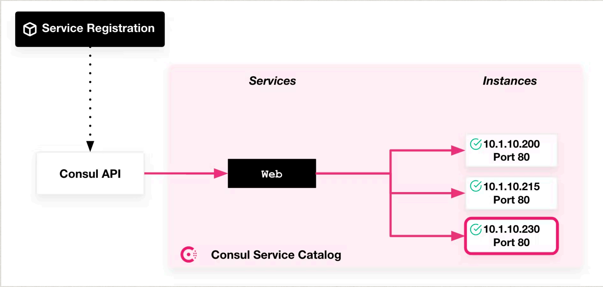
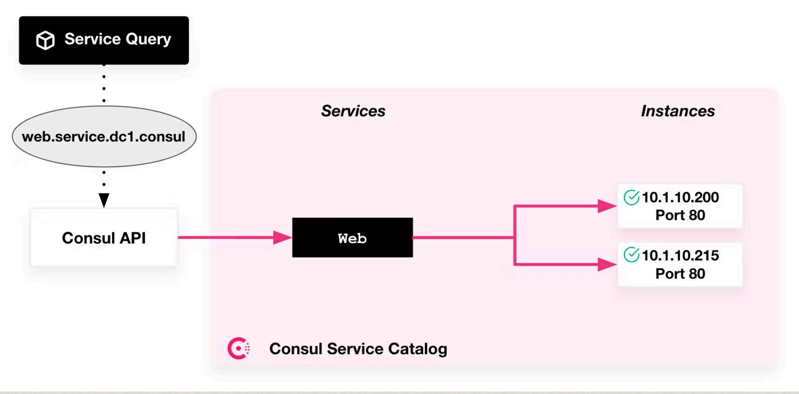
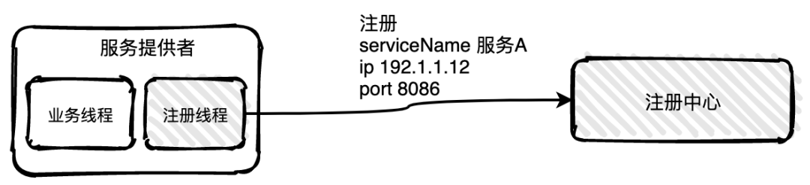
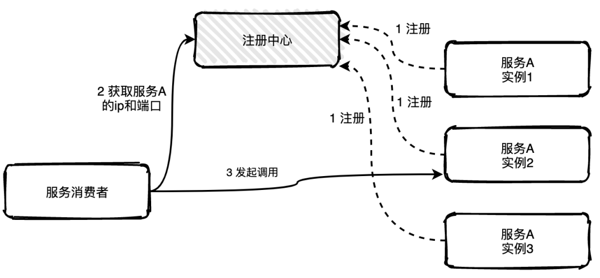
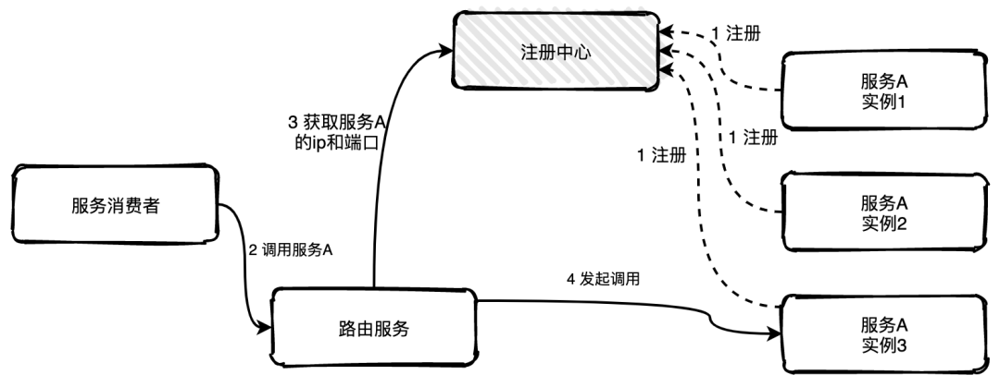
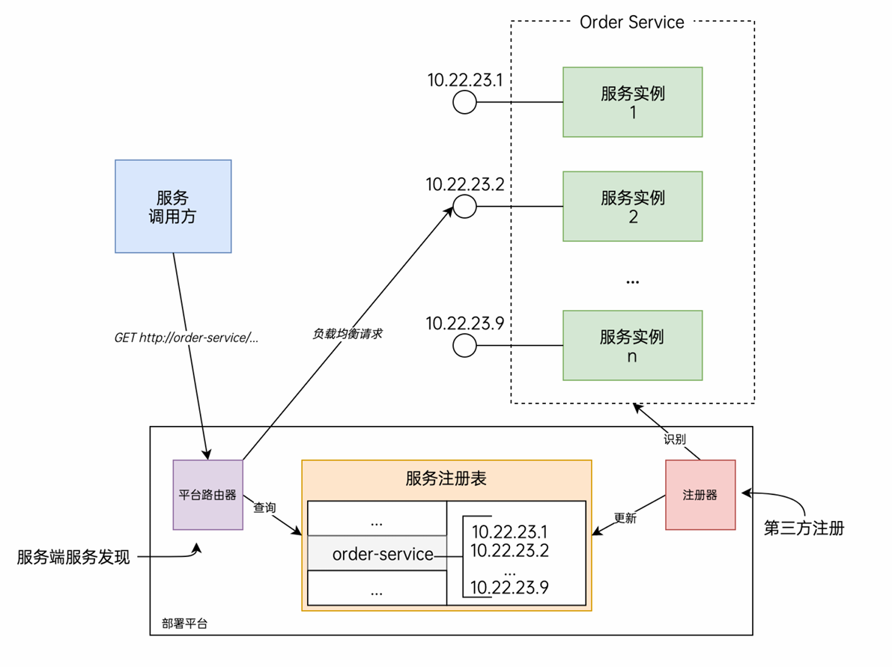
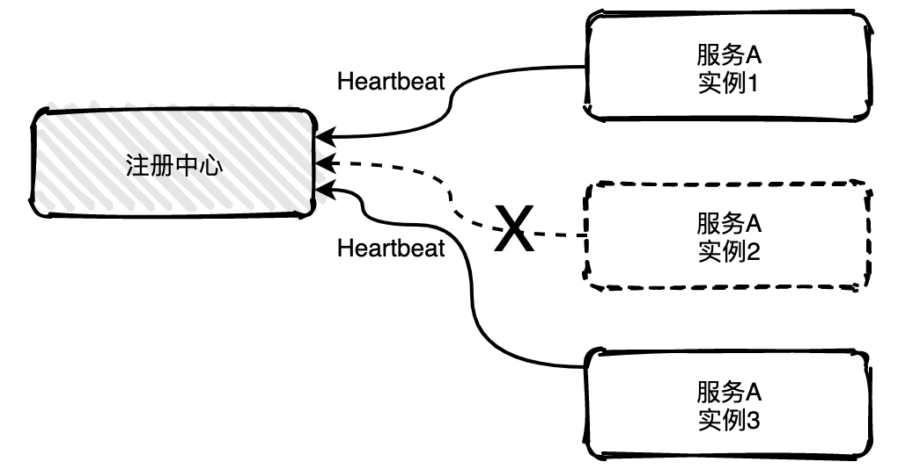
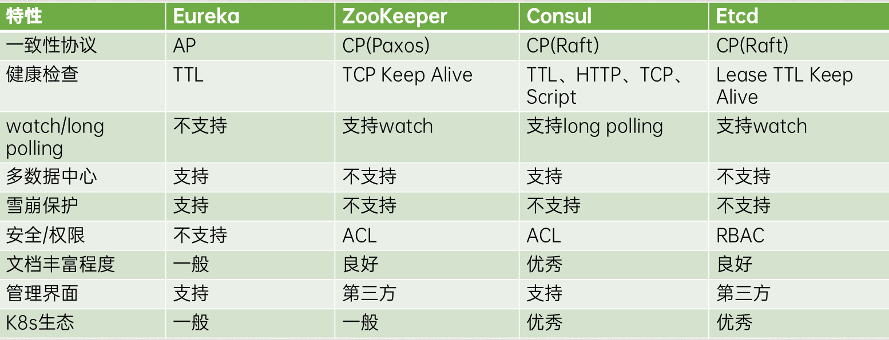

# 技术原理

### 基本介绍

在传统的服务架构中，服务的规模处于运维人员的可控范围内。当部署服务的多个节点时，一般使用静态配置的方式实现服务信息的设定。而在微服务应用中，服务实例的数量和网络地址都是动态变化的而且服务集群的跨度很大、数量很多（数以百计甚至更多），这对系统运维提出了巨大的挑战。

服务注册与服务发现是保证服务之间能够正常通信的核心机制。它们帮助服务实例在动态变化的环境中自动注册、发现和更新，从而确保系统的弹性和高可用性。

### 概念解析

服务注册：服务实例将自身服务信息注册到注册中心。这部分服务信息包括服务所在主机IP和提供服务的Port，以及暴露服务自身状态以及访问协议等信息。

服务发现：服务实例请求注册中心获取所依赖服务信息。服务实例通过注册中心，获取到注册到其中的服务实例的信息，通过这些信息去请求它们提供的服务。

注册中心（服务注册表）：负责存储、管理所有服务实例的注册信息，并提供查询接口，还会通过心跳检测等机制实时监控服务实例的健康状态。如果某个服务实例下线或出现故障，注册中心会及时将其从可用列表中移除，确保客户端获取到的都是健康的服务地址。

我们可以用一个简单的比喻来理解：
你的手机通讯录里保存了张三的手机号。你在手机通讯录找到张三，名片中显示他的手机号码，你拨号打给张三。张三换了手机号并告诉你，你在手机通讯录里修改下张三的手机号。张三又办了个手机号，你在手机通讯录里给张三名下添加一个手机号码。

类似地，服务注册就是保存手机号，服务发现就是查找手机号，注册中心就是你的通讯录。

### 流程图示

##### 服务发现

服务使用者通过唯一的 DNS 条目与“ Web”服务进行通信。

##### 服务注册

“ Web”服务的一个新实例使用其 IP 地址和端口向注册中心注册自己。当新实例注册成功后，它们将加入负载均衡池，以处理服务使用者请求。

##### 注册中心

随着服务的新实例的添加和旧的或不健康的服务实例的删除，注册中心会动态更新。已删除的服务将不再参与用于处理服务使用者请求的负载均衡池。

# 实现方案

### 服务注册&服务发现

一共分为两种方式：

客户端：服务及其调用方直接与注册中心交互。

服务端：通过部署基础设施来处理。

##### 客户端注册

客户端注册是服务自己要负责注册与注销的工作。当服务启动后注册线程向注册中心注册，当服务下线时注销自己。

##### 服务端注册

服务端注册由一个单独的代理服务负责注册与注销。当服务提供者启动后以某种方式通知代理服务，然后代理服务负责向注册中心发起注册工作。

##### 客户端发现

客户端发现是指客户端负责向注册中心查询可用服务地址，获取到所有的可用实例地址列表后客户端根据**负载均衡**算法选择一个实例发起请求调用。

##### 服务端发现

服务端发现是指新增一个路由服务负责服务发现获取可用的实例列表，服务消费者如果需要调用服务A的一个实例可以直接将请求发往路由服务，路由服务根据配置好的负载均衡算法从可用的实例列表中选择一个实例将请求转发过去即可，如果发现实例不可用，路由服务还可以自行重试，服务消费者完全不用感知。

##### 优缺点分析

###### 客户端模式

优势是支持多平台、各式服务的服务发现。不依赖于任何平台。
劣势是需要在服务端和客户端集成SDK，并且要维护相关代码逻辑，需要考虑SDK的多语言支持。服务注册 / 注销、实例地址获取、负载均衡等非业务逻辑与核心业务代码紧密耦合，不仅增加了代码复杂度，也导致相关逻辑变更时牵涉范围广、升级成本高。

###### 服务端模式

优势是服务发现的所有方面都由平台处理，服务端和客户端都不包含任何服务发现代码。
劣势是仅限于使用该平台部署的服务，依赖于公司内部的基础设施支撑。多一次网络跳转，存在性能损耗。

### 心跳机制

如果服务有多个实例，其中一个实例出现宕机，注册中心是可以实时感知到，并且将该实例信息从列表中移出，也称为摘机。

如何实现摘机？业界比较常用的方式是通过心跳检测的方式实现，心跳检测有**主动**和**被动**两种方式。

##### 被动检测

被动检测指服务主动向注册中心发送心跳消息，时间间隔可自定义，注册中心如果在三个周期内没有收到实例的心跳消息，就会将该实例从列表中移除。

图中服务A的实例2已经宕机不能主动给注册中心发送心跳消息，假设配置原本应该5秒发送一次，15秒之后注册中心就会将实例2移除掉。

##### 主动检测

主动检测是注册中心主动发起，每隔几秒中会给所有列表中的服务实例发送心跳检测消息，如果多个周期内未发送成功或未收到回复就会主动移除该实例。

# 技术选型

### 主流注册中心对比

### CAP理论

一致性(Consistency) ：所有节点在同一时间具有相同的数据
可用性(Availability) ：保证每个请求不管成功或者失败都有响应
分区容忍(Partition tolerance) ：系统中任意信息的丢失或失败不会影响系统的继续运作

# Consul

[Consul](https://www.consul.io)是一个服务网络解决方案，为网络基础设施设备提供服务发现、服务网格、流量管理和自动更新。
目前是社区主流的注册中心。

# Raft

Raft是一种共识算法，它主要解决的是分布式系统多个节点如何达成一致的问题。[动画演示Raft原理](https://thesecretlivesofdata.com/raft/)。

其他介绍：[click](https://github.com/STAR0903/note/blob/main/Go/%E5%BE%AE%E6%9C%8D%E5%8A%A1/Raft.md)

# 参考资料

[13张图搞懂分布式系统服务注册与发现原理-腾讯云开发者社区-腾讯云](https://cloud.tencent.com/developer/article/1778134)
