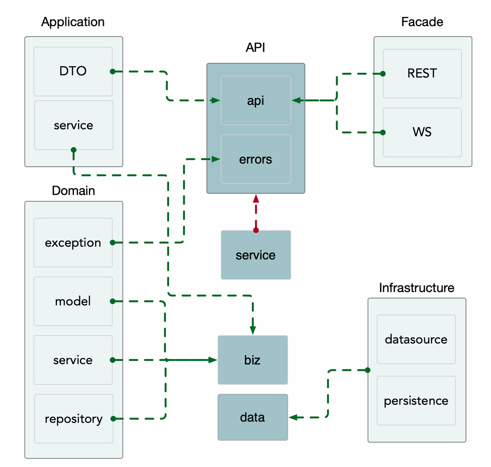

# 基本介绍

Kratos 一套轻量级 Go 微服务框架，包含大量微服务相关框架及工具。

进一步学习：[github](https://github.com/go-kratos/kratos)      [官方文档](https://go-kratos.dev/)

# 快速开始

### 前置准备

##### [CLI脚手架工具](https://go-kratos.dev/zh-cn/docs/getting-started/usage/)

kratos是与Kratos框架配套的脚手架工具，kratos能够

- 通过模板快速创建项目
- 快速创建与生成protoc文件
- 使用开发过程中常用的命令
- 极大提高开发效率，减轻心智负担

```bash
go install github.com/go-kratos/kratos/cmd/kratos/v2@latest
```

##### 依赖注入工具wire

**Wire** 是一个灵活的依赖注入工具，通过自动生成代码的方式在编译期完成依赖注入。

在各个组件之间的依赖关系中，通常鼓励显式初始化，而不是全局变量传递。

所以通过 Wire 进行初始化代码，可以很好地解决组件之间的耦合，以及提高代码维护性。

```bash
go install github.com/google/wire/cmd/wire@latest
```

### 创建项目

1）创建一个名为helloworld的项目。

```bash
kratos new helloworld
```

上面的命令会从github拉取项目目录模板，国内网络可能会失败。如果失败使用以下命令指定从gitee拉取。

```bash
# 如在国内环境拉取失败，可 -r 指定源
kratos new helloworld -r https://gitee.com/go-kratos/kratos-layout.git
```

2）进入项目目录

```bash
cd helloworld
```

3）拉取项目依赖

```bash
go mod download
```

### 生成代码

生成所有proto源码、wire等等

```bash
go generate ./...
```

### 运行

使用kratos运行项目

```bash
kratos run
```

或者手动编译后执行

```bash
# 编译
go build -o ./bin/ ./...
# 执行
./bin/helloworld -conf ./configs/config.yaml
# windows 执行
.\bin\helloworld.exe -conf .\configs
```

```bash
# 输出
INFO msg=config loaded: config.yaml format: yaml # 默认载入 configs/config.yaml 配置文件
INFO msg=[gRPC] server listening on: [::]:9000 # gRPC服务监听 9000 端口
INFO msg=[HTTP] server listening on: [::]:8000 # HTTP服务监听 8000 端口
```

# 项目的目录结构

```bash
E:.
│  .gitignore
│  Dockerfile
│  go.mod
│  go.sum
│  LICENSE
│  Makefile
│  openapi.yaml
│  README.md
│  
├─api // 下面维护了微服务使用的proto文件以及根据它们所生成的go文件
│  └─helloworld
│      └─v1
│              error_reason.pb.go
│              error_reason.proto
│              greeter.pb.go
│              greeter.proto
│              greeter_grpc.pb.go
│              greeter_http.pb.go
│
├─bin // 由我们自己建立的存放编译好的二进制可执行文件的目录
│      helloworld.exe
│
├─cmd // 整个项目启动的入口文件
│  └─helloworld
│          main.go
│          wire.go
│          wire_gen.go
│
├─configs // 配置文件目录
│      config.yaml
│
├─internal // 该服务所有不对外暴露的代码，通常的业务逻辑都在这下面，使用internal避免错误引用
│  ├─biz // 业务逻辑
│  │      biz.go
│  │      greeter.go
│  │      README.md
│  │
│  ├─conf // 内部使用的config的结构定义，使用proto格式⽣生成
│  │      conf.pb.go
│  │      conf.proto
│  │
│  ├─data // 业务数据访问，包含 cache.db 等封装，实现了 biz 的 repo 接口。
│  │      data.go
│  │      greeter.go
│  │      README.md
│  │
│  ├─server // http和grpc实例的创建和配置
│  │      grpc.go
│  │      http.go
│  │      server.go
│  │
│  └─service // 实现了 api 定义的服务层，格式化输出数据a协同各类 biz 交互，但是不应处理复杂逻辑
│          greeter.go
│          README.md
│          service.go
│
└─third_party // api 依赖的第三方proto
    │  README.md
    │
    ├─errors
    │      errors.proto
    │
    ├─google
    │  ├─api
    │  │      annotations.proto
    │  │      client.proto
    │  │      field_behavior.proto
    │  │      http.proto
    │  │      httpbody.proto
    │  │
    │  └─protobuf
    │      │  any.proto
    │      │  api.proto
    │      │  descriptor.proto
    │      │  duration.proto
    │      │  empty.proto
    │      │  field_mask.proto
    │      │  source_context.proto
    │      │  struct.proto
    │      │  timestamp.proto
    │      │  type.proto
    │      │  wrappers.proto
    │      │
    │      └─compiler
    │              plugin.proto
    │
    ├─openapi
    │  └─v3
    │          annotations.proto
    │          openapi.proto
    │
    └─validate
            README.md
            validate.proto

```

# 创建项目

使用CLI工具创建项目，我们要新建一个名为 bubble 的项目，那么就执行下面的命令：

```bash
kratos new bubble
```

创建好之后，执行以下命令切换到项目目录下。后面的内容就以实现一个待办列表的功能为例，进行讲解。

```bash
cd bubble
```

# 定义API

Kratos 主要参考 Google API 指南，实现了对应通信协议支持，并且遵守了 gRPC API 使用 HTTP 映射功能进行 JSON/HTTP 的支持。

也就是通过定义 proto 即可使用 REST API 和 RPC API。

### 定义proto文件

先添加模板，在项目目录下执行以下命令。

此时会在项目目录的 api/bubble/v1 目录下创建一个 todo.proto 文件。

```bash
kratos proto add api/bubble/v1/todo.proto
```

根据自己的业务来修改 api/bubble/v1/todo.proto 文件。

注意：添加HTTP注解需要导入 google/api/annotations.proto

```proto
syntax = "proto3";

package api.bubble.v1;

option go_package = "bubble/api/bubble/v1;v1";
option java_multiple_files = true;
option java_package = "api.bubble.v1";

import "google/api/annotations.proto";

service Todo {
	rpc CreateTodo (CreateTodoRequest) returns (CreateTodoReply){
		option (google.api.http) = {
			post : "/v1/todo",
			body : "*"
		};
	}
	rpc UpdateTodo (UpdateTodoRequest) returns (UpdateTodoReply){
		option (google.api.http) = {
			put : "/v1/todo/{todo.id}"
			body : "*"
		};
	}
	rpc DeleteTodo (DeleteTodoRequest) returns (DeleteTodoReply){
		option (google.api.http) = {
			delete : "/v1/todo/{id}"
		};
	}
	rpc GetTodo (GetTodoRequest) returns (GetTodoReply){
		option (google.api.http) = {
			get : "/v1/todo/{id}"
		};
	}
	rpc ListTodo (ListTodoRequest) returns (ListTodoReply){
		option (google.api.http) = {
			get : "/v1/todo"
		};
	}
}

message todo {
	int64 id = 1;
	string title = 2;
	bool status = 3;
}

message CreateTodoRequest {
	string title = 1;
}
message CreateTodoReply {
	todo todo = 1;
}

message UpdateTodoRequest {
	todo todo = 1;
}
message UpdateTodoReply {}

message DeleteTodoRequest {
	int64 id = 1;
}
message DeleteTodoReply {}

message GetTodoRequest {
	int64 id = 1;
}
message GetTodoReply {
	todo todo = 1;
}

message ListTodoRequest {}
message ListTodoReply {
	repeated todo t = 1;
}
```

### 生成代码

##### 生成proto代码

根据你写的proto文件生成go代码。有以下两种方式，根据自己的实际情况任选一个。

第一种方式是使用make命令。前提是你电脑上有make命令并且项目根目录下有Makefile文件。

```bash
make api
```

第二种方式是使用kratos命令，需要指定你的proto文件。

```bash
kratos proto client api/bubble/v1/todo.proto
```

上述命令执行完后会生成以下文件。

```
api/bubble/v1/todo.pb.go
api/bubble/v1/todo_grpc.pb.go
# 注意 http 代码只会在 proto 文件中声明了 http 时才会生成
api/bubble/v1/todo_http.pb.go
```

##### 生成Service代码

通过你的 proto 文件，可以直接生成对应的 Service 实现代码：

使用 kratos 命令并且通过 -t 指定生成代码的保存目录

```bash
kratos proto server api/bubble/v1/todo.proto -t internal/service
```

上述命令会在项目的 internal/service 目录下生成 todo.go 文件。

##### 项目结构



# 梳理流程

下面这些代码只做梳理目录结构和业务逻辑开发思路之用，后续实现功能时发现存在一些缺漏错误。

进入 internal/service 目录，比对官方提供的 greeter.go 和我们刚刚生成的 todo.go 的区别。

```go
// GreeterService is a greeter service.
type GreeterService struct {
	v1.UnimplementedGreeterServer

	uc *biz.GreeterUsecase
}

// NewGreeterService new a greeter service.
func NewGreeterService(uc *biz.GreeterUsecase) *GreeterService {
	return &GreeterService{uc: uc}
}

// SayHello implements helloworld.GreeterServer.
func (s *GreeterService) SayHello(ctx context.Context, in *v1.HelloRequest) (*v1.HelloReply, error) {
	g, err := s.uc.CreateGreeter(ctx, &biz.Greeter{Hello: in.Name})
	if err != nil {
		return nil, err
	}
	return &v1.HelloReply{Message: "Hello " + g.Hello}, nil
}
```

```go
type TodoService struct {
	pb.UnimplementedTodoServer
}

func NewTodoService() *TodoService {
	return &TodoService{}
}

func (s *TodoService) CreateTodo(ctx context.Context, req *pb.CreateTodoRequest) (*pb.CreateTodoReply, error) {
    return &pb.CreateTodoReply{}, nil
}
func (s *TodoService) UpdateTodo(ctx context.Context, req *pb.UpdateTodoRequest) (*pb.UpdateTodoReply, error) {
    return &pb.UpdateTodoReply{}, nil
}
func (s *TodoService) DeleteTodo(ctx context.Context, req *pb.DeleteTodoRequest) (*pb.DeleteTodoReply, error) {
    return &pb.DeleteTodoReply{}, nil
}
func (s *TodoService) GetTodo(ctx context.Context, req *pb.GetTodoRequest) (*pb.GetTodoReply, error) {
    return &pb.GetTodoReply{}, nil
}
func (s *TodoService) ListTodo(ctx context.Context, req *pb.ListTodoRequest) (*pb.ListTodoReply, error) {
    return &pb.ListTodoReply{}, nil
}
```

进入 internal/biz 目录，仿照官方提供的 greeter.go 完成 todo.go ，这里只完成了CreateTodo 。

```go
package biz

import (
	"context"
	"github.com/go-kratos/kratos/v2/log"
)

// Todo is a Todo model.
type Todo struct {
	ID     int64
	Title  string
	Status bool
}

// TodoRepo is a Todo repo.
// biz层对数据操作层提出的要求
type TodoRepo interface {
	Create(context.Context, *Todo) (*Todo, error)
	Update(context.Context, *Todo) error
	Delete(context.Context, *Todo) error
	FindByID(context.Context, int64) (*Todo, error)
	ListAll(context.Context) ([]*Todo, error)
}

// TodoUsecase is a Todo usecase.
type TodoUsecase struct {
	repo TodoRepo
	log  *log.Helper
}

// NewTodoUsecase new a Todo usecase.
func NewTodoUsecase(repo TodoRepo, logger log.Logger) *TodoUsecase {
	return &TodoUsecase{repo: repo, log: log.NewHelper(logger)}
}

// CreateTodo creates a Todo, and returns the new Todo.
// 对外提供业务函数，由service层调用
func (uc *TodoUsecase) CreateTodo(ctx context.Context, g *Todo) (*Todo, error) {
	uc.log.WithContext(ctx).Infof("CreateTodo: %#v", g)
	return uc.repo.Create(ctx, g)
}

```

进入 internal/service 目录，根据官方提供的 greeter.go 和我们在biz层完成的代码，修改 todo.go ，这里只修改了CreateTodo 。

```go
type TodoService struct {
	pb.UnimplementedTodoServer

	// 嵌入一个实现业务逻辑的结构体
	uc *biz.TodoUsecase
}

func NewTodoService(uc *biz.TodoUsecase) *TodoService {
	return &TodoService{uc: uc}
}

func (s *TodoService) CreateTodo(ctx context.Context, req *pb.CreateTodoRequest) (*pb.CreateTodoReply, error) {
	// 参数校验（省略）
	// 业务逻辑调用
	g := &biz.Todo{Title: req.Title}
	data, err := s.uc.CreateTodo(ctx, g)
	if err != nil {
		return nil, err
	}
	// 返回响应
	todo := &pb.Todo{
		Id:     data.ID,
		Title:  data.Title,
		Status: data.Status,
	}
	return &pb.CreateTodoReply{Todo: todo}, nil
}
```

我们刚刚提到 biz 层通过 TodoRepo 对数据操作层提出了要求。接下来我们进入 internal/data 目录，仿照官方提供的 greeter.go 完成 todo.go ，这里并没有实现具体的数据库操作。

```go
package data

import (
	"bubble/internal/biz"
	"context"
	"github.com/go-kratos/kratos/v2/log"
)

type todoRepo struct {
	data *Data
	log  *log.Helper
}

// NewTodoRepo .
func NewTodoRepo(data *Data, logger log.Logger) biz.TodoRepo {
	return &todoRepo{
		data: data,
		log:  log.NewHelper(logger),
	}
}

func (t todoRepo) Create(ctx context.Context, todo *biz.Todo) (*biz.Todo, error) {
	// 实现数据库操作
	return todo, nil
}

func (t todoRepo) Update(ctx context.Context, todo *biz.Todo) error {
	return nil
}

func (t todoRepo) Delete(ctx context.Context, todo *biz.Todo) error {
	return nil
}

func (t todoRepo) FindByID(ctx context.Context, i int64) (*biz.Todo, error) {
	return nil, nil
}

func (t todoRepo) ListAll(ctx context.Context) ([]*biz.Todo, error) {
	return nil, nil
}

```

最后我们修改 internal/service/service.go 、internal/biz/biz.go 、internal/data/data.go、internal/server/grpc.go、internal/server/http.go 文件。

并在 cmd/bubble 目录下执行指令：

```bash
wire
```

此时，我们并没有实现具体的功能，但是我们的服务已经可以成功启动，并且做出响应了。

```bash
curl -X POST http://localhost:8000/v1/todo -H "Content-Type: application/json" -d "{\"title\":\"学习kratos框架\"}"
{"todo":{"id":"0","title":"学习kratos框架","status":false}}
```

# [依赖注入](https://go-kratos.dev/zh-cn/docs/guide/wire/)

kratos 中使用 wire 实现依赖注入。

### wire的使用

1. 一般大型项目会用到。
2. 编写代码时注意使用依赖注入，把用到的依赖项使用参数传入，而不是自己直接写死。
3. 使用wire把构造函数连接起来，编写一个注入器。
4. 命令行工具wire生成Go代码到wire_gen.go文件。
5. 调用 wire_gen.go 中生成的函数。

### 注意事项

wire.go 最上面要加 `//go:build wireinject` 。

wire.go 需要和最终产出对象在同一个包内。在哪里用就在哪里创建 wire.go 文件。

# [配置](https://go-kratos.dev/docs/component/config)

### 三个关键点

具体的代码可以参照官方文档。

##### 配置源

* 文件：json yaml
* 环境变量：env
* 配置中心：apollo consul

##### 读取配置

* c.load 加载配置源
* c.Scan 读取配置数据到结构体中
* c.Value 单独获取某个字段的内容
* c.Watch 监听配置中某个字段的变更，在本地或远端的配置中心有配置文件变更时，执行回调函数进行自定义的处理
* 合并
* Resolver 自定义
* Codec自定义

##### 配置结构体

internal/conf/conf.pb.go 文件中的 Bootstrap

##### 代码示例

```go
// 创建配置对象
c := config.New(
    config.WithSource(
    file.NewSource(flagconf), // 指定配置的来源
    ),
)
defer c.Close()
// 加载配置（从配置文件/配置中心/环境变量加载配置）
if err := c.Load(); err != nil {
    panic(err)
}

// 创建配置结构体变量bc
var bc conf.Bootstrap
// 将配置数据扫描到结构体变量bc中
if err := c.Scan(&bc); err != nil {
    panic(err)
}
```

### 一个核心流程

程序添加/修改配置的核心流程，以添加一个运行模式参数 mode 为例。

##### 修改proto文件

修改 internal/conf/conf.proto 文件，用pb定义配置。

```go
message Bootstrap {
  Server server = 1;
  Data data = 2;
  string mode = 3;
}
```

##### 生成配置对应的Go代码

项目目录下执行：

```bash
 make config
```

如果没有装 make 命令，那么就执行：

```bash
protoc --proto_path=./internal \
--proto_path=./third_party \
--go_out-paths-source_relative=./internal \
internal/conf/conf.proto
```


##### 修改配置文件

```yaml
server:
  http:
    addr: 0.0.0.0:8000
    timeout: 1s
  grpc:
    addr: 0.0.0.0:9000
    timeout: 1s
data:
  database:
    driver: mysql
    source: root:root@tcp(127.0.0.1:3306)/test?parseTime=True&loc=Local
  redis:
    addr: 127.0.0.1:6379
    read_timeout: 0.2s
    write_timeout: 0.2s
mode: dev
```

##### 注意事项

* pb文件和配置文件的语法要规范
* 修改pb文件之后一定要重新生成Go代码
* 配置文件要能够与Go代码里的结构体对应

# 业务逻辑开发

### 基本思路

牢记一个思路：顺着请求流程，去写代码。

service → biz → data

- service：服务的入口，实现了API层定义的服务
- biz：业务逻辑层，复杂的业务逻辑写在这里
- data：数据层，数据（data、cache）有关的操作写在这里

### 具体实现

这里以小清单项目（待办事项的增删改查）为例。

##### 连接数据库

为了与 Go 语言社区和标准库 `database/sql` 对连接字符串的惯例保持一致，建议将配置文件中的 `source` 字段更名为 **`dsn`** (Data Source Name)。注意同步更改pb文件。

① 将 `dsn` 的值修改为本地数据库的实际连接信息 。

```yaml
data:
  database:
    driver: mysql
    dsn: root:my_root_password@tcp(localhost:3306)/todo?charset=utf8mb4&parseTime=True&loc=Local
```

② 在 internal/data/data.go ，连接数据库。

设计思考：为什么不直接在 `NewData()` 中连接数据库？

* 违反职责单一性 (SRP): `NewData` 的核心职责是创建并组装数据结构体 (`Data`)。如果它负责硬编码创建和初始化数据库连接，它就承担了外部资源管理的职责，使其“不够纯粹”。
* 实现控制反转 (IoC): IoC 要求组件不负责创建自身的依赖项。通过引入 `NewDB`，我们将数据库连接的控制权转移到外部（由 Wire 编排），然后通过 依赖注入 (DI) 将连接对象 (`*gorm.DB`) 传递给 `NewData`。

```go
package data

import (
	"bubble/internal/conf"
	"errors"
	"gorm.io/driver/mysql"
	"gorm.io/driver/sqlite"
	"gorm.io/gorm"
	"strings"

	"github.com/go-kratos/kratos/v2/log"
	"github.com/google/wire"
)

// ProviderSet is data providers.
var ProviderSet = wire.NewSet(NewDB, NewData, NewTodoRepo)

// Data .
type Data struct {
	db *gorm.DB
}

// NewData .
func NewData(db *gorm.DB, logger log.Logger) (*Data, func(), error) {
	cleanup := func() {
		log.NewHelper(logger).Info("closing the data resources")
	}
	return &Data{db: db}, cleanup, nil
}

// NewDB 连接数据库
func NewDB(c *conf.Data) (*gorm.DB, error) {
	// 根据配置文件中指定的driver来连接不同数据库
	switch strings.ToLower(c.Database.Driver) {
	case "mysql":
		return gorm.Open(mysql.Open(c.Database.Dsn), &gorm.Config{})
	case "sqlite":
		return gorm.Open(sqlite.Open(c.Database.Dsn), &gorm.Config{})
	default:
		return nil, errors.New("invalid driver")
	}
}
```

③ 由于 `NewDB` 现在是构建依赖图的一部分，必须修改 `ProviderSet` 并重新执行 `wire` 命令 ，以生成新的依赖注入代码。

##### service层

这里以 `GetTodo` 为例。

```
func (s *TodoService) GetTodo(ctx context.Context, req *pb.GetTodoRequest) (*pb.GetTodoReply, error) {
	// 1.参数处理
	if req.Id <= 0 {
		return nil, errors.New("invalid id")
	}
	// 2.调biz层逻辑处理
	data, err := s.uc.GetTodo(ctx, req.Id)
	if err != nil {
		return nil, err
	}
	// 3.返回响应
	return &pb.GetTodoReply{Todo: &pb.Todo{
		Id:     data.ID,
		Title:  data.Title,
		Status: data.Status,
	}}, nil
}
```

##### biz层

```
func (uc TodoUsecase) GetTodo(ctx context.Context, id int64) (*Todo, error) {
	uc.log.WithContext(ctx).Infof("GetTodo: %#v", id)
	return uc.repo.FindByID(ctx, id)
}
```

##### data层

```
func (t todoRepo) FindByID(ctx context.Context, id int64) (*biz.Todo, error) {
	todo := &biz.Todo{ID: id}
	err := t.data.db.First(todo).Error
	return todo, err
}
```

# 自定义HTTP返回

自定义 `http.ResponseEncoder` 并将其注入到 `http.Server` 中，是确保对外暴露的 HTTP API 具备高一致性和专业性的关键步骤。

用于以下两种场景：

① 需要构建标准化的 HTTP RESTful 接口

② 需要对所有成功的 HTTP 响应强制执行一套固定的、结构化的数据格式 。

```json
{
    "code": 200,
    "msg": "success",
    "data": []
}
```

### 默认的HTTP响应编码器

```go
func DefaultResponseEncoder(w http.ResponseWriter, r *http.Request, v interface{}) error {
    if v == nil {
    return nil
    }
    if rd, ok := v.(Redirector); ok {
    url, code := rd.Redirect()
    http.Redirect(w, r, url, code)
    return nil
    }
    codec, _ := CodecForRequest(r, "Accept")
    data, err := codec.Marshal(v)
    if err != nil {
    return err
    }
    w.Header().Set("Content-Type", httputil.ContentType(codec.Name()));
    _, err = w.Write(data)
    if err != nil {
    return err
    }
    return nil
    }
}
```

### 自定义的HTTP响应编码器

```go
package server

import (
	"github.com/go-kratos/kratos/v2/errors"
	"net/http"
	"strings"

	kratoshttp "github.com/go-kratos/kratos/v2/transport/http"
)

// HTTP Encoder
// 自定义http响应编码器：生成自定义的响应格式

type httpResponse struct {
	Code int    `json:"code,omitempty"`
	Msg  string `json:"msg,omitempty"`
	Data any    `json:"data,omitempty"`
}

// 在 HTTP 协议中，Content-Type 头部通常由主类型（main type）和子类型（subtype）组成，例如 application/json 或 text/html。这里将主类型固定为 application。
const baseContentType = "application"

// ContentType returns the content-type with base prefix.
// 接收一个字符串 subtype（子类型），并将其与预定义的 baseContentType 结合，形成完整的 Content-Type 字符串。
func ContentType(subtype string) string {
	return strings.Join([]string{baseContentType, subtype}, "/")
}

// 自定义编码器
func responseEncoder(w http.ResponseWriter, r *http.Request, v interface{}) error {
	if v == nil {
		return nil
	}
	// 判断是不是重定向
	if rd, ok := v.(kratoshttp.Redirector); ok {
		url, code := rd.Redirect()
		http.Redirect(w, r, url, code)
		return nil
	}
	// 构造自定义的相应结构体
	resp := &httpResponse{
		Code: http.StatusOK,
		Msg:  "success",
		Data: v,
	}
	// 设置响应头
	codec, _ := kratoshttp.CodecForRequest(r, "Accept")
	data, err := codec.Marshal(resp)
	if err != nil {
		return err
	}
	w.Header().Set("Content-Type", ContentType(codec.Name()))
	_, err = w.Write(data)
	return err
}
```

### 默认HTTP错误响应

```go
// DefaultErrorEncoder encodes the error to the HTTP response.
func DefaultErrorEncoder(w http.ResponseWriter, r *http.Request, err error) {
	se := errors.FromError(err)
	codec, _ := CodecForRequest(r, "Accept")
	body, err := codec.Marshal(se)
	if err != nil {
		w.WriteHeader(http.StatusInternalServerError)
		return
	}
	w.Header().Set("Content-Type", httputil.ContentType(codec.Name()))
	w.WriteHeader(int(se.Code))
	_, _ = w.Write(body)
}
```

### 自定义HTTP错误响应

原理和自定义HTTP响应一样的。

```go
// 自定义的错误响应编码器
func errorEncoder(w http.ResponseWriter, r *http.Request, err error) {
	if err == nil {
		return
	}
	resp := new(httpResponse)
	// 能从err里面解析出grpc错误码
	if s, ok := status.FromError(err); ok {
		resp = &httpResponse{
			Code: kratosStatus.FromGRPCCode(s.Code()),
			Msg:  s.Message(),
			Data: nil,
		}
	} else {
		resp = &httpResponse{
			Code: http.StatusInternalServerError,
			Msg:  "内部错误",
			Data: nil,
		}
	}

	codec, _ := kratosHttp.CodecForRequest(r, "Accept")
	body, err := codec.Marshal(resp)
	if err != nil {
		w.WriteHeader(http.StatusInternalServerError)
		return
	}
	w.Header().Set("Content-Type", ContentType(codec.Name()))
	w.WriteHeader(resp.Code)
	_, _ = w.Write(body)
}
```

### 注册自定义的编码器

在 internal/server/http.go 中

```go
// 替换默认的HTTP响应编码器和错误响应编码器
opts = append(opts, http.ResponseEncoder(responseEncoder), http.ErrorEncoder(errorEncoder))
```

# [错误处理](https://go-kratos.dev/docs/component/errors)

### 安装工具

安装生成错误状态码代码的工具

```bash
go install github.com/go-kratos/kratos/cmd/protoc-gen-go-errors/v2@latest
```

### 错误定义

定义错误码 proto 文件：`api/bubble/v1/todo_error.proto`

```proto
syntax = "proto3";

package api.bubble.v1;

import "errors/errors.proto";

option go_package = "bubble/api/bubble/v1;v1";
option java_multiple_files = true;
option java_package = "api.bubble.v1";

enum ErrorReason {
    // 设置缺省错误码
    option (errors.default_code) = 500;

    // 为某个枚举单独设置错误码
    TODO_NOT_FOUND = 0 [(errors.code) = 404];

    INVALID_PARAM = 1 [(errors.code) = 400];
}
```

注意事项:

* 当枚举组没有配置缺省错误码时，当前枚举组的没有配置错误码的枚举值会被忽略
* 当整个枚举组都没配置错误码时，当前枚举组会被忽略
* 错误码的取值范围应该在 `0 < code <= 600` 之间, 超出范围将抛出异常生成代码

### 生成错误相关Go代码

```bash
protoc --proto_path=. \
    --proto_path=./third_party \
    --go_out-paths-source_relative:. \
    --go-errors_out-paths-source_relative:. \
    api/bubble/v1/todo_error.proto
```

### 使用示例

```go
func (t todoRepo) FindByID(ctx context.Context, id int64) (*biz.Todo, error) {
	todo := &biz.Todo{ID: id}
	err := t.data.db.First(todo).Error
	if errors.Is(err, gorm.ErrRecordNotFound) {
		return nil, v1.ErrorTodoNotFound("todo not found")
	}
	return todo, err
}
```

# [日志](https://go-kratos.dev/docs/component/log)

### 基本介绍

Kratos的日志库主要有如下特性：

* Logger，用于对接各种日志库或日志平台，可以用现成的或者自己实现
* Helper，是在您的项目代码中实际需要调用的，用于在业务代码里打日志
* Filter，用于对输出日志进行过滤或魔改（通常用于日志脱敏）
* Valuer，用于绑定一些全局的固定值或动态值（比如时间戳、traceID或者实例id之类的东西）到输出日志中

### 两种用法

##### 全局日志方式

如果在项目中，只想使用简单的日志功能，全局可以随时打印，我们提供了全局日志。

```go
import"github.com/go-kratos/kratos/v2/log"
log.Info("info")
log.Warn("warn")
```

以上为使用默认 `log.DefaultLogger` 标准输出。您也可以在 contrib 下面找一个已经实现好的适配，或者用自己实现的 Logger，使用 `log.SetLogger` 设置全局日志的 logger 。

##### kratos-layout

在 `main()`函数，即程序入口处初始化 logger 实例，这个 logger 将通过依赖注入工具 wire 的生成，注入到项目的各层中，供其内部使用。

# [中间件](https://go-kratos.dev/docs/component/middleware/overview)

### 基本介绍

##### 生效顺序

一个请求进入时的处理顺序为 Middleware 注册的顺序，而响应返回的处理顺序为注册顺序的倒序，即先进后出(FILO)。

```
         ┌───────────────────┐
         │MIDDLEWARE 1       │
         │ ┌────────────────┐│
         │ │MIDDLEWARE 2    ││
         │ │ ┌─────────────┐││
         │ │ │MIDDLEWARE 3 │││
         │ │ │ ┌─────────┐ │││
REQUEST  │ │ │ │  YOUR   │ │││  RESPONSE
   ──────┼─┼─┼─▷ HANDLER ○─┼┼┼───▷
         │ │ │ └─────────┘ │││
         │ │ └─────────────┘││
         │ └────────────────┘│
         └───────────────────┘
```

##### 执行原理

```go
// Middleware 自定义中间件
// type middleware func(Handler) Handler
// type Handler func(ctx context.Context, req interface{}) (interface{}, error)
func Middleware() middleware.Middleware {
	return func(handler middleware.Handler) middleware.Handler {
		return func(ctx context.Context, req interface{}) (interface{}, error) {
			fmt.Println("Middleware：执行handle之前")
			defer func() {
				fmt.Println("Middleware：执行handle之后")
			}()
			return handler(ctx, req) // 执行目标handler
		}
	}
}
```

```go
var opts = []http.ServerOption{
	http.Middleware(
		// 全局中间件
		recovery.Recovery(), 
		// 特定Path才执行的中间件
		selector.Server(Middleware()).
			Path("/api.bubble.v1.Todo/CreateTodo").
			Build(),
	),
}
```

### [参数校验]()

##### [约束规则](https://github.com/bufbuild/protoc-gen-validate?tab=readme-ov-file#constraint-rules)

`ignore_empty`：当字段为默认值（如 0、空字符串、空列表等）时，跳过所有验证。

###### 数值类型（Numerics）

| 规则类型         | 字段示例                                                                     | 说明                                   |
| ---------------- | ---------------------------------------------------------------------------- | -------------------------------------- |
| `const`        | `float x = 1 [(validate.rules).float.const = 1.23];`                       | 值必须**精确等于**指定值         |
| `lt`           | `int32 x = 1 [(validate.rules).int32.lt = 10];`                            | 值必须 < 指定值                       |
| `lte`          | `int32 x = 1 [(validate.rules).int32.lte = 10];`                           | 值必须 ≤ 指定值                       |
| `gt`           | `uint64 x = 1 [(validate.rules).uint64.gt = 20];`                          | 值必须 > 指定值                        |
| `gte`          | `uint64 x = 1 [(validate.rules).uint64.gte = 20];`                         | 值必须 ≥ 指定值                       |
| 范围组合         | `fixed32 x = 1 [(validate.rules).fixed32 = {gte:30, lt: 40}];`             | 值 ∈ [30, 40)                         |
| 反向范围         | `double x = 1 [(validate.rules).double = {lt:30, gte:40}];`                | 值 ∉ [30, 40)（即 x < 30 或 x ≥ 40） |
| `in`           | `uint32 x = 1 [(validate.rules).uint32 = {in: [1,2,3]}];`                  | 值必须在列表中                         |
| `not_in`       | `float x = 1 [(validate.rules).float = {not_in: [0, 0.99]}];`              | 值不能在列表中                         |
| `ignore_empty` | `uint32 x = 1 [(validate.rules).uint32 = {ignore_empty: true, gte: 200}];` | 若值为默认值（0），跳过验证            |

> 支持类型：`float`, `double`, `int32`, `int64`, `uint32`, `uint64`, `sint32`, `sint64`, `fixed32`, `fixed64`, `sfixed32`, `sfixed64`

###### 布尔类型（Bools）

| 规则      | 示例                                                 | 说明                           |
| --------- | ---------------------------------------------------- | ------------------------------ |
| `const` | `bool x = 1 [(validate.rules).bool.const = true];` | 必须等于 `true` 或 `false` |

###### 字符串类型（Strings）

| 规则                          | 示例                                                      | 说明                                        |
| ----------------------------- | --------------------------------------------------------- | ------------------------------------------- |
| `const`                     | `string x = 1 [(validate.rules).string.const = "foo"];` | 精确匹配字符串                              |
| `len`                       | `string x = 1 [(validate.rules).string.len = 5];`       | **字符数** 必须等于 5（Unicode 码点） |
| `min_len` / `max_len`     | `min_len: 3, max_len: 10`                               | 字符数范围（含边界）                        |
| `min_bytes` / `max_bytes` | `max_bytes: 15`                                         | **字节数** 范围                       |
| `pattern`                   | `pattern = "(?i)^[0-9a-f]+$"`                           | RE2 正则匹配（无需 `/ /` 分隔符）         |
| `prefix`                    | `prefix = "foo"`                                        | 必须以指定字符串开头                        |
| `suffix`                    | `suffix = "bar"`                                        | 必须以指定字符串结尾                        |
| `contains`                  | `contains = "baz"`                                      | 必须包含子串                                |
| `not_contains`              | `not_contains = "baz"`                                  | **不能**包含子串                      |
| `in` / `not_in`           | `in: ["foo", "bar"]`                                    | 白名单/黑名单                               |
| `ignore_empty`              | `ignore_empty: true, len: 2`                            | 空字符串时不校验                            |
| Well-known 格式               |                                                           |                                             |
| `email`                     | `email = true`                                          | 符合 RFC 5322 邮箱格式                      |
| `address`                   | `address = true`                                        | 有效 IP 或主机名                            |
| `hostname`                  | `hostname = true`                                       | 符合 RFC 1034 主机名                        |
| `ip`                        | `ip = true`                                             | IPv4 或 IPv6 地址                           |
| `ipv4` / `ipv6`           | `ipv4 = true`                                           | 仅 IPv4 / IPv6                              |
| `uri`                       | `uri = true`                                            | 符合 RFC 3986 的绝对 URI                    |
| `uri_ref`                   | `uri_ref = true`                                        | URI 引用（绝对或相对）                      |
| `uuid`                      | `uuid = true`                                           | RFC 4122 UUID                               |
| `well_known_regex`          | `HTTP_HEADER_NAME`                                      | 内置标准正则（如 HTTP 头名/值）             |
| `strict`                    | `strict: false`                                         | 是否严格（如禁用 `\r\n\0`）               |

###### 字节数组（Bytes）

| 规则                                 | 示例                                        | 说明                                                           |
| ------------------------------------ | ------------------------------------------- | -------------------------------------------------------------- |
| `const`                            | `const = "foo"` 或 `"\xf0\x90\x28\xbc"` | 精确匹配字节序列（用字符串表示）                               |
| `len`, `min_len`, `max_len`    | `len = 3`                                 | **字节数** 限制                                          |
| `pattern`                          | `pattern = "^[\x00-\x7F]+$"`              | RE2 匹配（ASCII 字节）                                         |
| `prefix`, `suffix`, `contains` | `prefix = "\x99"`                         | 指定字节前缀/后缀/包含                                         |
| `in` / `not_in`                  | `in: ["foo", "bar"]`                      | 白名单/黑名单（字符串形式）                                    |
| `ignore_empty`                     | `ignore_empty: true`                      | 空字节跳过验证                                                 |
| Well-known 格式                      |                                             |                                                                |
| `ip` / `ipv4` / `ipv6`         | `ipv4 = true`                             | 以**字节形式** 表示的 IP 地址（如 `\xC0\xA8\x00\x01`） |

###### 枚举（Enums）

> 示例枚举：

```proto
enum State {
  INACTIVE = 0;
  PENDING = 1;
  ACTIVE = 2;
}
```

| 规则                | 示例                    | 说明                              |
| ------------------- | ----------------------- | --------------------------------- |
| `const`           | `const = 2`           | 必须等于指定数值（如 ACTIVE = 2） |
| `defined_only`    | `defined_only = true` | 值必须在枚举定义中（防止非法值）  |
| `in` / `not_in` | `in: [0,2]`           | 仅允许 INACTIVE 或 ACTIVE         |
| `not_in: [1]`     | 禁止 PENDING            |                                   |

> 注意：所有值使用 **int32 数值**，而非名称

###### 消息类型（Messages）

| 规则         | 示例                             | 说明                                       |
| ------------ | -------------------------------- | ------------------------------------------ |
| 递归验证     | `Person x = 1;`                | 若 `Person` 启用 PGV，则自动递归验证     |
| `skip`     | `skip = true`                  | 跳过该消息字段的验证                       |
| `required` | `required = true`              | 字段**不能未设置**（即使为可选字段） |
| 组合         | `{required: true, skip: true}` | 必须设置，但不验证其内容                   |

###### 重复字段（Repeated）

| 规则                          | 示例                        | 说明                                              |
| ----------------------------- | --------------------------- | ------------------------------------------------- |
| `min_items` / `max_items` | `min_items: 3`            | 元素个数范围                                      |
| `unique`                    | `unique = true`           | 所有元素必须唯一（**不支持 message 类型**） |
| `items`                     | `items.float.gt = 0`      | 对每个元素应用验证规则                            |
| `items.message.skip`        | 跳过每个 message 元素的验证 |                                                   |
| `ignore_empty`              | `ignore_empty: true`      | 若列表为空，跳过验证                              |

###### 映射（Maps）

| 规则                          | 示例                          | 说明                                                                |
| ----------------------------- | ----------------------------- | ------------------------------------------------------------------- |
| `min_pairs` / `max_pairs` | `min_pairs: 3`              | 键值对数量限制                                                      |
| `no_sparse`                 | `no_sparse = true`          | 若值为 message，**不能有未设置的值**（即所有 value 必须非空） |
| `keys`                      | `keys.sint32.lt = 0`        | 对所有 key 应用规则                                                 |
| `values`                    | `values.string.min_len = 3` | 对所有 value 应用规则                                               |
| `values.message.skip`       | 跳过 value（message）的验证   |                                                                     |
| `ignore_empty`              | `ignore_empty: true`        | 若 map 为空，跳过验证                                               |

###### Well-Known Types (WKTs)

标量包装类型（如 `google.protobuf.Int32Value`）

- 使用对应的**基础类型规则**（如 `int32.gt`）
- 示例：
  ```proto
  google.protobuf.Int32Value x = 1 [(validate.rules).int32.gt = 3];
  ```
- 可结合 `message.required = true` 强制字段必须设置（避免未设置但值为 0）

Any

| 规则                | 示例                                    | 说明                            |
| ------------------- | --------------------------------------- | ------------------------------- |
| `required`        | `required = true`                     | 必须设置                        |
| `in` / `not_in` | `not_in: ["type.googleapis.com/..."]` | 限制 `type_url` 的允许/禁止值 |

Duration（持续时间）

| 规则                                | 示例                                     | 说明                             |
| ----------------------------------- | ---------------------------------------- | -------------------------------- |
| `required`                        | `required = true`                      | 必须设置                         |
| `const`                           | `const = {seconds:1, nanos:500000000}` | 精确等于 1.5 秒                  |
| `lt` / `lte` / `gt` / `gte` | `lt.seconds = 10`                      | 与指定 Duration 比较             |
| `in` / `not_in`                 | `in: [{}, {seconds:1}]`                | 白名单/黑名单（Duration 字面量） |

Timestamp（时间戳）

| 规则                                | 示例                                         | 说明                                               |
| ----------------------------------- | -------------------------------------------- | -------------------------------------------------- |
| `required`                        | `required = true`                          | 必须设置                                           |
| `const`                           | `{seconds: 63393490800, nanos: 500000000}` | 精确等于某时间点                                   |
| `lt` / `lte` / `gt` / `gte` | `lt.seconds = 0`                           | 与 Unix 时间比较                                   |
| `lt_now` / `gt_now`             | `lt_now = true`                            | 与**当前时间**比较（不能与绝对时间规则共用） |
| `within`                          | `within.seconds = 1`                       | 在当前时间 ±1 秒内                                |
| 组合                                | `{gt_now: true, within: {seconds: 3600}}`  | 时间 ∈ (now, now + 1h)                            |

###### 消息级全局规则

| 规则                                   | 作用                                        |
| -------------------------------------- | ------------------------------------------- |
| `option (validate.disabled) = true;` | 禁用整个 message 的所有验证（包括嵌套字段） |
| `option (validate.ignored) = true;`  | 不生成任何验证代码（完全忽略该 message）    |

###### OneOf 规则

| 规则                                   | 示例              | 说明                                          |
| -------------------------------------- | ----------------- | --------------------------------------------- |
| `option (validate.required) = true;` | 在 oneof 块内声明 | 必须设置 oneof 中的某一个字段（不能全未设置） |

```proto
oneof id {
  option (validate.required) = true;
  string x = 1;
  int32  y = 2;
  Person z = 3;
}
```

##### 使用步骤

① 下载插件

在使用 validate 之前首先需要安装 [proto-gen-validate](https://github.com/envoyproxy/protoc-gen-validate)。

```bash
go install github.com/envoyproxy/protoc-gen-validate@latest
```

② 在pb⽂件中按要求编写字段校验规则：`api/review/v1/review.proto` ⽂件

③ ⽣成代码

* 直接使用 `protoc`生成

  ```bash
  protoc --proto_path=. \
             --proto_path=./third_party \
             --go_out=paths=source_relative:. \
             --validate_out=paths=source_relative,lang=go:. \
             xxxx.proto
  ```
* 在Makefile中添加 `validate`命令

  ```Makefile
  .PHONY: validate
  # generate validate proto
  validate:
      protoc --proto_path=. \
             --proto_path=./third_party \
             --go_out=paths=source_relative:. \
             --validate_out=paths=source_relative,lang=go:. \
             $(API_PROTO_FILES)
  ```
* 执行命令

  ```
  make validate
  ```

④ 注册参数校验中间件

我们可以将 validate 中间件注入到 http 或者 grpc 中，在有请求进入时 validate 中间件会自动对参数根据 proto 中编写的规则进行校验。

* http

  ```
  httpSrv := http.NewServer(
      http.Address(":8000"),
      http.Middleware(
          validate.ProtoValidate(),
      ))
  ```
* grpc

  ```
  grpcSrv := grpc.NewServer(
      grpc.Address(":9000"),
      grpc.Middleware(
          validate.ProtoValidate(),
      ))
  ```

# [服务注册与服务发现](https://go-kratos.dev/zh-cn/docs/component/registry/#_top)

① 新增注册中⼼配置(实现准备好注册中⼼以consul为例)

* internal/conf/xx.proto
* configs/xx.yaml

② review-service添加服务注册流程

* 注册的时机 --> internal/server层 --> 提供构造函数--> wire注⼊
* main函数传⼊conf.Registry配置
* 指定应⽤程序的name和version，在注册时使⽤

③ review-b添加服务发现流程

* 服务发现的时机 --> internal/data 层 --> 提供构造函数 --> wire注⼊
* main函数传⼊conf.Registry配置
