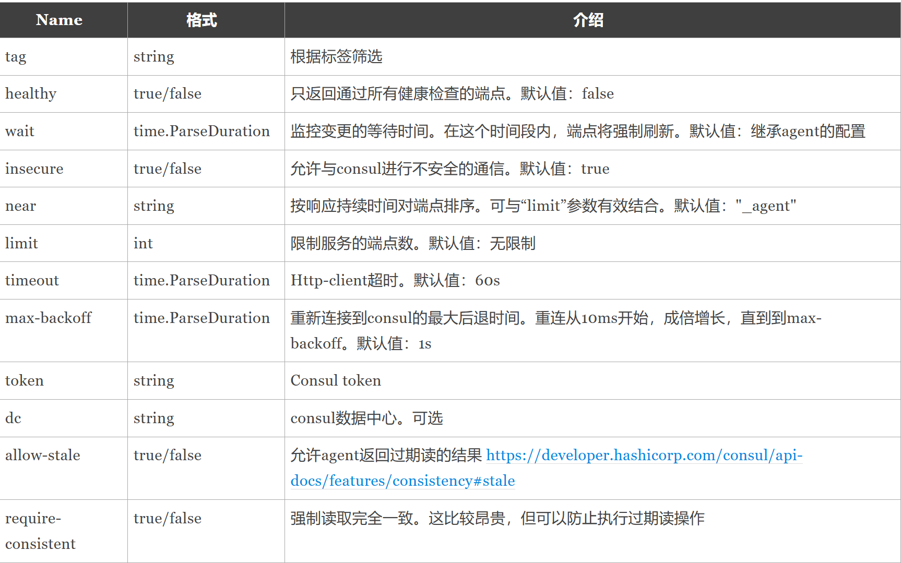

# Consul介绍

[Consul](https://www.consul.io/)是一个分布式、高可用性和数据中心感知的解决方案，用于跨动态、分布式基础设施连接和配置应用程序。

### 控制平面

Consul 提供了一个控制平面（control plane），使你能够注册、访问和安全的部署在你的网络上的服务。控制平面是网络基础设施的一部分，它维护一个中央注册中心来跟踪服务及其各自的 IP 地址。

当使用 Consul 的服务网格功能时，Consul 在请求路径中动态配置边车（sidecar）和网关代理，这使你能够授权服务到服务的连接，将请求路由到健康的服务实例，并在不修改服务代码的情况下强制 mTLS 加密。这可以确保通信的性能和可靠性。


### 特性

Consul提供了几个关键特性:

* 多数据中心——Consul 被构建为数据中心感知的，可以支持任意数量的区域，而不需要复杂的配置。
* 服务网格/服务细分——使用自动 TLS 加密和基于身份的授权实现安全的服务对服务通信。应用程序可以在服务网格配置中使用 sidecar 代理为入站和出站连接建立 TLS 连接，而完全不知道连接方。
* 服务发现——Consul 使服务注册自己和通过 DNS 或 HTTP 接口发现其他服务变得简单。也可以注册外部服务，如 SaaS 提供者。
* 健康检查——健康检查使得 Consul 能够就集群中的任何问题快速向操作员发出警报。与服务发现的集成可以防止将流量路由到不健康的主机，并启用服务级断路器。
* Key/Value存储——一个灵活的键/值存储允许存储动态配置、特性标记、协调、领导选举等。简单的 HTTP API 使得在任何地方都可以轻松使用。

### 数据中心

Consul 控制平面包含一个或多个数据中心。数据中心是执行基本 consul 操作的 consul 基础设施的最小单元。

一个数据中心至少包含一个 consul 服务器代理（server agent），但是一个实际部署包含三个或五个服务器代理（server agent）和几个 consul 客户机代理（client agent）。你可以创建多个数据中心，并允许不同数据中心中的节点相互交互。

##### 集群

Consul 代理之间相互联通的集合称为集群。数据中心和集群的概念通常可以互换使用。但是，在某些情况下，集群只引用 ConsulServer 代理，比如在 HCP Consull 中。在其他上下文中，例如 Consul Enterprise 包含的管理分区特性，集群可能引用客户机代理的集合。

### 代理（Agents）

你可以运行 Consul 二进制文件来启动 consul 代理，这些代理是实现 consul 控制平面功能的守护进程。代理可以作为服务器或客户端启动。

##### server agent

Consul 服务器代理存储所有状态信息，包括服务和节点 IP 地址、健康检查和配置。建议在一个集群中部署三到五台服务器。部署的服务器越多，出现故障时的弹性和可用性就越大。然而，更多的服务器会降低一致性，而一致性是一个关键的服务器功能，它使 Consul 能够高效地处理信息。

###### 共识协议

Consul 集群通过一个称为“一致同意”的过程选出一个服务器作为 leader。leader 处理所有查询和事务，这可以防止包含多个服务器的集群中发生冲突的更新。

当前不充当群集 leader 的服务器称为 follower。follower 从客户机代理向集群 leader 转发请求。leader 将请求复制到集群中的所有其他服务器。复制能确保如果 leader 不可用，群集中的其他服务器可以选择另一个 leader 而不丢失任何数据。

Consul 服务器在端口8300上使用 Raft 算法建立共识。有关 Raft 算法介绍，可以参考[https://thesecretlivesofdata.com/raft](https://thesecretlivesofdata.com/raft/)。


##### client agent

Consul 客户向 consul 集群报告节点和服务状态。在典型的部署中，必须在数据中心的每个计算节点上运行客户端代理。客户端使用远程过程调用(RPC)与服务器交互。默认情况下，客户机向端口 `8300`上的服务器发送 RPC 请求。

对于可以使用的客户机代理或服务的数量没有限制，但是生产部署应该跨多个 Consul 数据中心分发服务。使用多数据中心部署增强了基础设施的弹性，并限制了控制平面出现问题。建议每个数据中心最多部署5,000个客户机代理。一些大型组织已经在一个多数据中心部署中部署了成千上万的客户机代理和成千上万的服务实例。

### LAN gossip pool

客户机和服务器代理参与 LAN gossip pool，以便分发和执行节点健康检查。池中的代理将健康检查信息传播到整个群集。代理在 `8301`端口上使用 UDP 进行 gossip 通信。如果 UDP 不可用，代理的 gossip 就会退而求其次使用 TCP。

下面的图显示了服务器和客户端之间的交互。

LAN gossip pool集群中的RPC通信

### 跨数据中心请求

每个 consul 数据中心维护自己的服务和健康目录。默认情况下，信息不会跨数据中心复制。WAN 联盟（WAN federation）和集群对等（cluster peering）是两种支持跨数据中心服务连接的多数据中心部署模型。

##### WAN federation

WAN 联盟是一种连接多个 consul 数据中心的方法。它要求指定一个主数据中心，其中包含有关所有数据中心的权威信息，包括服务网格配置和访问控制列表(ACL)资源。

在这个模型中，当客户机代理请求远程辅助数据中心中的资源时，本地 Consul服务器将 RPC 请求转发给具有访问资源权限的远程 Consul 服务器。远程服务器将结果发送到本地服务器。如果远程数据中心不可用，则其资源也不可用。默认情况下，WAN 联盟服务器通过端口 `8300`上的 TCP 发送跨数据中心请求。

###### WAN gossip pool

服务器还可以参与 WAN gossip pool，该池针对因特网带来的更大延迟进行了优化。该池使服务器能够交换信息，例如它们的地址和健康状况，并且在发生故障时能够优雅地处理连接性的丢失。

在下图中，每个数据中心的服务器通过端口 `8302`上的 TCP/UDP 发送数据，从而参与到广域网 gossip 池中。有关更多信息，请参考[流言协议](https://developer.hashicorp.com/consul/docs/architecture/gossip)。

WAN gossip pool

远程数据中心转发

##### Cluster peering (beta)

可以在两个或多个独立集群之间创建对等连接，以便部署到不同数据中心或管理分区的服务可以进行通信。管理分区是 Consul 商业版中的一个特性，它使你能够定义使用相同 Consul Server 的独立网络区域。在集群对等模型中，你将在一个数据中心或分区中创建一个令牌，并配置另一个数据中心或分区来显示该令牌以建立连接。

想要了解更多信息， 请查看[什么是Cluster Peering](https://developer.hashicorp.com/consul/docs/connect/cluster-peering)。

# Consul开发环境

搭建一套实际生产环境的 Consul 集群是相对比较复杂的，如果只是出于学习目的，我们完全可以在自己的电脑上搭建单节点 consul 环境，或者稍微复杂点搭建一个3节点的集群环境。

### 搭建开发环境

这里推荐大家按[官方docker-compose-datacenter教程](https://learn.hashicorp.com/tutorials/consul/docker-compose-datacenter)使用docker-compose一键搭建consul环境。

> 十分推荐使用 Docker Compose 快速搭建学习使用的 Consul 环境。

执行下面的命令，从官方 github 仓库中获取的配置和资源。

```bash
git clone https://github.com/hashicorp/learn-consul-docker.git
```

这个仓库中有很多定义好的各式 consul 环境 docker-compose 配置，我们这里使用的是服务发现的环境，进入到 `datacenter-deploy-service-discovery` 目录。

```bash
cd datacenter-deploy-service-discovery
```

执行以下命令，启动容器。

```bash
❯ docker-compose up -d
Creating network "datacenter-deploy-service-discovery_consul" with driver "bridge"
Creating consul-server ... done
Creating consul-client ... done
```

这样一个用于服务发现的 consul 环境就搭建好了。

而 `datacenter-deploy-secure` 目录中提供了一个由3个server和1个client组成的集群环境。

### 管理后台

使用浏览器打开 [http:127.0.0.1:8500](http://127.0.0.1:8500/) 就可以看到Consul的管理界面了。


# Agent HTTP API

请查阅完整的[Agent HTTP API文档](https://www.consul.io/api-docs/agent/service)。

### 服务注册与服务发现

这里只列出与服务注册和服务发现相关的API。

查询服务

| Method  | Path                | Produces             |
| ------- | ------------------- | -------------------- |
| `GET` | `/agent/services` | `application/json` |

注册服务

| Method  | Path                        | Produces             |
| ------- | --------------------------- | -------------------- |
| `PUT` | `/agent/service/register` | `application/json` |

注销服务

| Method  | Path                                      | Produces             |
| ------- | ----------------------------------------- | -------------------- |
| `PUT` | `/agent/service/deregister/:service_id` | `application/json` |

**注意：** 实际Path路径前需要加 `v1`版本前缀。

# Go SDK

> 在实际的业务场景中，我们更多的是将服务和 consul agent 部署到同一个 pod 中。由 Consul agent 来完成服务注册、服务发现以及健康检查的相关工作。本文为方便理解而使用 Consul Go SDK 来演示服务注册与服务发现的相关流程。

在代码中导入官方 api 包。

```go
import "github.com/hashicorp/consul/api"
```

### 连接consul

定义一个 `consul`结构体，保存consul client对象。

```go
// consul 定义一个consul结构体，其内部有一个`*api.Client`字段。
type consul struct {
	client *api.Client
}

// NewConsul 连接至consul服务返回一个consul对象
func NewConsul(addr string) (*consul, error) {
	cfg := api.DefaultConfig()
	cfg.Address = addr
	c, err := api.NewClient(cfg)
	if err != nil {
		return nil, err
	}
	return &consul{c}, nil
}
```

### 获取本机出口IP

这里补充一个获取本机出口IP的方法。

```go
// GetOutboundIP 获取本机的出口IP
func GetOutboundIP() (net.IP, error) {
	conn, err := net.Dial("udp", "8.8.8.8:80")
	if err != nil {
		return nil, err
	}
	defer conn.Close()
	localAddr := conn.LocalAddr().(*net.UDPAddr)
	return localAddr.IP, nil
}
```

### 服务注册

将我们 grpc 服务注册到 consul。

需要注意的是，如果你的 gRPC 服务只在 **本机的回环地址 (`127.0.0.1`)** 上监听，从 **其他机器** 或者通过 **本机的局域网 IP 地址** (比如 `192.168.1.100`) 是 **无法访问** 到这个服务的。

```go
// RegisterService 将gRPC服务注册到consul
func (c *consul) RegisterService(serviceName string, ip string, port int) error {
	srv := &api.AgentServiceRegistration{
		ID:      fmt.Sprintf("%s-%s-%d", serviceName, ip, port), // 服务唯一ID
		Name:    serviceName,                                    // 服务名称
		Tags:    []string{"star", "hello"},                      // 为服务打标签
		Address: ip,
		Port:    port,
	}
	return c.client.Agent().ServiceRegister(srv)
}
```

### 健康检查

consul支持为服务配置相应的健康检查。

##### gRPC服务支持健康检查

gRPC 服务要支持健康检查需要先导入相关依赖包。

```go
import "google.golang.org/grpc/health"
import healthpb "google.golang.org/grpc/health/grpc_health_v1"
```

向gRPC服务注册健康检查服务。

```go
s := grpc.NewServer() // 创建gRPC服务器
healthcheck := health.NewServer()
healthpb.RegisterHealthServer(s, healthcheck)
```

##### consul添加健康检查

在向 consul 注册我们的 gRPC 服务时，可以指定健康检查的配置。

```go
// RegisterService 将gRPC服务注册到consul
func (c *consul) RegisterService(serviceName string, ip string, port int) error {
	// 健康检查
	check := &api.AgentServiceCheck{
		GRPC:     fmt.Sprintf("%s:%d", ip, port), // 这里一定是外部可以访问的地址
		Timeout:  "10s",                          // 超时时间
		Interval: "10s",                          // 运行检查的频率
		// 指定时间后自动注销不健康的服务节点
		// 最小超时时间为1分钟，收获不健康服务的进程每30秒运行一次，因此触发注销的时间可能略长于配置的超时时间。
		// 建议选择足够长的合适的时间，以免服务因为网络波动等原因被注销
		DeregisterCriticalServiceAfter: "5m",
	}
	srv := &api.AgentServiceRegistration{
		ID:      fmt.Sprintf("%s-%s-%d", serviceName, ip, port), // 服务唯一ID
		Name:    serviceName,                                    // 服务名称
		Tags:    []string{"star", "hello"},                      // 为服务打标签
		Address: ip,
		Port:    port,
		Check:   check,
	}
	return c.client.Agent().ServiceRegister(srv)
}
```

### 服务发现

##### 通过 api 查询 consul

在服务端程序将服务注册到 consul 之后，客户端程序可以查询服务名称下的服务实例（机器），具体支持的filter策略可查看[文档](https://www.consul.io/api-docs/agent/service#filtering)。

```go
// 连接consul
cc, err := api.NewClient(api.DefaultConfig())
if err != nil {
	fmt.Printf("api.NewClient failed, err:%v\n", err)
	return
}
// 返回的是一个 map[string]*api.AgentService
// 其中key是服务ID，值是注册的服务信息
serviceMap, err := cc.Agent().ServicesWithFilter("Service==`hello`")
if err != nil {
	fmt.Printf("query service from consul failed, err:%v\n", err)
	return
}
// 选一个服务机（这里选最后一个）
var addr string
for k, v := range serviceMap {
	fmt.Printf("%s:%#v\n", k, v)
	addr = v.Address + ":" + strconv.Itoa(v.Port)
}

// 建立RPC连接
conn, err := grpc.Dial(addr, grpc.WithTransportCredentials(insecure.NewCredentials()))
if err != nil {
	log.Fatalf("grpc.Dial failed,err:%v", err)
	return
}
defer conn.Close()
```

 **注意** ：这里只是演示如何通过 api 查询 consul ，实际的服务发现过程并不需要这么写。

##### consul resolver

gRPC支持自定义resolver，借助第三方的[grpc-consul-resolver](https://github.com/mbobakov/grpc-consul-resolver)库，我们可以更便捷的实现基于consul的服务发现。

在代码中按如下方式匿名导入 `github.com/mbobakov/grpc-consul-resolver`包。

```go
import _ "github.com/mbobakov/grpc-consul-resolver"
```

在 `grpc.Dial`时直接使用类似 `consul://[user:password@]127.0.0.127:8555/my-service?[healthy=]&[wait=]&[near=]&[insecure=]&[limit=]&[tag=]&[token=]`的连接字符串来指定连接目标。

目前支持的参数：



例如下面的示例中，使用 `consul://127.0.0.1:8500/hello?healthy=true`即可快速实现查询hello服务健康节点的服务发现过程。其他部分代码无需改变。

```go
conn, err := grpc.NewClient(
	"consul://127.0.0.1:8500/hello?healthy=true",
	grpc.WithTransportCredentials(insecure.NewCredentials()),
)
```

一个值得注意的地方是，`api.DefaultConfig()` 源代码里面是这样设置的：

```
config := &Config{
	Address:   "127.0.0.1:8500",
	Scheme:    "http",
	Transport: transportFn(),
}
```

然而，当你使用 `consul://localhost:8500/hello?healthy=true`进行连接时，操作系统的**域名解析器（DNS Resolver）** 需要决定是使用 IPv4还是 IPv6 。

在某些系统配置或网络环境下，解析器可能会优先选择 IPv6 。这意味着你的程序实际上尝试连接的是 `::1:8500` (IPv6)，而不是 `127.0.0.1:8500` (IPv4)，从而导致报错。

### 注销服务

将服务从 consul 注销可以使用 `ServiceDeregister`函数。

```go
// Deregister 注销服务
func (c *consul) Deregister(serviceID string) error {
	return c.client.Agent().ServiceDeregister(serviceID)
}
```

在现实场景中我们通常需要在某个server节点退出时将当前节点从 consul 注销。 这里搭配 `chan os.Signal`实现程序退出前执行注销服务操作。

```go
func main() {
	flag.Parse()
	addr := fmt.Sprintf(":%v", *port)

	lis, err := net.Listen("tcp", addr)
	if err != nil {
		log.Fatalf("falied to listen: %v", err)
	}

	s := grpc.NewServer()
	pb.RegisterHelloServer(s, &server{})
	healthcheck := health.NewServer()
	healthpb.RegisterHealthServer(s, healthcheck)

	c, err := NewDefaultConsul()
	if err != nil {
		log.Fatalf("NewDefaultConsul failed: %v", err)
	}
	ip, err := GetOutBondIP()
	if err != nil {
		log.Fatalf("GetOutBondIP failed: %v", err)
	}

	err = c.RegisterService("hello", ip.String(), *port)
	if err != nil {
		log.Fatalf("c.RegisterService failed: %v", err)
	}

	go func() {
		log.Printf("gRPC serve on: %v", addr)
		if err := s.Serve(lis); err != nil {
			log.Fatalf("falied to server: %v", err)
		}
	}()

	quit := make(chan os.Signal, 1)
	signal.Notify(quit, syscall.SIGTERM, syscall.SIGINT)
	<-quit
	// 退出时注销服务
	serviceID := fmt.Sprintf("%s-%s-%d", "hello", ip.String(), *port)
	c.Deregister(serviceID)
}
```

### 负载均衡

gRPC中使用 `grpc.WithDefaultServiceConfig`来指定使用的负载均衡策略。

> 网上很多介绍gRPC负载均衡的旧资料还在使用已经废弃且被 v1.46 移除的[WithBalancerName](https://github.com/grpc/grpc-go/blob/431ea809a7676e1da8d09c33ae0d31fcba85f1ff/dialoptions.go#L208)。

下面的示例演示了 gRPC 客户端使用 consul 作为注册中心，`round_robin`作为负载均衡策略建立 gRPC 连接的示例。

```go
conn, err := grpc.NewClient(
	// consul服务
	"consul://127.0.0.1:8500/hello?healthy=true",
	// 指定round_robin策略
	grpc.WithDefaultServiceConfig(`{"loadBalancingPolicy": "round_robin"}`),
	grpc.WithTransportCredentials(insecure.NewCredentials()),
)
```

### consul 服务注册与服务发现总结

在实际生产环境中，我们的服务直接与本节点的 Consul client 进行交互，完成服务注册与服务发现。


