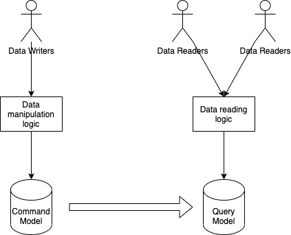
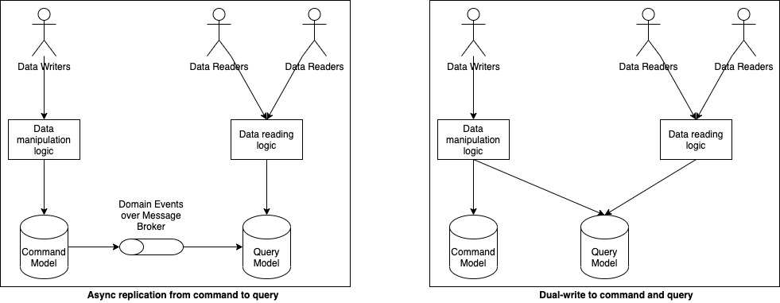

# CRUD传统问题

在传统体系结构中，单个数据模型通常用于读取和写入作。 此方法非常简单，适用于基本的创建、读取、更新和删除（CRUD）操作。

随着应用程序的增长，优化单个数据模型的读取和写入操作变得越来越困难。 读取和写入操作通常具有不同的性能和扩展性需求。 传统的 CRUD 体系结构不考虑这种不对称性，这可能会导致以下挑战：

* **数据不匹配：** 数据读取和写入表示形式通常有所不同。 更新操作中必需的某些字段在读取操作时可能不需要。
* **锁争用：** 同一数据集上的并行操作可能会导致锁争用。
* **性能问题：** 传统方法可能会对性能产生负面影响，因为数据存储和数据访问层加载，以及检索信息所需的查询的复杂性。
* **安全挑战：** 当实体受到读取和写入作的约束时，管理安全性可能很困难。 这种重叠可以在意外的上下文中公开数据。

合并这些职责可能会导致模型过于复杂。

# CQRS基本介绍

CQRS 是“命令查询责任分离”(Command Query Responsibility Segregation) 的缩写。

在基于 CQRS 的系统中，命令(写操作)和查询(读操作)所使用的数据模型是有区别的。命令模型用于有效地执行写/更新操作，而查询模型用于有效地支持各种读模式。通过领域事件或其他各种机制将命令模型中的变更传播到查询模型中，让两个模型之间的数据保持同步。

如果你觉得它们看起来就像是两个不同的微服务，那么我来说一说它们之间的一个细微区别。从物理实现层面来看，这两个数据模型可以作为两个独立的微服务，甚至可以用一个命令模型来支持多个查询模型。但是，微服务架构的一个关键构造是两个微服务通常代表两个独立的领域，而在 CQRS 中，无论运行时架构是怎样的，命令模型和查询模型都属于同一逻辑领域。如果查询模型对命令模型一无所知，就无法发挥作用。这里的耦合是预期的，不同于微服务之间的解耦行为。

CQRS 并没有规定这两个模型如何保持同步。同步可以通过同时更新两个模型来同步实现，也可以通过消息代理（如 Kafka）将命令从命令模型传输到查询模型来异步实现。后一种比较常用，因为它让系统更加可伸缩，尽管它需要在写操作和读操作的最终一致性方面做出权衡。

最终一致性：当用户从异步从库读取时，如果此异步从库落后，他可能会看到过时的信息。这种不一致只是一个暂时的状态——如果等待一段时间，从库最终会赶上并与主库保持一致。

### 这不就是缓存吗？

只用于读取的数据模式看起来就像是一个缓存。事实上，查询模型可以使用 Redis 这样的缓存技术来实现。但是，CQRS 不只是为了分离数据的写入和读取，它的根本目的是为了实现数据的多重表示，每一种表示都能够满足某些用户的需求。CQRS 可能会有多种查询模式，每个模式可能使用不同的物理实现。有些可能使用数据库，有些可能使用 Redis，等等。

### 什么时候应该使用 CQRS

对于一部分场景，CQRS 是一种非常有用的架构模式。

第一个是我在前面已经提到过的。如果同一个数据模型不能有效地满足系统的读和写模式，那么通过应用 CQRS 来解耦读写是很有意义的。解耦后的数据模型可以满足特定的需求。CQRS 有效地将单个数据表示变成任意数量的(读)表示，所有这些表示都与负责处理所有更新的核心表示保持一致。

适用 CQRS 的第二个场景是将读负载与写负载分开。前面我讲了缓存和 CQRS 的区别，缓存并不是应用 CQRS 的目的。但是，通过分离命令模式和查询模式，就有了对单个模式进行伸缩的可能性。查询模型可以有自己的数据库和缓存，可以使用最适合某些特定场景的技术来实现。但不管怎样，命令模型的伸缩都不会受制于查询模型。我在这里需要重申的是，它们不是独立的系统，尽管它们之间有深度的耦合，但这不是问题。

### 什么时候不该使用 CQRS

在系统中使用 CQRS 会带来显著的认知负担和复杂性。开发人员必须面对至少两个数据模型和多种技术选择，所有这些都是不可忽略的负担。

第二个问题是如何保持命令模型和查询模型的数据同步。如果选择了异步方式，那么整个系统就要承担最终一致性所带来的后果。这可能非常麻烦，特别是当用户希望系统能够立即反映出他们的操作时，即使是单个一致性要求也会危及整个系统的设计。

如果我们选择让模型在任何时候都保持一致，就会有 CAP 和两阶段提交问题。如果两个模型使用同一个支持 ACID 的数据库，我们可以通过事务来保持它们的一致性，但 CQRS 的很多可伸缩性优势就发挥不出来了。如果要支持多个查询模型，写操作将会越来越慢，因为需要更新所有的查询模型。

在提交阶段中，如果协调者在向参与者发送提交或回滚指令时宕机或网络中断，参与者可能会一直处于准备提交 (prepared) 状态，无法自主决定提交还是回滚，从而导致事务被长时间锁定资源，影响系统可用性。

因为这两个问题的存在，在选择是否使用 CQRS 时就要十分谨慎。如果使用得当，它可以极大提升应用程序的伸缩性。但是，支持多个数据模型并不是件容易的事，所以应该只在没有其他方法可以满足要求时才考虑这么做。

CAP 定理：在分布式系统中，一致性 (Consistency) 、可用性 (Availability) 和分区容忍性 (Partition Tolerance) 三者不能同时完全满足：系统在发生网络分区时，必须在保证一致性和可用性之间做出权衡，即只能选择保证其中两项。因此，CAP 定理本质上描述了分布式系统在网络不可靠环境下的设计取舍。

两阶段提交 (2PC)：一种分布式事务协议，用于保证多个参与节点对同一事务的一致性。它将提交过程分为两个阶段：准备阶段 (Prepare)，协调者询问各参与者是否可以提交事务，参与者返回同意或拒绝；提交阶段 (Commit/Abort)，如果所有参与者同意，则协调者发送提交指令，否则发送回滚指令。通过这两个阶段，2PC 确保在分布式环境下事务要么全部提交，要么全部回滚，从而保证数据一致性，但其缺点是存在阻塞风险。

### CQRS 的优点

* **独立缩放。** CQRS 使读取模型和写入模型能够独立缩放。 此方法可帮助最大程度地减少锁争用并提高负载下的系统性能。
* **优化的数据架构。** 读取操作可以使用针对查询进行优化的模式。 写入操作使用针对更新优化的模式。
* **安全性。** 通过分隔读取和写入，可以确保只有适当的域实体或操作有权对数据执行写入操作。
* **关注点分离。** 分离读取和写入责任会导致更简洁、更易于维护的模型。 写入端通常处理复杂的业务逻辑。 读取端可以保持简单且专注于查询效率。
* **更简单的查询。** 在读取数据库中存储具体化视图时，应用程序可以在查询时避免复杂的联接。

# 参考资料

[https://kislayverma.com/software-architecture/architecture-pattern-cqrs/?fileGuid=0IWvR8dLbi0m7fi4](https://kislayverma.com/software-architecture/architecture-pattern-cqrs/?fileGuid=0IWvR8dLbi0m7fi4)

[https://learn.microsoft.com/zh-cn/azure/architecture/patterns/cqrs](https://learn.microsoft.com/zh-cn/azure/architecture/patterns/cqrs)
