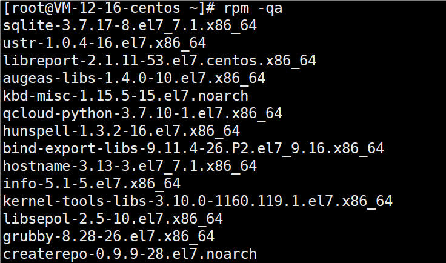

# rpm

rpm用于互联网下载包的打包及安装工具，它包含在某些Linux分发版中。它生成具有.RPM扩展名的文件

RPM是RedHat Package Manager（RedHat软件包管理工具）的缩写，类似windows的setup.exe，这一文件格式名称虽然打上了RedHat的标志，但理念是通用的。

Linux的分发版本都有采用（suse，redhat，centos等等），算是公认的行业标准。

### 指令

查询已安装的rpm列表

```
rpm -qa | grep xx
```


包名：firefox-60.10.0-1.el7.centos.x86_64
名称：firefox
版本号：60.10.0-1
适用操作系统：`el7.centos.x86_64`表示 `centos7.x的64位系统`，如果是 `i686、i386`表示 `32位系统`，`noarch`表示通用

查询所安装的所有rpm软件包

```
rpm - qa
```



查询指定软件包是否安装

```
rpm -q 软件包名
```


查询软件包信息

```
rpm -qi 软件包名
```


查询软件包中的文件

```
rpm -ql 软件包名
```


查询文件所属的软件包

```
rpm -qf 文件全路径名 
```


卸载rpm包

```
rpm -e RPM包的名称
rpm -e --nodeps RPM包的名称
```


如果其他软件包依赖于您要卸载的软件包，卸载时则会产生错误信息。

```
removing these packages would break dependencies: foo is needed by bar-1.0-1
```

如果我们就是要删除foo这个rpm包，可以增加参数–nodeps，就可以强制删除，但是一般不推荐这样做，因为依赖于该软件包的程序可能无法运行。

安装rpm包

```
rpm -ivh RPM包全路径名称
```

参数说明：

* i=install 安装
* v=verbose 提示
* h=hash 进度条

补充：怎么找firefox安装包？在centos7光驱中找。可以将包移动到/opt下，方便安装。

# yum

Yum是一个Shell前端软件包管理器。基于RPM包管理，能够从指定的服务器自动下载RPM包并且安装，可以自动处理依赖性关系，并且一次安装所有依赖的软件包。

示意图

### 指令

查询yum服务器是否有需要安装的软件

```
yum list | grep xx软件列表
```

安装指定的yum包

```
yum install xxx 
```
