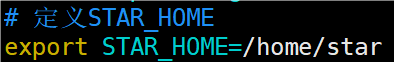

# 基本介绍

Shell是一个命令行解释器，它为用户提供了一个向Linux内核发送请求以便运行程序的界面系统级程序，用户可以用Shell来启动、挂起、停止甚至是编写一些程序。

# Shell脚本的执行方式

### 格式要求

* 脚本以 ` #!bin/bash` 开头，表明以bashell执行
* 脚本需要有可执行权限
* shell脚本约定俗成以.sh结尾

### 编写Shell脚本

需求说明：创建一个Shell脚本，输出hello,world！


单行注释：

```
#
```

多行注释：

```
:<<!
内容
!
```

### 常用执行方式

```
xxx.sh 或者 /xxxx/xx/xxx.sh
```

直接通过相对路径或者绝对路径执行。

注意执行者需要对 hello.sh 有x（执行）权限。


```
sh xxx.sh的相对路径或者绝对路径
```

不用赋予脚本+x权限，直接执行即可。


# 变量

Linux Shell中的变量分为：系统变量和用户自定义变量。

系统变量：`$HOME,$PWD,$SHELL,$USER`等等


显示当前shell中所有变量：set


### 变量的定义

##### 基本语法

```
定义变量：变量名=值（不要打空格）
撤销变量：unset 变量
声明静态变量：readonly 变量（静态变量不会被反复定义和初始化，只会被定义一次，不能unset）
```

##### 快速入门

案例1：定义变量A

案例2：撤销变量A

案例3：声明静态的变量，验证不能unset


案例4：可把变量提升为全局环境变量，可供其他shell程序使用[该案例后面讲]

### 变量的命名和赋值规则

##### 定义变量的规则

* 变量名称可以由字母、数字和下划线组成，但是不能以数字开头。5A=200(不可以)
* 等号两侧不能由空格。
* 变量名称一般习惯为大写（这是一个规范，我们遵守即可）

##### 将命令的返回值赋给变量

```
A=`date` 或者 A=$(date)
```

运行里面的命令，并把结果返回给变量A（没有反引号，会认为是单词赋给A）。


# 设置环境变量

### 基本语法

```
export 变量名=变量值
将shell变量输出为环境变量/全局变量
source 配置文件 
让修改后的配置信息立即生效
echo $变量名 
查询环境变量的值
```

### 快速入门

在/etc/profile文件中定义 STAR_HOME 环境变量



查看环境变量 STAR_HOME 的值，在输出环境变量前，需要让其生效


在另外一个shell程序中使用 STAR_HOME


# 位置参数变量

当我们执行一个shell脚本时，如果希望获取到命令行的参数信息，就可以使用到位置参数变量。

比如：./myshell.sh 100 200，这个就是一个执行shell的命令行，可以在myshell脚本中获取到参数信息。

### 基本语法

```
$n 
n为数字，$0代表命令本身，$1-$9代表第一到第九个参数，十以上的参数需要用大括号包含，如{10}
$* 
这个变量代表命令行中所有的参数，*把所有的参数看成一个整体
$@
这个变量也代表命令行中所有的参数，不过@把每个参数区分对待
$# 
这个变量代表命令行中所有参数的个数
```

### 快速入门

编写一个shell脚本myshell.sh，在脚本中获取到命令行的各个参数信息。


# 预定义变量（了解即可）

就是shell设计者事先已经定义好的变量，可以直接在shell脚本中使用。

### 基本语法

```
$$
当前进程的进程号(PID)
$! 
后台运行的最后一个进程的进程号(PID)
$? 
最后一次执行的命令的返回状态。如果这个变量的值为0，证明上一个命令正确执行；如果这个变量的值为非0（具体是哪个数，由命令自己来决定），则证明上一个命令执行不正确了。
```

### 快速入门

在一个shell脚本中简单使用一下预定义变量 preVar.sh


卡住的原因是在一个脚本里执行另外一个脚本，按ctrl+C退出。

# 运算符

### 基本语法

```
$((运算式))  
$[运算式] 
expr m + n 
注意expr运算符间要有空格，如果希望将expr的结果赋给某个变量，使用``括起来。
+、-、\*、 /、 % 分别表示加，减，乘，除，取余。
```

### 快速入门

案例1：计算(2+3)*4的值

案例2：请求出命令行两个参数[整数]的和，比如20和50


# 条件判断

### 判断语句

```
if [ condition ] # 注意condition前后要有空格
then
	...
fi
```

非空返回true，可使用$?验证（0为true，>1为false）。

### 常用判断条件

1. 字符串比较

   ```
   =
   ```
2. 两个整数的比较

   ```
   -lt 小于
   -le 小于等于
   -eq 等于
   -gt 大于
   -ge 大于等于
   -ne 不等于
   ```
3. 按照文件权限进行判断

   ```
   -r 有读的权限
   -w 有写的权限
   -x 有执行的权限
   ```
4. 按照文件类型进行判断

   ```
   -f 文件存在并且是一个常规的文件
   -e 文件存在
   -d 文件存在并是一个目录
   ```

### 快速入门

案例1：“ok”是否等于“ok”

案例2：23是否大于等于22

案例3：目录中的文件是否存在


# 流程控制

### if 判断

##### 单分支

```
if [ 条件判断式 ]
then
	代码
fi
```

##### 多分支

```
if [ 条件判断式 ]
then
	代码
elif [ 条件判断式 ]
then
	代码
fi
```

注意事项：[ 条件判断式 ]，中括号和条件判断式之间必须有空格。

##### 快速入门

案例：请编写要给shell程序，如果输入的参数，大于等于60，则输出“及格了”，如果小于60，则输出”不及格“


### case语句

##### 基本语法

```
case $变量名 in
”值1“)
如果变量的值等于值1，则执行程序1
;;
“值2”)
如果变量的值等于值2，则执行程序2
;;
...省略其他分支...
*）
如果变量的值都不是以上的值，则执行此程序
;;
esac
```

##### 快速入门

案例：当命令行参数是1时，输出“周一”，是2时，就输出“周二”，其他情况输出“other”


### for循环

##### 基本语法

```
for 变量 in 值1 值2 值3  # 值外面可以加双引号
do
	程序/代码
done
```

```
for((初始值;循环控制条件;变量变化))
do
	程序/代码
done
```

##### 快速入门

案例1：打印命令行输入的参数


案例2：从1加到100的值输出显示


### while循环

##### 基本语法

```
while [ 条件判断式 ]
do
程序
done
```

注意：while和 `[`有空格，条件判断式和 `[`也有空格。

##### 快速入门

案例：从命令行输入一个数n，统计从1+…+n的值是多少？


# read读取控制台输入

### 基本语法

```
read(选项)(参数)
选项：
-p：指定读取值的提示符
-t：指定读取值时等待的时间（秒），如果没有在指定的时间内输入，就不再等待了
参数
变量：指定读取值的变量名
```

### 快速入门

案例1：读取控制台输入一个NUM1值

案例2：读取控制台输入一个NUM2值，在3秒内输入


# 函数

shell编程和其他编程语言一样，有系统函数，也可以自定义函数。系统函数中，我们这里就介绍两个。

### 系统函数

##### basename

```
basename [pathname] [suffix]
basename [string] [suffix]
```

功能：返回完整路径最后/的部分，常用于获取文件名

选项：suffix为后缀，如果suffix被指定了，basename会将`pathname`或`string`中的suffix去掉。


##### dirname

```
dirname 文件绝对路径
```

功能：从给定的包含绝对路径的文件名中去除文件名（非目录的部分），然后返回剩下的路径（目录的部分）


### 自定义函数

##### 基本语法

函数定义

```
function funname[()]
{
	Action;
	[return int;]
}
```

调用函数时，直接写函数名

```
funname [值]
```

##### 快速入门

案例1：计算输入两个参数的和（动态获取），getSum


# 综合案例

### 需求分析

* 每天凌晨2：30备份数据库hspedu到/data/backup/db
* 备份开始和备份结束能够给出相应的提示信息
* 备份后的文件要求以备份时间为文件名，并打包成.tar.gz的形式，比如：2021-03-12_230201.tar.gz
* 在备份的同时，检查是否有10天前备份的数据库文件，如果有就将其删除。

```
cd /user/sbin
vim mysql_db_backup.sh

//.sh文件内容
#!/bin/bash
# 备份目录
BACKUP=/data/backup/db
# 当前时间
DATETIME=$(date +%Y-%m-%d_%H%M%S)
echo $DATETIME
# 数据库的地址
HOST=localhost
# 数据库的用户名
DB_USER=root
# 数据库密码
DB_PW=hspedu100
# 备份的数据库名
DATABASE=hspedu

# 创建备份目录，如果不存在，就创建
[ ! -d "${BACKUP}/${DATETIME}" ] && mkdir -p "${BACKUP}/${DATETIME}"

# 备份数据库
mysqldump -u${DB_USER} -p${DB_PW} --host=${HOST} -q -R --databases ${DATABASE} | gzip > ${BACKUP}/${DATETIME}/${DATETIME}.sql.gz

# 将文件处理成 tar.gz(压缩打包）
cd ${BACKUP}
tar -zcvf $DATETIME.tar.gz ${DATETIME}
# 删除对应的备份
rm -rf ${BACKUP}/${DATETIME}

# 删除十天前的备份文件(atime是访问时间)
find ${BACKUP} -atime +10 -name "*.tar.gz" -exec rm -rf {} \;
echo "备份数据库${DATEBASE} 成功~"
//.sh文件内容结束

crontab -e
# 填入内容
30 2 * * * /usr/sbin/mysql_db_backup.sh

```
