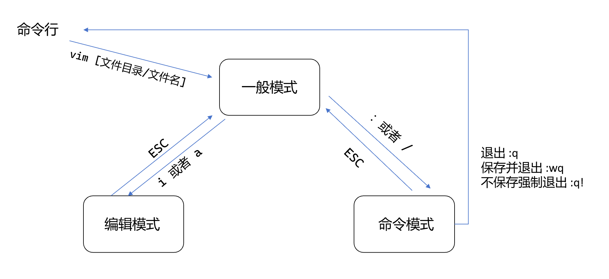

# 基本介绍

Linux系统会内置vi文本编辑器。

Vim具有程序编程的能力，可以看作是Vi的增强版本，可以主动地以字体颜色辨别语法的正确性，方便程序设计。代码补全、编译及错误跳转等方便编程的功能特别丰富，在程序员中被广泛使用。

# 常用模式

### 正常模式

以vim打开一个档案就直接进入一般模式(默认模式)。在这个模式中，你可以使用[上下左右]按键来移动光标，你可以使用[删除字符]或[删除整行]来处理档案内容，也可以使用[复制、粘贴]来处理你的文件数据。

### 插入模式

按下i，I，o，O，a，A，r，R等任何一个字母之后才会进入编辑模式，一般来说按i即可。

### 命令行模式

插入模式切换到命令行模式：先输入esc，再输入冒号":"或“/”。

在这个模式中，可以提供你相关指令，完成读取、写入(w)、替换、离开vim(q)、显示行号、写入并退出(wq)等动作。

### 相互切换

# 快捷键

### 一般模式

* 拷贝当前行：yy ，拷贝当前行向下的5行：5yy
* 删除当前行：dd ，删除当前行向下的5行：5dd
* 粘贴：p
* 撤销：u
* 光标移动到文档的最末行 `G(g+Shift)`，最首行 gg
* 光标移动到20行：`20G`，先输入20，再同时按下 `(g+Shift)`

### 命令模式

* 设置文件的行号：`:set nu`
* 取消文件的行号：`:set nonu`
* 在文件中查找某个单词：`/单词`，回车就会对单词进行查找，输入 `n`就是查找下一个，当找完一轮之后，会提示 `search hit BOTTOM, continuing at TOP`，并且指向第一次出现的地方。
