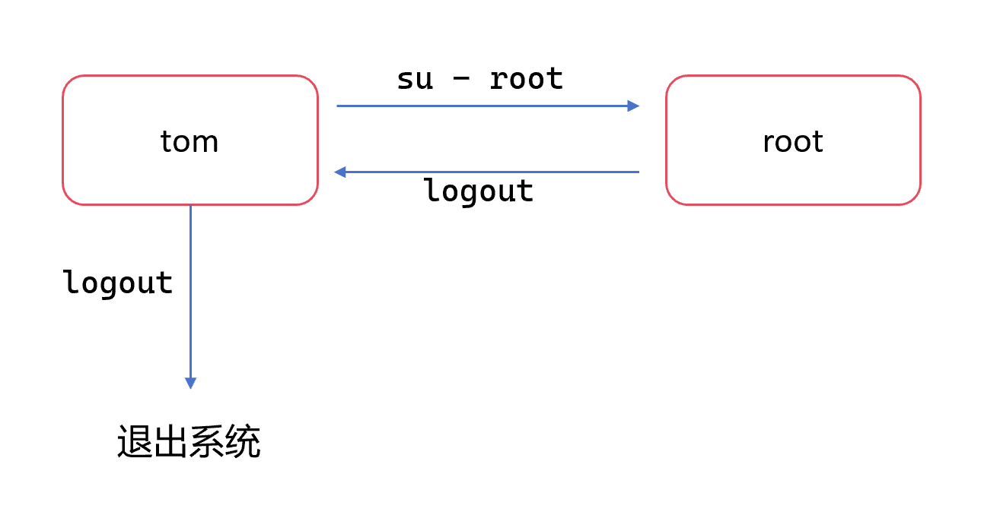

# 关机重启

### 指令

* shutdown : 相当于 shutdown -h 1
* shutdown -h now ： 立即关机
* shutdown -h 1 [提示信息] ：在终端显示提示信息，并且在1分钟后关机
* shutdown -r now ： 立即重新启动计算机
* halt ：立即关机
* reboot ：立即重新启动计算机
* sync ：把内存的数据同步到磁盘

### 提示

目前的 shutdown/reboot/halt 等命令在底层都已经在关机前进行了 sync ，不过为了确保安全，建议还是在执行这些指令之前，先执行一次 sync，把内存中的数据写到磁盘中。

如果你使用的 xshell + 服务器，在关机之后必须重启/开机服务器，才能通过 xshell 再次连接。

# 用户登录和注销

### 登录

登录时尽量少用root账号登录，因为它是系统管理员，最大的权限，要避免使用它导致误操作。

可以利用普通用户登录，然后登陆后再用` su - 用户名 `命令来切换成系统管理员身份。

### 注销

输入 logout 即可注销用户。

