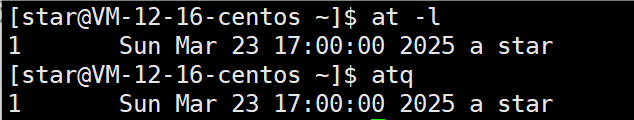
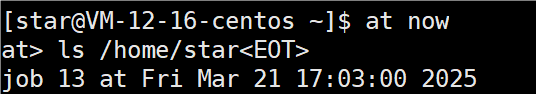

# crond

```
crontab [选项]
crontab -e
编辑个人crontab定时任务
crontab -r
终止任务调度（其实就是删除）
crontab -l
列出当前有哪些任务调度
service crond restart 
重启任务调度
```

crontab 进行定时任务的设置。


任务调度：是指系统在某个时间执行的特定的命令或程序。

任务调度分类：

* 系统工作：有些重要的工作必须周而复始地执行。如病毒扫描等
* 个别用户工作：个别用户可能希望执行某些程序，比如对mysql数据库的备份

### 常用选项

| 选项 | 功能                          |
| ---- | :---------------------------- |
| -l   | 查询crontab任务               |
| -r   | 删除当前用户所有的crontab任务 |
| -e   | 编辑crontab定时任务           |

### 参数细节说明

```
*/1 * * * * ls -l /etc/ > /tmp/to.txt
即每分钟执行ls -l /etc/ > /tmp/to.txt命令
```

##### 5个占位符的说明

| 项目   | 含义                 | 范围                    |
| ------ | -------------------- | ----------------------- |
| 第一个 | 一小时当中的第几分钟 | 0-59                    |
| 第二个 | 一天当中的第几小时   | 0-23                    |
| 第三个 | 一个月当中的第几天   | 1-31                    |
| 第四个 | 一年当中的第几月     | 1-12                    |
| 第五个 | 一周当中的星期几     | 0-7（0和7都代表星期日） |

##### 特殊符号的说明

| 特殊符号 | 含义                                                                                       |
| -------- | ------------------------------------------------------------------------------------------ |
| *        | 代表任何时间。第一个 `*`，代表一小时中每分钟都执行一次                                   |
| ，       | 代表不连续的时间。比如 `0 8,12,16 * * *`，代表在每天的8点0分，12点0分，16点0分都执行一次 |
| -        | 代表连续的时间范围。比如 `0 5 * * 1-6`，代表在周一到周六的凌晨5点0分执行                 |
| */n      | 代表每隔多久执行一次。比如 `*/10 * * * *`，代表每隔10分钟就执行一次                      |

##### 特定时间执行任务案例


解析 `*/10 10 * * * ll /home/jack > /home/jack/list.txt `

从10点每隔10分钟执行一次，进入11点后不再执行。


### 应用实例

案例1：每隔1分钟，就将当前的日期信息，追加到 mydate 文件中


案例2：每隔1分钟，将当前日期和日历都追加到/home/mycal文件中

方案1：写两条指令到crontab中

方案2：写一个完成两条指令的脚本，然后让crond定时执行


注意要给予脚本的执行权限。


crontab 设置个人定时任务。


每隔1分钟，将当前日期和日历都追加到/home/mycal文件中


演示 -r 选项


# at定时任务

```
at [选项] [时间]
Crtl + D 结束at命令的输入（按两次)
at -d 任务编号 或者 atrm 编号
删除已经设置的任务
at -l 或者 atq
查看系统中没有执行的工作任务
```

### 基本介绍

* at命令是一次性定时计划任务，at的守护进程atd会以后台模式运行，检查作业队列来运行。
* 默认情况下，atd守护进程每60秒检查作业队列，有作业时，会检查作业运行时间，如果时间与当前时间匹配，则运行此作业
* at命令是一次性定时计划任务，执行完一个任务后不再执行此任务了
* 在使用at命令的时候，一定要保证atd进程的启动，可以使用相关指令来查看
  * 指令ps -ef（检测当前所有正在运行的进程有哪些）
  * 指令ps -ef | grep atd （检测当前所有正在运行的进程与atd相关指令)

### 常用选项

| 选项         | 含义                                                                     |
| ------------ | ------------------------------------------------------------------------ |
| -m           | 当指定的任务被完成后,将给用户发送邮件,即使没有标准输出                   |
| -I           | atq的别名                                                                |
| -d           | atrm的别名                                                               |
| -v           | 显示任务将被执行的时间                                                   |
| -c           | 打印任务的内容到标准输出                                                 |
| -V           | 显示版本信息                                                             |
| -q<队列>     | 使用指定的队列，队列名为单个字母，字母越靠前（如 `a`），任务优先级越高 |
| -f<文件>     | 从指定文件读入任务而不是从标准输入读入                                   |
| -t<时间参数> | 以时间参数的形式提交要运行的任务                                         |

### 时间定义

1. 接受在当天的 hh:mm(小时：分钟）式的时间指定。假如该时间已过去，那么就放在第二天执行。例如：04：00
2. 使用midnight（深夜），noon（中午），teatime（饮茶时间，一般是下午4点）等比较模糊的词语来指定时间。
3. 采用12小时计时制，即在时间后面加上AM（上午）或PM（下午）来说明是上午还是下午。例如：12pm
4. 使用相对计时法。指定格式为：now + count time-units，now就是当前时间，time-units是时间单位，这里能够使minutes（分钟）、hours（小时）、days（天）、weeks（星期）。count是时间的数量，几天，几小时。例如：now + 5 minutes
5. 直接使用today（今天）、tomorrow（明天）来指定完成命令的时间。
6. 指定命令执行的具体日期，指定格式为month day（月 日）或mm/dd/yy（月/日/年）或dd.mm.yy（日.月.年），指定的日期必须跟在指定时间的后面。例如：04：00 2021-03-1

| 格式类型             | 示例命令                  | 说明                   |
| -------------------- | ------------------------- | ---------------------- |
| **英文月 日**  | `at 04:00 March 1 2024` | 月份用英文全称或缩写   |
| **MM/DD/YY**   | `at 04:00 03/01/24`     | 月/日/年（2位或4位年） |
| **DD.MM.YY**   | `at 04:00 01.03.24`     | 日.月.年               |
| **YYYY-MM-DD** | `at 04:00 2024-03-01`   | 年-月-日               |

部分演示：


### 应用案例

案例1：2天后的下午5点执行/bin/ls /home


案例2：来查看系统中没有执行的工作任务



案例3：明天17点钟，输出时间和日历到指定文件内


案例4：1分钟后，输出目录



输出内容在 /var/spool/mail/[用户] 查看


案例5：删除已经设置的任务


注意：当出现at>，要输入指令时，退格会失效，要退格，需要使用ctrl+退格。
