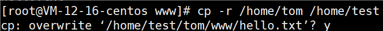
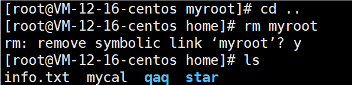

# 指定运行级别

### 基本级别说明

* 0：关机
* 1：单用户【找回丢失密码】
* 2：多用户状态没有网络服务（用的很少）
* 3：多用户状态有网络服务（用的最多的，不带图形界面，节省资源；支持多用户且有网络服务-在实际生产环境中使用最多）
* 4：系统未使用保留给用户（用的比较少）
* 5：图形界面（启动后默认进入的级别，是多用户的）
* 6：系统重启

常用运行级别是3和5，也可以指定默认运行级别。

### 应用实例

```
init [0~6]
```


### 运行级别说明

在centos7以前，我们是在/etc/inittab文件中进行修改。

到了centos7，进行了简化，在/etc/inittab文件中有如下：


查看当前运行级别

```
systemctl get-default
```

设置默认运行级别

```
systemctl set-default TARGET.target
```


# 找回root密码

注意：不同版本找回密码的方式可能有一些小区别

1.首先，启动系统，进入开机界面，在界面中按”e“进入编辑界面。如图

2.进入编辑界面，使用键盘的上下键将光标往下移动，找到以”Linux16“开头内容所在的行数，在行的最后面输入：init=/bin/sh。如

3.接着，输入完成后，直接按快捷键：Ctrl+x进入单用户模式。

4.接着，在光标闪烁的位置中输入：mount -o remount,rw / （注意：各个单词间有空格），完成后按键盘的回车键，如图。

5.在新的一行最后面输入：passwd，完成后按键盘的回车键(Enter)。输入密码，然后再次确认密码即可（密码长度最好是8位以上，但不是必须的），密码修改成功后，会显示passwd。。。的样式，说明密码修改成功。

6.接着，在光标闪烁的位置中(最后一行中)输入：touch /.autorelabel（注意：touch与 /之间有一个空格），完成后按键盘的回车键（Enter）。

7.继续在光标闪烁的位置中，输入：exec /sbin/init（注意： exec与 /之间有一个空格），完成后按键盘的回车键（Enter），等待系统自动修改密码（这个过程时间可能有点长，耐心等待），完成后，系统会自动重启，新的密码生效了。

# 帮助指令

### man

获取帮助信息。

```
man [命令或配置文件]
```

如果帮助信息太长，没有显示完全，那么按空格键，会继续往下显示。

按h寻求man指令的帮助，按q退出man指令。

### help

获得shell内置命令的帮助信息。

```
help 命令
```

help命令只能显示shell内置命令的帮助信息，而linux系统中绝大多数命令是外部命令。

man命令查看命令的详细文档。没有内建与外部命令的区分，因为 man 工具是显示系统手册页中的内容，man 得到的内容比 help 更多更详细。

# 文件目录类

### pwd指令

```
pwd
```

显示当前工作目录的绝对路径。


### ls指令

```
ls [选项] [目录或是文件]
```

没有指定目录或者文件时，默认为当前目录。

##### 常用选项

* -a：列出所有文件，包括以 `.`开头的隐含文件（在linux中，隐含文件是以 `.`开头的，a代表all）
* -l：以列表的方式显示信息
* -h：表示人可以看清楚的形式展示，此时显示的文件大小会自动转化为xx M


##### 选项的组合使用

`-la`或者 `-al`（顺序不做要求），则表示单行输出，且包含所有隐藏文件。


### cd指令

```
cd [参数] 
```

切换到指定目录。

##### 常用参数

* `cd ~或cd`，回到自己的家目录，比如你是root，则到/root，如果是tom，则到/home/tom
* `cd ..`，回到当前目录的上一级目录


应用实例

案例1：使用绝对路径切换到root目录


案例2：使用相对路径到/root目录


### mkdir指令

```
mkdir [选项] 要创建的目录
```

创建目录。

##### 常用选项

-p：创建多级目录

##### 应用实例

案例1：创建一个目录 /home/tom/dog


案例2：创建多级目录 /home/tom/zoo/tiger


### rmdir指令

```
rmdir [选项] 要删除的空目录
```

删除空目录。

##### 应用实例

案例：删除一个空目录 /home/dog


案例：删除一个非空目录 /home/tom/zoo

rmdir 删除的是空目录，如果目录下有内容时无法删除的。

删除非空目录，使用 `rm -rf 要删除的目录（-rf表示强制递归）`。

rm指令单独只能删除文件，加上参数-r可以删除包含文件的文件夹。但是在删除前shell会询问。


### touch指令

```
touch [文件名]
```

创建空文件。

##### 应用实例

案例：在 /qaq 目录下，创建一个空文件 hello.txt


### cp指令

```
cp [选项] source（指定文件） dest（指定目录）
```

拷贝文件到指定目录。

##### 常用选项

-r：递归复制整个文件夹

##### 应用实例

案例1：将 /home/test/hello.txt 拷贝到 /home/tom/www 目录下


案例2：递归复制整个文件夹，将 /home/tom 整个目录，拷贝到 /home/test


案例3：将 /home/tom 整个目录，再次拷贝到 /home/test ，覆盖原本内容。



对于覆盖的每个文件都会询问是否覆盖，如果文件过多，会造成不便。

强制覆盖不提示的方法：\cp


### rm指令

```
rm [选项] 要删除的文件或目录
```

移除文件或目录。

##### 常用选项

* -r：递归删除整个文件夹
* -f：强制删除不提示

##### 应用实例

案例1：将 /home/hello.txt 删除


案例2：递归删除整个目录 /home/test


强制删除不提示的方法：带上-f参数即可


mv指令

```
mv oldNameFile newNameFile 
同一个目录下：重命名文件或目录
mv /temp/movefile /targetFolder
不同的目录下：移动文件或目录
```

mv移动/重命名文件或目录。

应用实例
案例1：将 /home/cat.txt 文件重新命名为 pig.txt

在 /home  目录下处理：


在其他目录下处理：


案例2：将 /home/pig.txt 文件移动到 /root 目录下


案例3：移动整个目录，比如将 /root/hai 移动到 /home下，并重命名为 hello


注意，如果本来 /home 下存在 hello 目录，hi 目录最后会位于 /home/hello/hi


### cat指令

```
cat [选项] 要查看的文件
```

cat查看文件内容（与vim的区别是，cat只能查看，不能修改，更安全）。

##### 常用选项

-n：显示行号

##### 应用实例

案例1：/etc/profile 文件内容，并显示行号


cat只能浏览文件，而不能修改文件，为了浏览方便，一般会带上 管道命令：| more

管道命令有点类似于，将前面的结果，再交给下一个指令进行处理，管道命令就是一个竖杠，再带一个其他命令


### more指令

```
more 要查看的文件
```

more指令是一个基于VI编辑器的文本过滤器，它以全屏幕的方式按页显示文本文件的内容。more指令中内置了若干快捷键（交互的指令）

| 操作          | 功能说明                              |
| ------------- | ------------------------------------- |
| 空白键(space) | 代表向下翻一页                        |
| Enter         | 代表向下翻『一行』                    |
| q             | 代表立刻离开 more，不再显示该文件内容 |
| Ctrl+F        | 向下滚动一屏                          |
| Ctrl+B        | 返回上一屏                            |
| =             | 输出当前行的行号                      |
| :f            | 输出文件名和当前行的行号              |

##### 应用实例

案例：采用more查看文件 /etc/profile


### less指令

```
less 要查看的文件
```

less指令用来分屏查看文件内容，它的功能与more指令类似，但是比more指令更加强大，支持各种显示终端。

less指令在显示文件内容时，并不是一次将整个文件加载之后才显示，而是根据显示需要加载内容，对于显示大型文件具有较高的效率。

| 操作       | 功能说明                                     |
| ---------- | -------------------------------------------- |
| 空白键     | 向下翻动一页                                 |
| [pagedown] | 向下翻动一页                                 |
| [pageup]   | 向上翻动一页                                 |
| /字串      | 向下搜寻『字串』的功能;n:向下查找;N:向上查找 |
| ?字串      | 向上搜寻『字串』的功能;n:向上查找;N:向下查找 |
| q          | 离开 less 这个程序                           |

##### 应用实例

案例：采用less查看一个大文本文件


### echo指令

```
echo [选项] [输出内容]
```

输出内容到控制台。

##### 应用实例

案例1：使用echo指令输出环境变量


案例2：使用echo指令输出hello,world！


### head指令

```
head 文件
查看文件前10行内容
head -n 5 文件 
查看文件前5行内容，5可以是任意行数
```

head用于显示文件的开头部分内容，默认情况下head指令显示文件的前10行内容。空行也算一行。

##### 应用实例

案例：查看/etc/profile的前面7行和10行的代码


### tail指令

```
tail 文件 
查看文件尾10行内容
tail -n 5 文件 
查看文件尾5行内容，5可以是任意行数
tail -f 文件 
先显示文档现有内容，再实时追踪该文档的所有更新，ctrl+C退出监控
```

tail用于输出文件中尾部的内容，默认情况下tail指令显示文件的前10行内容。

##### 应用实例

案例1：查看/etc/profile最后5行的代码


案例2：实时监控mydate.txt，看看当该文件有变化时，是否看到，实时追加hello,world


### >指令和>>指令

```
ls -l >文件 
列表的内容覆盖写入文件中
ls -al >>文件
列表的内容追加到文件的末尾
cat 文件1>文件2 
将文件1的内容覆盖到文件2的内容
echo 内容 >> 文件 
将内容追加到文件中
```

`>` 输出重定向， `>>`追加到末尾。

##### 应用实例

案例1：将 /home 目录下的文件列表写入 /home/info.txt 中


案例2：将当前日历信息追加到 /home/mycal 文件中：cal >> /home/mycal


案例三：将含空格信息覆盖写入


在Bash中，反引号用于 **命令替换** （执行反引号内的命令并将输出插入到原位置）。

字符串可以用单引号或者双引号标记。

### ln指令

```
ln -s [原文件或目录] [软链接名] 
给原文件创建一个软链接
```

软链接也称为符号链接，类似于windows里的快捷方式，主要存放了链接其他文件的路径。

##### 应用实例

案例1：在/home目录下创建一个软链接myroot，连接到 /root 目录


案例2：删除软连接myroot



##### 细节说明

* 如果rm /home/myroot/，会提示无法删除/home/myroot/，是一个目录
* 当我们使用pwd指令查看目录时，仍然看到的是软链接所在目录

### history指令

```
history
```

查看已经执行过的历史指令，也可以执行历史指令。

##### 应用实例

案例1：显示所有的历史命令：history


案例2：显示最近使用过的10个指令：history 10


案例3：执行历史编号为4的指令（可以输入负数，表示倒数的指令）


# 时间日期类

### date指令

```
date 
显示当前时间
date +%Y
显示当前年份
date +%m 
显示当前月份
date +%d 
显示当前是哪一天
date ‘+%Y-%m-%d %H:%M:%S’ 
显示年月日时分秒
```

##### 应用实例 - 显示当前日期

案例1：显示当前时间信息


案例2：显示当前时间年月日


案例3：显示当前时间年月日时分秒


```
date -s 字符串时间
```

##### 应用实例 - 设置日期

案例：设置系统当前时间，比如设置成2021-11-11 11:22:22

```
date -s '2021-11-11 11:22:22'
```

### cal指令

```
cal [选项] 
不加选项，显示本月日历
```

查看日历指令。

##### 应用实例

案例1：显示当前日历：cal


案例2：显示2020年日历：cal 2020


# 搜索查找类

### find指令

```
find [搜索范围] [选项]
find [搜索范围] -name [文件名]
按照指定的文件名查找模式查找文件
find [搜索范围] -user [用户名]
查找属于指定用户名所有文件
find [搜索范围] -size [符号][文件大小限制]
按照指定的文件大小查找文件，+n（大于）-n（小于）n（等于），文件大小单位有k,M,G
```

find指令将从指定目录向下递归地遍历其各个子目录，将满足条件的文件或者目录显示在终端。

| 选项             | 功能                             |
| ---------------- | -------------------------------- |
| -name <查询方式> | 按照指定的文件名查找模式查找文件 |
| -user <用户名>   | 查找属于指定用户名所有文件       |
| -size <文件大小> | 按照指定的文件大小查找文件       |

##### 应用案例

案例1：按文件名：根据名称查找 /home 目录下的 hello.txt 文件


找到了返回地址，没找到无提示信息。

案例2：按拥有者：查找 /opt 目录下，用户名称为 nobody 的文件


案例3：查找 /home 下大于2k的文件

### locate指令

```
locate 搜索文件
```

快速定位文件路径。

locate指令利用事先建立的系统中所有文件名称及路径的locate数据库实现快速定位给定的文件。locate指令无需遍历整个文件系统，查询速度较快。为了保证查询结果的准确度，管理员必须定期更新locate时刻。

##### 特别说明

由于locate指令基于数据库进行查询，所以第一次运行前，必须使用updatedb指令创建locate数据库

##### 应用实例

案例1：请使用locate指令快速定位hello.txt文件所在目录


案例2：为了保证查询结果的准确度，管理员必须定期更新locate时刻


### which指令

```
which [指令]
```

可以查看某个指令在哪个目录下。

##### 应用实例


### grep指令和管道符号|

```
grep [选项] 查找内容 源文件
```

grep过滤查找关键词。

管道符 `|`，表示将前一个命令的处理结果传递给后面的命令处理。

##### 常用选项

* -n：显示匹配行及行号
* -i：忽略字母大小写

##### 应用实例

案例：请在hello.txt文件中，查找hello所在行，并显示行号

方法1：


方法2：


# 压缩和解压类

任何压缩方法，被压缩文件路径最好使用相对路径，否则会自动压缩绝对路径多创文件夹。

### gzip/gunzip指令

```
gzip 文件 
压缩文件，只能将文件压缩为*.gz文件
gunzip 文件.gz 
解压缩文件命令
```

gzip用于压缩文件，gunzip用于解压。

##### 应用实例

案例1：gzip压缩，将 /home 下的hello.txt文件进行压缩


案例2：gunzip压缩，将/home下的hello.txt.gz文件进行解压缩


### zip/unzip指令

```
zip [选项] xxx.zip 将要压缩的内容
压缩文件和目录
unzip [选项] xxx.zip 
解压缩文件
```

zip用于压缩文件（或目录），unzip用于解压。这个在项目打包发布中很有用。

##### 常用选项

```
zip
-r：递归压缩，即压缩目录
unzip
-d <目录>：指定解压后文件的存放目录
```

##### 应用实例

案例1：将/home下的所有文件进行压缩成myhome.zip


案例2：将myhome.zip解压到 /home/tom 目录下


### tar指令

```
tar [选项] xxx.tar.gz 打包的内容 
打包目录，压缩后的文件格式.tar.gz
```

tar指令是打包指令，最后打包后的文件是.tar.gz的文件。

##### 常用选项

| 选项 | 功能                         |
| ---- | ---------------------------- |
| -c   | 产生.tar打包文件             |
| -v   | 显示详细信息                 |
| -f   | 指定压缩后的文件目录和文件名 |
| -z   | 表示指定gzip格式压缩或解压   |
| -x   | 解包.tar文件                 |
| -C   | 切换目录                     |

补充：打包解包是针对.tar文件而言的，.tar文件就是将多个文件合并成一个单文件，解压和压缩是针对.gz文件而言，-c是打包成.tar文件，-x是把.tar包解开，-z会根据带的x还是c来决定解压还是压缩

##### 应用实例

案例1：压缩多个文件，将hello.txt 和 info.txt 压缩成 pc.tar.gz

/home 的文件压缩后保存到 /home


/home 的文件压缩后保存到 /home/tom


/home/tom 的文件压缩后保存到 /home/qaq


这里使用 -C 来切换到 /home/tom 目录，再拿取需要压缩的文件。

案例2：在绝对路径下压缩，会把/home目录也压缩进去，在相对路径下压缩则不会这样


案例3：将pc.tar.gz解压到当前目录


案例4：解压到 /home/qaq 目录下


这里-C用来指定输出目录。
