Linux系统是一个多用户多任务的操作系统，任何一个要使用系统资源的用户，都必须首先向系统管理员申请一个账号，然后以这个账号的身份进入系统。

# 添加用户

```
useradd 用户名
自动创建和用户同名的家目录：/home/用户名
useradd -d 指定目录 用户名
给新创建的用户指定家目录
```


star 家目录：/home/star


tom 家目录：/home/test

# 指定/修改密码

```
passwd 用户名
注意：如果不写用户名，则只会给当前用户修改密码
```

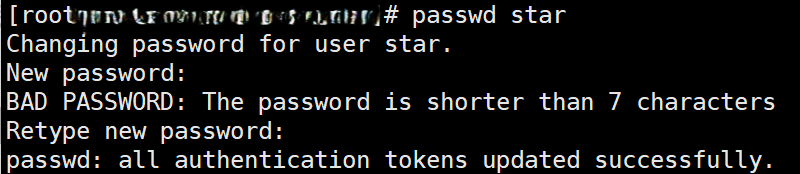

如果密码较为简单，系统会进行提示，但是在重新输入是输入一样的密码就可以。注意，不提倡使用过于简单的密码。

# 删除用户

```
userdel 用户名
删除用户，保留用户家目录
userdel -r 用户名
删除用户以及用户家目录
```

注意：一般情况下，我们建议保留家目录。

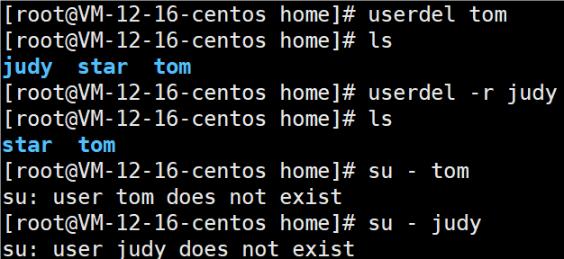

# 查询用户信息指令

```
id 用户名
```

当用户不存在时，返回无此用户

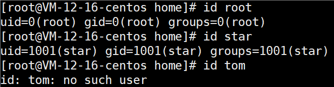

# 切换用户

```
su - 切换用户名
su 切换用户名
```

从权限高的用户切换到权限低的用户，不需要输入密码，反之需要。

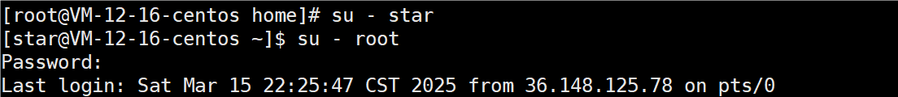

当需要返回到原来用户时，使用exit/logout指令。

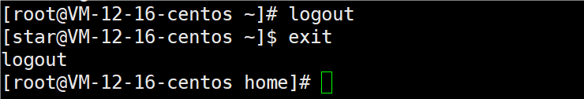

也可以使用 `su 切换用户名`来切换用户，但这样登录不是通过shell登录，不能通过logout注销，只能通过exit退出登录

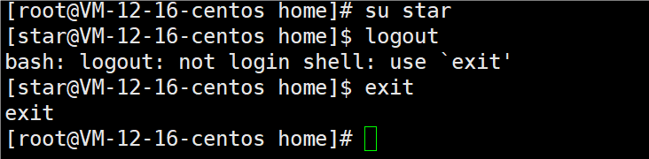

在操作Linux中，如果当前用户的权限不够，可以通过指令，切换到高权限用户，比如root。

注意：

* su root，临时切换到root，切换后环境变量不变，取得root的部分权限，不能使用root在path中的独有命令
* su - root，切换后环境变量改变，几乎可以不受限制做任何事

# 查看当前用户/登录用户

```
whoami
显示当前使用的身份(切换后身份会变)，只显示用户名
who am i
显示的是最初登录的身份，无论后面切换了多少次用户都一样，显示最初登录用户和登录时间
```

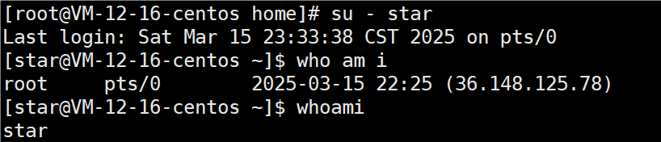

# 用户组

### 介绍

类似于角色，系统可以对有共性（权限）的多个用户进行统一的管理

### 指令

##### 新增组

```
groupadd 组名
```

##### 删除组

```
groupdel 组名
```

##### 增加用户时直接加上组

```
useradd -g 用户组 用户名
```

用户组必须存在，否则报错 `useradd: group 'wind' does not exist `

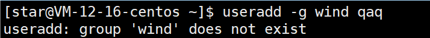

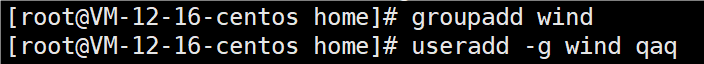

`useradd 用户名`相当于创建一个同名组，并将用户放入那个组。

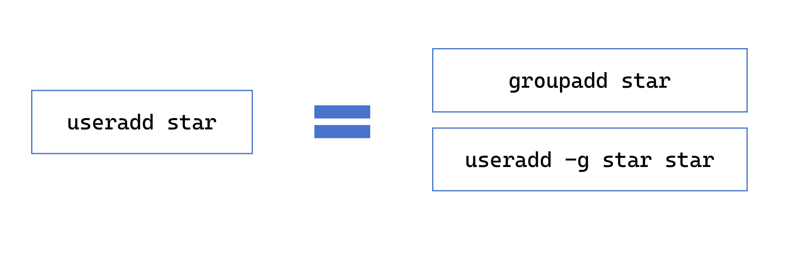

##### 修改用户的组

```
usermod -g 用户组 用户名
```

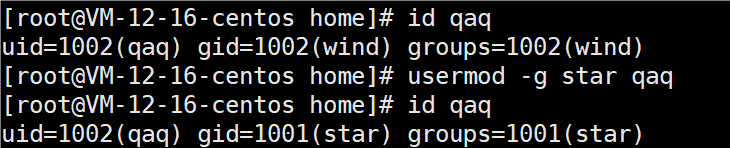

### 用户和组相关文件

##### /etc/passwd文件

用户（user）的配置文件，记录用户的各种信息。

每行的含义：`用户名：口令：用户标识号（uid）：组标识号（gid）：注释性描述：主目录（家目录）：登录Shell`

shell：cd指令，linux内核无法识别，要通过shell翻译解释，而shell的种类很多，有bash（中国常用），tcsh，csh等等

##### /etc/shadow文件

口令的配置文件。

每行的含义：`登录名：加密口令：最后一次修改时间：最小时间间隔：最大时间间隔：警告时间：不活动时间：失效时间：标志`

注意：

* 每次输入的口令，会在shadow文件中验证
* 最后一次修改时间，最小时间间隔，最大时间间隔，警告时间，不活动时间，失效时间，标志，都是用特殊的标识表示的，无法看懂。

##### /etc/group文件

组（group）的配置文件，记录Linux包含的组的信息。

每行含义：`组名：口令：组标识号：组内用户列表（隐藏）`
