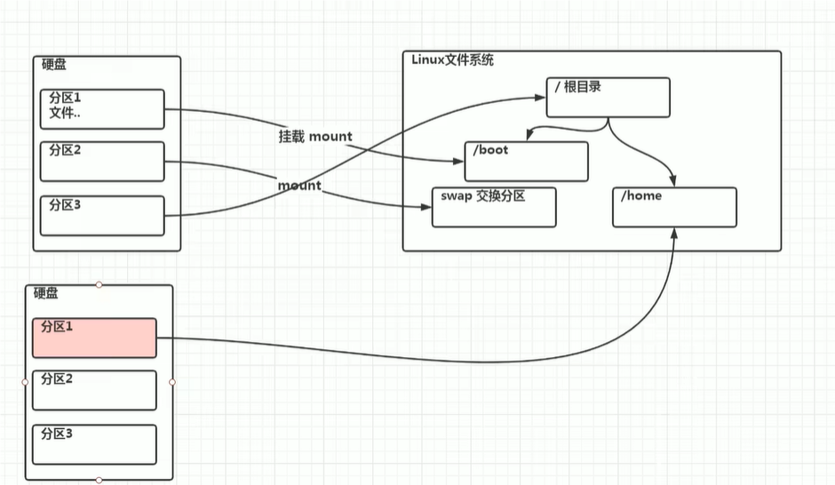

# Linux分区

### 原理介绍

Linux来说无论有几个分区，分给哪一目录使用，它归根结底就只有一个根目录，一个独立且唯一的文件结构，Linux中每个分区都是用来组成整个文件系统的一部分。

Linux采用了一种叫“载入”的处理方法，它的整个文件系统中包含了一整套的文件和目录，且将一个分区和一个目录联系起来。这时要载入的一个分区将使它的存储空间在一个目录下获得。



### 硬盘说明

Linux硬盘分IDE硬盘和SCSI硬盘，目前基本上是SCSI硬盘。

* 对于IDE硬盘，驱动器标识符为 `hdx~`，其中 `hd` 表明分区所在设备的类型，这里是指IDE硬盘
* 对于SCSI硬盘则标识为 `sdx~`，其中 `sd` 来表示分区所在设备的类型的，这里是指SCSI硬盘
* `x`为盘号：a为基本盘，b为基本从属盘，c为辅助主盘，d为辅助从属盘
* `~`代表分区：前四个分区用数字1-4表示，它们是主分区或扩展分区，从5开始就是逻辑分区

例如：hda3表示为第一个IDE硬盘上的第三个主分区或扩展分区，hdb2表示为第二个IDE硬盘上的第二个主分区或扩展分区。

# 查看所有设备挂载情况

```
lsblk
lsblk -f 
```


FSTYPE是文件类型，UUID是当你格式化后，会给你的每一个分区分配一个唯一的不重复的40位的字符串（唯一标识符），MOUNTPOINT是挂载点。

# 挂载的经典案例

### 如何增加一块硬盘

* 虚拟机增加硬盘
* 分区
* 格式化
* 挂载
* 设置可以自动挂载

### 虚拟机增加硬盘

在 [虚拟机] 菜单中，选择 [设置]，然后设备列表里添加硬盘，然后一路 [下一步]，中间只有选择磁盘大小的地方需要修改，直到完成。然后重启系统才能识别到增加的硬盘。

因为买的服务器，不能随意添加硬盘，所以这一步改为选择要分区的硬盘。这里选择vda。


### 分区

```
fdisk /dev/硬盘名称
```

```
m 显示命令列表
p 显示磁盘分区 同 fdisk -l
n 新增分区
d 删除分区
w 写入并退出
```


开始分区后输入n，新增分区，然后选择p，分区类型为主分区。两次回车默认剩余全部空间。最后输入w写入分区并退出，若不保存退出输入q。

### 格式化磁盘

```
mkfs [选项] [-t 分区格式] 分区路径
```

例如 mkfs -t ext4 /dev/sdb1 或者 mkfs.ext4 /dev/sdb1

其中ext4是分区类型。

# 挂载与卸载

### 挂载

```
mount 设备名称 挂载目录
```

将一个分区与一个目录关联起来。用命令行挂载重启后会失效（即这样操作的挂载关系是临时的）。

例如：mount /dev/sdb1 /newdisk（必须先创建/newdisk目录）。

### 卸载

```
umount 设备名称 或者 挂载目录
```

例如：umount /dev/sdb1 或者 umount /newdisk

### 永久挂载

通过修改/etc/fstab实现自动挂载。


最后的两个数字：第一个是挂载点内备份，0表示不做dump备份。第二个表示磁盘检查，0表示不检查磁盘扇区，1表示其他目录文件检查，2表示根目录文件检查

添加完成后，执行 mount -a 即刻生效，或者执行 reboot 也会自动生效。

永久挂载前最好保存快照。防止操作失误导致开不了机。

# 磁盘情况查询

### 查询系统整体磁盘使用情况

```
df -h
```

查询系统整体磁盘使用情况


如果磁盘使用率达到80%以上，就需要想办法清理空间了。

### 查看指定目录的磁盘占用情况

```
du -h /目录
```

查询指定目录的磁盘占用情况，不指定则默认查询当前目录。

```
-s 指定目录占用大小汇总
-h 带计量单位（人类可读）
-a 含文件
--max-depth=1 子目录深度（当前目录的1层子目录也显示）
-c 列出明细的同时，增加汇总值
```

应用案例


# 磁盘工作指令

1.统计 /home/qaq 文件夹下文件的个数

```
ls -l /home/qaq | grep '^-' | wc -l
```

第一步：列出目录下的内容


第二步：通过正则表达式过滤出文件

对于 ls -l 打印的信息有：

> 第一列，文件属性与权限。
>
> 第0位确定文件类型（d，-，l，c，b）
>
> * l，链接，相当于windows的快捷方式
> * d，目录，相当于windows的文件夹
> * -，普通文件
> * c，字符设备文件，鼠标，键盘（cd /dev可以看到）
> * b，块设备，比如硬盘（cd /dev可以看到）


第三步：利用wc指令和-l选项统计行数


补充：

```
wc (wordcount简写) 指令选项：
-l：计算行数（line）
-c：计算字节数（character）
-m：计算字符数（char）
-w：计算单词数（word）
```

2.统计文件夹下目录的个数

```
ls -l  | grep '^d' | wc -l
```


3.统计文件夹下文件的个数，包括子文件夹里的

```
ls -lR | grep '^-' | wc -l
```


4.统计文件夹下目录的个数，包括子文件夹里的

```
ls -lR  | grep '^d' | wc -l
```


5.以树状显示目录结构：tree 目录

注意：如果没有tree指令，则使用yum install tree，前提网络是畅通的。


