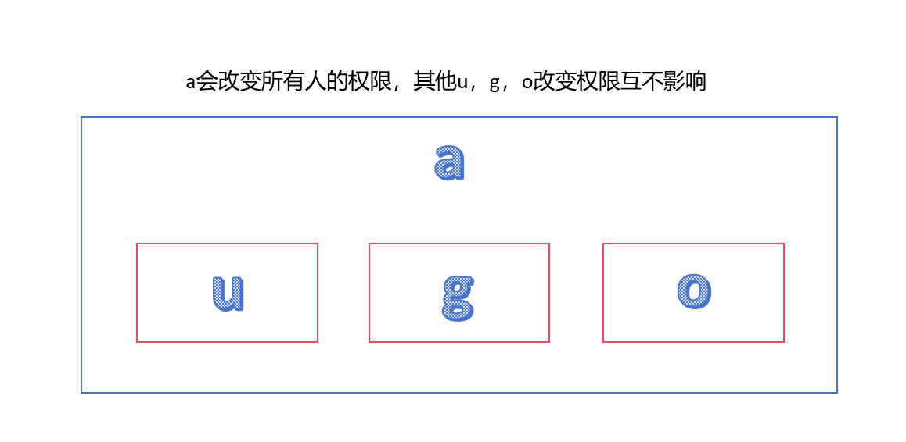
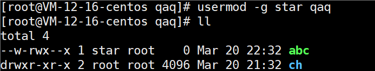

# 组

### 基本介绍

在linux中的每个用户必须属于一个组，不能独立于组外。

在linux中每个文件有所有者、所在组、其他组的概念。

* 所有者（谁创建谁就是所有者，可以修改）
* 所在组（创建者所属用户组，可以修改）
* 其他组

### 所有者

一般为文件/目录的创建者，谁创建了该文件/目录，就自然地成为该文件/目录的所有者。

##### 查看所有者

```
ls -ahl
ll
```


##### 修改所有者

```
chown 用户名 文件/目录名
```


改变所有者，所在组不会变。

### 组的创建

```
groupadd 组名
```


### 所在组

当某个用户创建了一个文件/目录后，默认这个文件/目录的所在组就是该用户所在的组。

##### 查看所在组

```
ls -ahl
```

创建一个文件，看看该文件属于哪个组


##### 修改所在组

```
chgrp 组名 文件名
```

使用root用户创建文件orange.txt，看看当前这个文件属于哪个组，然后将这个文件所在组，修改到fruit组

### 其他组

除文件的所有者和所在组的用户外，系统的其他用户都是文件的其他组。

### 改变用户所在组

在添加用户时，可以指定将该用户添加到哪个组中，同样的，用root的管理权限可以改变某个用户所在的组。

```
usermod -g 新组名 用户名
usermod -d 目录名 用户名 改变该用户登录的初始目录（特别说明：用户需要有进入到新目录的权限）
```

将用户从原来所在组，修改到另一个组


修改用户的初始目录


思考：为什么修改初始目录之后更换到 qaq 身份，没有显示用户名为首的信息，而是 `-bash-4.2$` 呢？


因为 ch 只是我们随便创建的一个空目录，没有有关 qaq 的配置文件。


修改初始目录为原来的就会正常显示。

# 权限

### 基本介绍

ls -l中显示的内容如下：


第一列，文件属性与权限。

> 第一列一共有10位，分别用0-9表示，下面是0-9位的说明：
>
> 第0位确定文件类型（d，-，l，c，b）
>
> * l，链接，相当于windows的快捷方式
> * d，目录，相当于windows的文件夹
> * -，普通文件
> * c，字符设备文件，鼠标，键盘（cd /dev可以看到）
> * b，块设备，比如硬盘（cd /dev可以看到）
>
> 第1-3位，所有者（该文件的所有者）User对该文件的权限。
>
> 第4-6位，所在组（同用户组的）Group对该文件的权限。
>
> 第7-9位，其他用户Other对该文件的权限。

第二列，文件的该数一定为1，目录的该数为对应子目录数和子文件数之和。

第三列，所有者。

第四列，所在组。

第五列，文件大小（字节），如果是文件夹，显示4096字节。

第六到八列，最后修改日期。

第九列，文件/目录名。

示例分析：

```
-rw-r--r-- 1 tom    root      0 Mar 20 23:07 abc.txt
第一列，文件属性与权限。普通文件，所有者可以读写，所在组和其他组可以读。
第二列，文件的该数一定为1。
第三列，所有者。tom。
第四列，所在组。root。
第五列，文件大小（字节）。空文件，0字节。
第六到八列，最后修改日期。Mar 20 23:07。
第九列，文件/目录名。abc.txt。
```

### rwx权限

可用数字表示：r=4，w=2，x=1，rwx=4+2+1=7，数字可以进行组合。

当文件可执行的时候，它的颜色会变成绿色。

##### rwx作用到文件

[r]代表可读（read）：可以读取，查看

[w]代表可写（write）：可以修改，但是不代表可以删除该文件，删除一个文件的前提条件是对该文件所在的目录有写权限，才能删除该文件

[x]代表可执行（execute）：可以被执行


##### rwx作用到目录

[r]代表可读（read）：可以读取，ls查看目录内容

[w]代表可写（write）：可以修改，对目录内创建+删除+重命名目录

[x]代表可执行（execute）：可以进入该目录


### 修改权限

通过chmod指令，可以修改文件或目录的权限。

##### +、-、= 变更权限

u:所有者 g：所有组 o：其他人 a：所有人（u、g、o的总和）



```
chmod u=rwx,g=rx,o=x 文件/目录名
对多个项更改权限
chmod o+w 文件/目录名
对指定项增加权限
chmod a-x 文件/目录名
对指定项删减权限
```

案例演示：

1.给abc文件的所有者读写执行的权限，给所在组读执行权限，给其他组读执行权限


2.给abc文件的所有者除去执行的权限，增加组写的权限


3.给abc文件的所有用户添加读的权限


##### 通过数字变更权限

```
chmod u=rwx,g=rx,o=x 文件目录名
相当于
chmod 751 文件目录名
```

将文件的权限修改成rwxr-xr-x，使用给数字的方式实现：


##### 修改用户/组对权限影响

文件和所有者同组，所有者组改变，文件组也改变


单独改变文件所有者或者文件所在组时，另一个属性保持不变


文件和所有者不同组，所有者组改变，文件组不变



### 修改文件所有者

```
chown newowner 文件/目录 
改变所有者
chown newowner:newgroup 文件/目录
改变所有者和所在组
```

选项：-R，如果是目录，则使其下所有子文件或目录递归生效

案例演示：

请将/home/abc.txt文件的所有者修改成tom


请将/home/kkk目录下所有的文件和目录的所有者都修改成tom


### 修改文件/目录所在组

```
chgrp newgroup 文件/目录
```

选项：-R，如果是目录，则使其下所有子文件或目录递归生效。

# 警察和土匪游戏

police：jack，jerry

bandit：xh，xq

流程与演示：

* 创建组和用户。jack创建一个文件，自己可以读写，本组人可以读，其他组没有任何权限。


权限验证：

jack 可以进行读写。


在获取进入目录权限[x]后，同组 jerry 可以读不可以写。


其他组 xh 不可以读写。


* jack修改该文件，让其他组可以读，本组人可以读写


* xh投靠警察，测试，看看xh是否可以读写


* xq是否可以？可以读不可以写。


