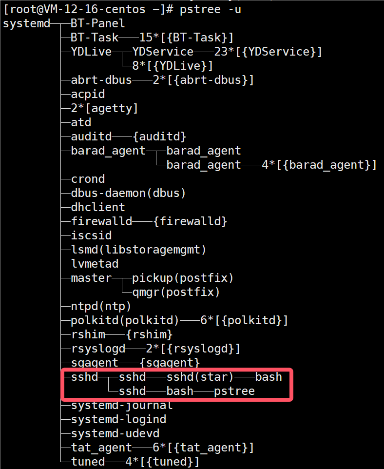
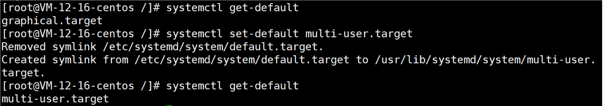
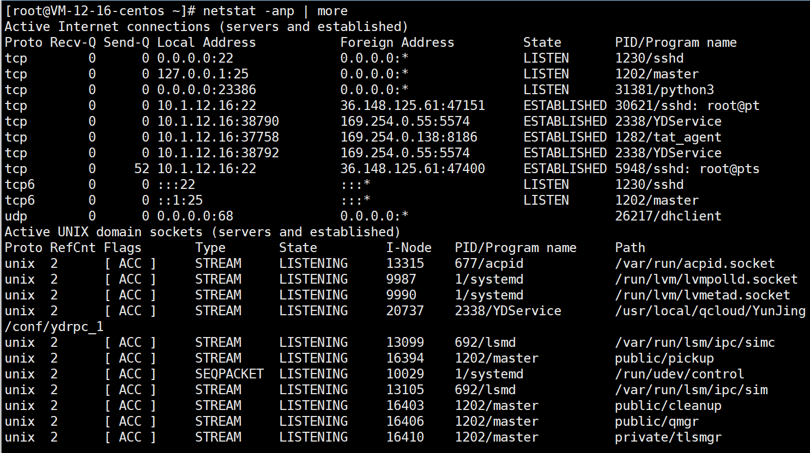

# 基本介绍

1> 在Linux中，每个执行的程序都成为一个进程。每一个进程都分配一个ID号(pid，也叫进程号）。

下图是windows下通过任务管理器查看进程。


程序（静态概念）不运行的时候，就是一段代码。当它加载到内存里时，它才是一个进程（动态概念）。

2> 每个进程都可能以两种方式存在。前台与后台，所谓前台进程就是用户目前的屏幕上可以进行操作的。后台进程则是实际在操作，但由于屏幕上无法看到的进程，通常使用后台方式执行，比如mysql服务。

3> 一般系统的服务都是以后台进程的方式存在，如mysql，tomcat，而且都会常驻在系统中。直到关机才结束。

4> 一个进程可以创建生成多个子进程，所以会有所谓的多进程的概念。

# 显示系统执行的进程

ps命令是用来查看目前系统中，有哪些正在执行，以及它们执行的状况。可以不加任何参数。

### 常用选项

* -a: 显示当前终端的所有进程信息
* -u: 以用户的格式显示进程信息
* -x: 显示后台进程运行的参数
* -e: 显示所有进程
* -f : 全格式

### 应用实例

查看进程。

```
ps -aux
```


```
System V 风格
USER：用户名称
PID：进程号
%CPU：进程占用CPU百分比
%MEM：进程占用物理内存的百分比
VSZ：进程占用的虚拟内存大小（单位 ：KB）
RSS：进程占用的物理内存大小（单位：KB）
TTY：终端名称，缩写
STAT：进程状态，其中S-睡眠，s-表示该进程是会话的先导进程，N-表示进程拥有比普通优先级更低的优先级，R-正在运行，D-短期等待，Z-僵死进程，T-被跟踪或者被停止等等
STARTED：进程的启动时间
TIME：CPU时间，即进程使用CPU的总时间
COMMAND：启动进程所用的命令和参数，如果过长会被截断显示
```

```
ps -ef
```


```
BSD风格
UID：用户ID
PID：进程ID
PPID：父进程ID
C：CPU用于计算执行优先级的因子。数值越大， 表明进程是CPU密集型运算，执行优先级会降低；数值越小，表明进程是I/O密集型运算，执行优先级会提高
STIME：进程启动的时间
TTY：完整的终端名称
TIME：CPU时间
CMD：启动进程所用的命令和参数
```

查看sshd的父进程信息。

```
ps -ef | grep xxx
```


可以看出，sshd的父进程的PID为1。

通过指令ps -aux | more可以看到PID为1的进程。


# 终止进程

```
kill [选项] 进程号
通过进程号终止进程
killall 进程名称 
通过进程名称终止进程，也支持通配符，这在系统因负载过大而变得很慢时很有用
```

若是某个进程执行一半需要停止时，或是已消了很大的系统资源时，此时可以考虑停止该进程。使用kill命令来完成此项任务。

### 区别

* 通过kill只会终止父进程，其子进程会交给1号进程接管。
* 通过killall终止进程，会将该进程下面的所有子进程也一并终止。

### 常用选项

-9：表示强迫进程立即停止。在有些情况下，系统处于保护机制，它会忽略kill指令，但是带-9会强制终止进程。

### 应用实例

案例1：踢掉某个非法登录用户


案例2：终止远程登录服务sshd，在适当时候再次启动sshd服务

```
kill sshd对应的进程号
/bin/systemctl start sshd.service  #再次重启sshd服务
```

案例3：终止多个gedit

```
killall gedit
```

案例4：强制杀掉一个终端

因为该终端正在工作，认为你可能是误操作，直接kill不会作出反应。此时要终止必须要强制终止。

```
kill -9 5480
```

# 查看进程树

```
pstree [选项] [进程号]
```

可以更加直观的来看进程信息，不写进程号，默认查看进程为1的进程树

### 常用选项

* -p：显示进程的PID
* -u：显示进程的所属用户

### 应用实例

案例1：请以树状的形式显示进程


案例2：请以树状的形式显示进程的用户



# 服务管理

服务（service）本质就是进程，但是是运行在后台的，通常都会监听某个端口，等待其他程序的请求，比如（mysqld，sshd，防火墙等），因此我们又称为守护进程，是Linux中非常重要的知识点。


SSHD，就是远程登陆服务，是通过SSH来登陆的。最后的一个符号D其实是daemon的简写，表示后台程序/守护进程/服务

### service指令

* service 服务名 [start | stop | restart | reload | status]
* 在CentOS7.0后，很多服务不再使用service，而是systemctl
* 在CentOS7.0后，被service指令管理的服务在 `/etc/init.d/`查看


##### 应用实例

请使用service指令，查看，关闭，启动network

在虚拟系统演示，因为网络连接会关闭，进程不再监听端口，xshell就无法连接上sshd。

我通过腾讯云服务器的VNC登录完成了这个案例演示。


### 查看服务名

```
setup
```

下图中打星号的表示会随着linux的启动，自动启动。没有带星号的则需要手动启动。

将光标移动到某一个服务上，按空格，可以在自动启动和手动启动之间切换。

按tab可以切换选择框。

    

### 服务的运行级别

Linux系统中有7种运行级别（runlevel）：常用的是级别3和5
运行级别0：系统停机状态（一旦启动马上关机），系统默认运行级别不能设为0，否则不能正常启动
运行级别1：单用户工作状态，root权限，用于系统维护，禁止远程登录
运行级别2：多用户状态（没有NFS），不支持网络
运行级别3：完全的多用户状态（有NFS），无界面，登录后进入控制台命令行模式
运行级别4：系统未使用，保留
运行级别5：X11控制台，登录后进入图形GUI模式
运行级别6：系统正常关闭并重启，默认运行级别不能设为6，否则不能正常启动

##### 开机流程

```
开机->BIOS->/boot->systemd进程1->运行级别->运行级对应的服务
```

##### 运行级别修改与查看

在centos7以前，我们是在/etc/inittab文件中进行修改。

到了centos7，进行了简化，在/etc/inittab文件中有如下：


查看当前运行级别

```
systemctl get-default
```

设置默认运行级别

```
systemctl set-default TARGET.target
```



### chkconfig指令

```
chkconfig
查看所有服务
chkconfig | grep 服务名
查看指定服务
chkconfig --level 运行级别 服务名 on/off
用这条指令可以设置某一个服务在某一个运行级别是自启动或者关闭自启动
```

* 通过 chkconfig 命令可以给服务的各个运行级别设置自启动/关闭
* Centos7.0后，很多服务使用 systemctl 管理
* chkconfig 指令管理的服务在 /etc/init.d 查看
* chkconfig 重新设置服务后自启动或关闭，需要重启机器reboot生效

##### 应用实例

对 network 服务进行各种操作，把 network 在3这个级别关闭自启动之后复原


注意：sysv和systemd都是管理进程启动或关闭的程序，sysv启动服务慢，systemd启动服务快
chkconfig 服务名 --list

### systemctl指令

```
systemctl [start | stop | restart | status] 服务名
systemctl list-unit-files [| grep 服务名] 
查看服务开机启动状态，grep可以进行过滤
systemctl enable 服务名
设置服务开机启动
systemctl disable 服务名
关闭服务开机启动
systemctl is-enabled 服务名
查询某个服务是否是自启动的
```

systemctl enable/disable 服务名的指令不需要带level，这是因为centos7.0以后，通过systemctl开启和关闭服务，默认是对级别3和5都生效。

systemctl指令管理的服务在 /usr/lib/systemd/system 查看。


##### 应用实例

防火墙的服务名可以通过过滤查看/usr/lib/systemd/system文件来获得：


查看服务开机启动状态：

static状态表示该服务与其他服务相关联，不能单独设置该服务的启动状态。


查看防火墙服务开机启动状态：


查看防火墙的状态：


关闭防火墙：


重启防火墙：


上面对于防火墙的关闭和启动防火墙操作只是临时生效的，当重启系统后，还是回归以前对服务的设置。如果希望设置某个服务自启动或关闭永久生效，要使用 `systemctl [enable|disable] 服务名`

关闭防火墙服务开机启动：


查询防火墙服务是否是自启动的：


设置防火墙服务开机启动：


##### 细节讨论

关闭或者启用防火墙后，立即生效。[telnet测试 某个端口即可]

可以通过 netstat -anp | more 指令查看网络状态。



开启telnet命令需要：依次点击‘开始’->“控制面板”->“程序”->“在程序和功能”找到并点击“启用或关闭windows功能”进入windows系统功能设置对话框。找到并勾选“Telnet客户端”和“Telnet服务器”

测试：telnet 192.168.200.130 111

无法连接，说明防火墙是启动的，并且没有把111端口打开。
当关闭防火墙后，再测试连接端口，则可以通过。

### 防火墙

##### 基本原理

可以认为系统在监听端口前面加了一个防火墙，当一个请求来的时候，如果相应端口是放开的，则请求可以通过，否则不通过。防火墙可以理解为筛子，通过预先设置的大小，来过滤掉不符合尺寸的服务。


在真正的生产环境，往往需要将防火墙打开，但问题来了，如果我们把防火墙打开，那么外部请求数据包就不能跟服务器监听端口通讯。这时，需要打开指定的端口。比如80、22、8080等，这个又怎么做呢？

##### firewall指令

```
firewall-cmd --permanent --add-port=端口号/协议
打开端口
firewall-cmd --permanent --remove-port=端口号/协议
关闭端口
firewall-cmd --reload
打开或者关闭端口之后，要重新载入，才能生效
firewall-cmd --query-port=端口/协议
查询端口是否开放
netstat -anp
查询对应端口的协议等信息
```

##### 应用实例

可能是服务器设置问题，`netstat -anp`显示内容没有111端口，无法完成完整演示。

查看端口的协议：


查看发现111端口未开放：


开放111端口：

```
firewall-cmd --permanent --add-port=111/tcp
firewall-cmd --reload
firewall-cmd --query-port=111/tcp
```

再次关闭111端口：

```
firewall-cmd --permanent --remove-port=111/tcp
firewall-cmd --reload
firewall-cmd --query-port=111/tcp
```

### 动态监控进程

```
top [选项]
```

top与ps命令很相似。它们都用来显示正在执行的进程。top与ps最大的不同之处，在于top指令可以每隔一段时间就更新正在运行的进程。

##### 常用选项

| 选项    | 功能                                         |
| ------- | -------------------------------------------- |
| -d 秒数 | 指定top命令每隔几秒更新。默认是3秒           |
| -i      | 使 top不显示任何闲置或者僵死进程。           |
| -p      | 通过指定监控进程ID来仅仅监控某个进程的状态。 |

##### 展示信息说明


```
10：30：50 	# 当前时间
4：47      	# 系统执行时间
2users     	# 目前在线的用户数
load average：0.00, 0.01, 0.05	#负载均衡：这三个值加起来除以3，如果在0.7以上，则负载较大，在0.7以下，则负载还行。
Tasks: 232 total,   1 running, 231 sleeping,   0 stopped,   0 zombie # 任务数，1个正在运行，231个休眠，0个终止，0个僵死
%Cpu(s):  0.0 us,  0.0 sy,  0.0 ni,100.0 id,  0.0 wa,  0.0 hi,  0.0 si,  0.0 st # us用户占用cpu；sy系统占用cpu；id空闲cpu比例
KiB Mem :  2027892 total,   998752 free,   567012 used,   462128 buff/cache # 共2G内存，大约1G空闲，用了0.5G，缓存占用0.5G
KiB Swap:  2097148 total,  2097148 free,        0 used.  1282572 avail Mem # swap分区，共2G，大约2G空闲，使用0个，可获取的内存1G多
```

这些单位可以按E或e切换，切换为KB/MB/GB/EB/PB。

##### 交互操作说明

| 操作 | 功能                          |
| ---- | ----------------------------- |
| P    | 以CPU使用率排序，默认就是此项 |
| M    | 以内存的使用率排序            |
| N    | 以PID排序                     |
| q    | 退出top                       |

##### 应用实例

案例1.监控特定用户，比如我们监控star用户

```
输入top，回车，然后输入u，再输入用户名，回车
```


登录 star 后


案例2：终止指定的进程，比如我们要结束star登录

```
输入top，回车，然后输入k，再输入要结束的进程ID号，回车，此时一般会提示要输入信号量，输入9表示强制删除。
```


案例3：指定系统状态更新的时间（每隔10秒自动更新），默认是3秒


### 监控网络状态

```
netstat [选项]
```

##### 常用选项

* -an 按一定顺序排列输出
* -p 显示哪个进程在调用


##### 展示信息说明

```
proto：网络协议
Local Address：本地地址（是指linux地址），如0.0.0.0:22：指有一个程序在本地监听22号端口
Foreign Address：外部地址
State：LISTEN表示监听，ESTABLISHED表示连接建立，TIME_WAIT表示超时等待
```

`0.0.0.0`和 `127.0.0.1`表示本地地址，`：：：`三个冒号是ipv6的形式显示的本地地址。


这条ESTABLISHED表示连接成功了，其中 `10.1.12.16:22`是linux的本地地址，与外部地址 `36.148.125.61`的47573端口发生连接。


只要要建立通信，必须要有端口，发送端端口是随机产生的，接收端端口相对是固定的。

当tcp协议的一方断开连接时，另一方会认为可能是网络临时有问题，所以会等待，直到超时（一般是一分钟或者更久），此时状态是TIME_WAIT。


### 检测主机连接命令ping

```
ping 对方ip地址
```

是一种网络检测工具，它主要是用来检测远程主机是否正常，或是两部主机间的网线或网卡故障。
