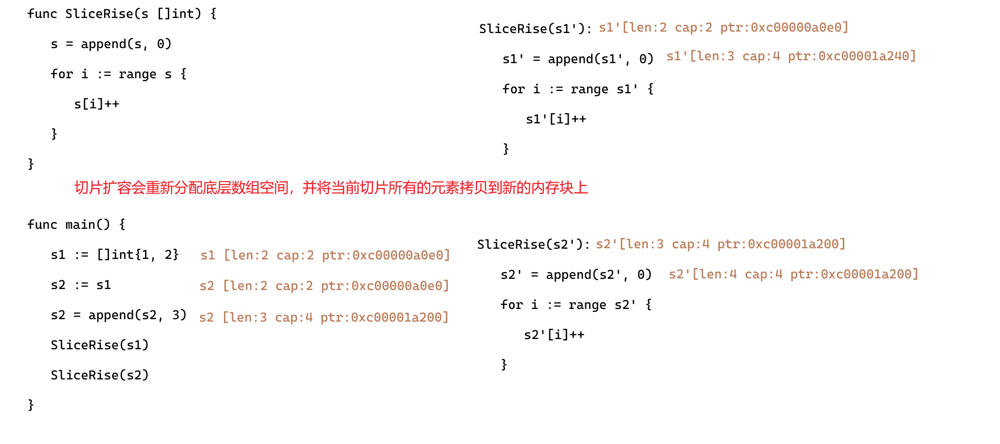
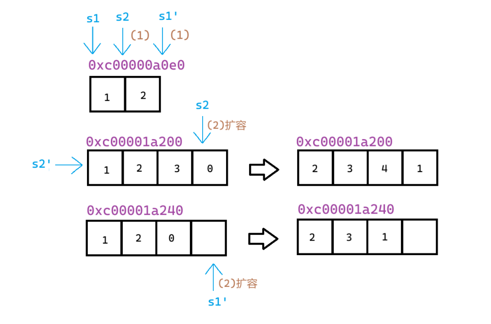

# 扩容机制

```
// nextslicecap 计算切片扩容后的新容量
func nextslicecap(newLen, oldCap int) int {
	newcap := oldCap
	doublecap := newcap + newCap
	// 如果新长度超过旧容量的两倍，直接返回新长度作为新容量
	if newLen > doublecap {
		return newLen
	}

	const threshold = 256 // 容量增长策略的切换阈值
	// 旧容量小于阈值时，采用双倍扩容策略
	if oldCap < threshold {
		return doublecap
	}

	// 当切片容量较大时，平滑过渡到1.25倍增长策略
	for {
		// 计算公式：newcap += (newcap + 3*threshold) / 4
		// 该公式在小容量时接近2倍增长，大容量时接近1.25倍增长
		newcap += (newcap + 3*threshold) >> 2

		// 通过无符号比较同时检查两种情况：
		// 1. 新容量是否满足需求 (newcap >= newLen)
		// 2. 是否发生整数溢出（当有符号数溢出时，无符号表示会大于 newLen）
		if uint(newcap) >= uint(newLen) {
			break
		}
	}

	// 处理整数溢出的特殊情况：当计算值溢出变为负数时，直接返回请求的容量
	if newcap <= 0 {
		return newLen
	}
	return newcap
}
```

# 常用操作

[极客兔兔](https://geektutu.com/post/hpg-slice.html#3-%E6%80%A7%E8%83%BD%E9%99%B7%E9%98%B1)

# 性能陷阱

在已有切片的基础上进行切片，不会创建新的底层数组。因为原来的底层数组没有发生变化，内存会一直占用，直到没有变量引用该数组。因此很可能出现这么一种情况，原切片由大量的元素构成，但是我们在原切片的基础上切片，虽然只使用了很小一段，但底层数组在内存中仍然占据了大量空间，得不到释放。比较推荐的做法，使用 `copy` 替代 `re-slice`。

# 示例

### len & cap

```
func main() {
	h := make([]int, 0, 5)
	h2 := make([]int, 3, 5)
	fmt.Println("h:", h)
	fmt.Println("h2:", h2)
	h = append(h, 11)
	h2 = append(h2, 11)
	fmt.Println("h:", h)
	fmt.Println("h2:", h2)
}
```

```
输出：
h: []
h2: [0 0 0]
h: [11]
h2: [0 0 0 11]
```

len 决定了初始化的数组长度，cap 决定与扩容有关的机制。

append 是从 len 开始有内容就覆盖，没有内容就添加。

### 扩容 & 值传递

```
package main

import "fmt"

func SliceRise(s []int) {
	s = append(s, 0)
	for i := range s {
		s[i]++
	}
}

func main() {
	s1 := []int{1, 2}
	s2 := s1
	s2 = append(s2, 3)
	SliceRise(s1)
	SliceRise(s2)
        fmt.Println(s1,s2)
}
```

```
问：该函数输出什么？
A:[2,3][2,3,4]	B:[1,2][1,2,3]	C:[1,2][2,3,4]	D:[2,3,1][2,3,4,1]
```





所以，选C

### 切片指针

```
func SliceRise(s *[]int) {
	fmt.Println("in")
	fmt.Printf("%p %v\n", *s, s)
	*s = append(*s, 0)
	fmt.Printf("%p %v\n", *s, s)
	for i := range *s {
		(*s)[i]++
	}
	fmt.Printf("%p %v\n", *s, s)
	fmt.Println("out")
}

func main() {
	s1 := []int{1, 2}
	s2 := s1
	fmt.Printf("%p %p %v\n", s1, &s1, s1)
	fmt.Printf("%p %p %v\n", s2, &s2, s2)
	s2 = append(s2, 3)
	fmt.Printf("%p %p %v\n", s2, &s2, s2)
	SliceRise(&s1)
	SliceRise(&s2)
	fmt.Printf("%p %p %v\n", s1, &s1, s1)
	fmt.Printf("%p %p %v\n", s2, &s2, s2)
}
```

```
0xc00000a0e0 0xc000008048 [1 2]
0xc00000a0e0 0xc000008060 [1 2]
0xc00001a220 0xc000008060 [1 2 3]
in
0xc00000a0e0 &[1 2]
0xc00001a240 &[1 2 0]
0xc00001a240 &[2 3 1]
out
in
0xc00001a220 &[1 2 3]
0xc00001a220 &[1 2 3 0]
0xc00001a220 &[2 3 4 1]
out
0xc00001a240 0xc000008048 [2 3 1]
0xc00001a220 0xc000008060 [2 3 4 1]
```
